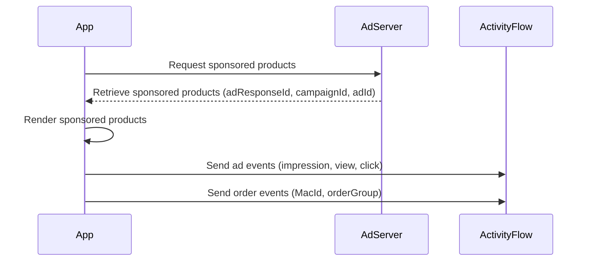

[VTEX Ad Network](https://help.vtex.com/en/tutorial/vtex-ad-network-beta--2cgqXcBuJmXN2livQvClur) allows publishers to monetize their traffic through ads and advertisers to promote their products to multiple publishers from a single admin panel. This guide explains how publishers can implement sponsored ads in VTEX stores using VTEX Ad Network.

## Prerequisites

To use VTEX Ad Network, your store must be a multi-brand retailer or a marketplace.

## Integration flow

Two flows are required for the VTEX Ad Network to function: one for requesting ads and another for sending ad and order events. The following diagram shows the sequence for requesting ads and tracking performance metrics.



The steps below explain the ad request and event tracking process:

1. **Request sponsored products**

   VTEX Ad Network initiates with a request to the ad server for sponsored product recommendations. This request includes parameters such as user data, ad placement, and targeting information. See [Requesting ads](#requesting-ads) for more information.  
     
2. **Retrieve sponsored products**

   The ad server processes the request and returns the details of the sponsored products.  See [Requesting ads](#requesting-ads) for more information.  
     
3. **Render sponsored products on the storefront**

   After receiving the response, the app displays the sponsored products in the appropriate section of the storefront.  
     
4. **Send ad events**

   When the user interacts with the ads (e.g., views, clicks, or impressions), the app sends the corresponding ad events back to the AdServer. See [Sending ad events](#sending-ad-events) for more information.  
     
5. **Send order events**

   When the user makes an order from an ad, the app sends the corresponding order event to the AdServer. See [Sending order events](#sending-order-events) for more information.  
     
6. **Log events in ActivityFlow**

   The ad server forwards the collected ad events to the ActivityFlow system for tracking and analysis. This step ensures accurate monitoring of the ad's performance metrics.

## Requesting ads

There are two ways of requesting sponsored products, depending on the search engine in use:

| Endpoint | Use case | Response |
| - | - | - |
| `GET` [Get list of products for a query](https://developers.vtex.com/docs/api-reference/intelligent-search-api#get-/product_search/-facets-) (Intelligent Search API) | Publishers using [Intelligent Search](https://help.vtex.com/en/tracks/vtex-intelligent-search--19wrbB7nEQcmwzDPl1l4Cb/3qgT47zY08biLP3d5os3DG) | Returns both organic and sponsored products based on the search query. |
| `GET` [Get sponsored products for a query](https://developers.vtex.com/docs/api-reference/vtex-ad-network-api#get-/sponsored_products/-facets-) (Ad Network API) | Publishers using a third-party search engine | Returns only sponsored products based on the search query. |

### Setting up the request

To successfully request ads from the VTEX Ad Network, you need to structure your API calls correctly. This section explains how to configure the request parameters to retrieve sponsored products based on your use case.

To specify the number of sponsored products to retrieve, use the `sponsoredCount` query parameter, for example, `sponsoredCount=5`. 

If you are using ads in a different placement than `top_search`, use the `advertisementPlacement` option in the query string to inform the placement, for example, `advertisementPlacement=search_shelf`.

### Considerations for Intelligent Search

When using Intelligent Search to retrieve sponsored products, consider the following:

* Use the `showSponsored=true` query parameter to include sponsored products.  
* Don’t use the `sort` query parameter, as sponsored products must be sorted by relevance.  
* Use `repeatSponsoredProducts=false` to prevent sponsored products from appearing again in organic results or `repeatSponsoredProducts=true to allow duplicates`.

### Response example with ad information

When retrieving sponsored products through the API, the response includes details about the ad, such as the ad ID, campaign ID, and associated costs. This information helps track ad performance and link interactions to specific campaigns. Below is an example of how this data appears in the response:

```json
...
"advertisement": {
    "adId": "bcc4a97e-0f3e-4eef-897c-02a92849fb5c",
    "campaignId": "af596d8e-2de7-4802-8e17-56354fa130a1",
    "actionCost": 2.5,
    "adRequestId": "c9bdc2e0-a7dd-48cf-8e9c-94039f93e5b5",
    "adResponseId": "481be8a4-a420-489b-9be9-49496efb293a"
}
...
```

## Sending ad events

Ad events include impressions, views, and clicks, all sent via the `POST` [Send ad events](https://developers.vtex.com/docs/api-reference/vtex-ad-network-api#post-/ads) endpoint in Ad Network API. Each event should be sent at a specific moment:


| Event type | Trigger condition |
| :---- | :---- |
| **Impressions** | When the ad is rendered on the storefront. |
| **Views** | When more than 50% of the ad is visible for more than 1 second. |
| **Clicks** | When the ad is clicked. |

Check the `POST` [Send ad events](https://developers.vtex.com/docs/api-reference/vtex-ad-network-api#post-/ads) API reference for details on each field that should be sent in the request.

>⚠️ The `MacId` and `SessionID` properties are required and must be handled as described in `POST` [Send ad events](https://developers.vtex.com/docs/api-reference/vtex-ad-network-api#post-/ads). They are used as anonymous identifiers to link events with orders. These attributes are the publisher's responsibility and need to be managed at the device level.

### Request body example

The request body for sending ad events must include key identifiers such as `MacId`, `SessionId`, and `adRequestId`. These attributes ensure proper tracking of ad interactions and attribution to campaigns. Below is an example request body:  

```json
{
    "MacId": "f805a89b-ef06-4d6a-ae9d-4dd5699ccd6f",
    "Url": "https://www.test.com.br/busca?tshity",
    "Ref": "https://www.test.com.br",
    "SessionId": "fb252d90-7494-4097-90fd-cc73eeaa575c",
    "accountName": "test",
    "placement":'search_results',
    "position": 1,
    "adRequestId": "1f97dca0-b022-4bce-907c-d22daa1cef01",
    "adResponseId": "b0b5d188-21b3-4d3a-b3ca-81c0626ff7d6",
    "actionType": "impression",
    "productId": "1234",
    "productName": "tshirt XYZ",
    "campaignId": "9e424dcd-9b46-456e-a3a5-05803c83452f",
    "adId": "05949176-3a10-435e-9d08-3ba8da51de3b",
    "labels": [],
    "actionCost": 1.0,
    "channel": "website"
}
```

## Sending order events

Order events should be sent when a user places an order containing a sponsored product. These events should be sent separately using the `POST` [Send order events](https://developers.vtex.com/docs/api-reference/vtex-ad-network-api#post-/order) endpoint from Ad Network API. Check the `POST` [Send order events](https://developers.vtex.com/docs/api-reference/vtex-ad-network-api#post-/order) API reference for details on each field that should be sent in the request.

>⚠️ The request must contain the `MacId` and the `orderGroup` attributes. The `orderGroup` should be the same as the one created in the OMS to enable the correlation between the order events and the order tables.

### Request body example

The request body for sending order events must include key identifiers such as `MacId`, `SessionId`, and `adRequestId`. These attributes ensure proper tracking of ad interactions and attribution to campaigns. Below is an example request body:

```json
{
"accountName": "test",    
"macId": "f805a89b-ef06-4d6a-ae9d-4dd5699ccd6f",
    	"url": "https://www.test.com.br/busca?tshirt",
    	"ref": "https://www.test.com.br",
    	"sessionId": "fb252d90-7494-4097-90fd-cc73eeaa575c",
    	"orderGroup": "XYZ1241DVD",
    	"channel": "website"
}
```
