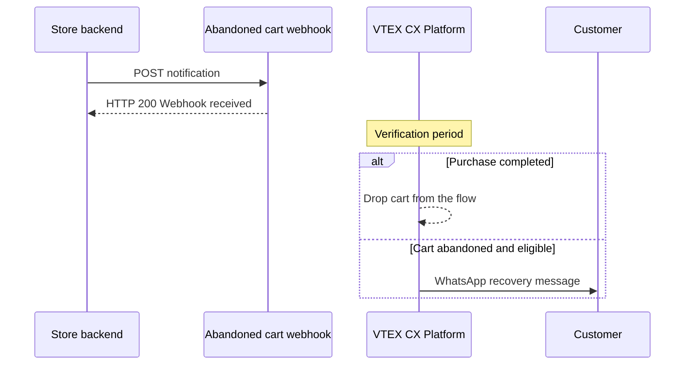

If your store operates storefronts beyond the website, such as a mobile app or a headless frontend, your backend can notify the abandoned cart webhook whenever the customer order form changes. The abandoned cart automation registers the cart, waits for the configured verification period, and, if the purchase wasn't completed, starts the recovery flow with a WhatsApp template message.

In this guide, you'll learn how to:

- Notify the webhook from your backend
- Define when to send each call
- Handle errors and volume
- Confirm that a cart was registered

> ℹ️ This webhook feeds the abandoned cart recovery agent of the [VTEX CX Platform](https://help.vtex.com/docs/tutorials/introduction-to-cx). It's different from the native email-based [abandoned cart](https://help.vtex.com/en/docs/tutorials/setting-up-abandoned-carts) feature, which is configured through Master Data. Both can run at the same time. This guide covers the store side of the integration. Automation settings, such as verification period, minimum cart value, cooldown, and phone restrictions, are configured in the abandoned cart automation and aren't part of the payload you send.

## How it works

The integration follows this flow:



1. **Notification:** Your backend sends a `POST` request to the webhook whenever there's a relevant change to the customer order form.
2. **Registration:** For each valid notification, VTEX records the cart state (`order_form_id`, `phone`, and `name`) and starts or restarts the verification period countdown.
3. **Verification:** At the end of the verification period configured in the automation, VTEX checks whether the order matching that `order_form_id` was completed.
4. **Result:** If the purchase was completed, the cart is dropped from the flow. If it wasn't, the cart is flagged as abandoned and the recovery flow starts, if the cart is eligible.

The webhook records only the cart state at the moment of the request. The decision between *purchased* and *abandoned* happens asynchronously, at the end of the verification period.

> ⚠️ An HTTP `200` response means only that the request was received, not that the cart was registered. See [Step 4 - Confirming that the cart was registered](#step-4---confirming-that-the-cart-was-registered).

## Before you begin

Make sure you have the following:

- The abandoned cart automation configured in your VTEX account.
- The `integrated_agent_uuid` of the automation, provided during onboarding. This UUID identifies your store in the request URL and is the only credential of the integration, so treat it as a secret.
- A backend service able to make server-to-server requests. Calls made directly from a mobile app, browser, WebView, or any other end-user client are supported, but we don't recommend using them.
- The ability to send the notification asynchronously, through a queue, a worker, or fire-and-forget, off the critical path of the user-facing response.

> ⚠️ There's no token-based or key-based authentication. Anyone holding the UUID can submit arbitrary `phone` and `name` values and make your official WhatsApp sender deliver recovery messages to numbers that never visited your store. This degrades the quality rating of the sender, may lead to sending limits or a block, and has a per-message cost. If you suspect the UUID was exposed, open a ticket with [VTEX Support](https://help.vtex.com/en/support) requesting a new one, and update the integration with the new value.

## Instructions

### Step 1 - Implementing the call in your backend

Have your app or frontend notify your own backend, and your backend call the webhook. Besides keeping the UUID on the server, this design lets you consolidate events, apply a retry policy, and validate the payload in a single place.

Send a `POST` request with a flat JSON body:

```bash
curl --location 'https://retailsetup.weni.ai/api/v3/agents/abandoned-cart-webhook/{integrated_agent_uuid}/' \
  --header 'Content-Type: application/json' \
  --data '{
    "order_form_id": "order-form-abc123",
    "phone": "5584987654321",
    "name": "Maria"
  }'
```

In the following table, see the elements of the request:

| Request element | Value |
| :---- | :---- |
| Method | `POST` |
| URL | `https://retailsetup.weni.ai/api/v3/agents/abandoned-cart-webhook/{integrated_agent_uuid}/` |
| Header | `Content-Type: application/json` |
| Expected response | HTTP `200` with `{ "message": "Webhook received" }` |

> ⚠️ The trailing slash (`/`) in the URL is required. Requests sent without it are redirected, and most HTTP clients don't resend the request body after a redirect. The result is a call that appears to be accepted but arrives without data.

In the following table, see the request parameters:

| Parameter | Type | Required | Description |
| :---- | :---- | :---- | :---- |
| `order_form_id` | string | Yes | Unique identifier of the order form (cart) in the store. This is the key used later to check whether the purchase was completed. |
| `phone` | string | Yes | Customer phone or WhatsApp number in international format, without symbols (for example, `5584987654321`). Used to send the WhatsApp template message if the cart is abandoned. |
| `name` | string | Yes | Customer name. Populates the personalization variable of the recovery message. |

> ❗ If `name` is omitted or sent blank, payload validation fails and the cart isn't registered, but the response is still HTTP `200`. This combination, a success response without registration, is the most common cause of carts that never generate a recovery message. Validate the three fields before every request.

#### Testing with a query string

For manual testing, the webhook also accepts the parameters as a query string. You can send both formats in the same request. If the same field is sent in the body and in the query string, the body value takes precedence.

The query string is convenient for manual testing through a browser or [Postman](https://www.postman.com/), but it exposes the customer name and phone number in the URL and, as a consequence, in server logs, proxy history, monitoring tools, and referrer headers. Don't use the query string in production.

### Step 2 - Defining when to send the notification

The payload contains only `order_form_id`, `phone`, and `name`. It doesn't contain the item list or the cart value, which are obtained by querying VTEX at verification time. This means notifying every item or value change carries no new information. The effect of each call is to register the cart and restart the verification period. The notification acts as a customer activity signal, not as a cart state synchronization.

Send the notification in the following situations:

- **First call:** Send it as soon as `order_form_id`, `phone`, and `name` are available, without consolidation. This is the call that registers the cart.
- **Contact data changes:** Send it again whenever the customer phone number or name is filled in or corrected, using only complete and validated values.
- **Periodic activity renewal:** While the customer is interacting with the cart, resend the notification at consolidated intervals. An interval of 5 minutes is appropriate for a 60-minute verification period, and the consolidation interval must always be significantly shorter than the period configured in the automation, so that activity renewal has any effect.

Renewal must be driven by real customer activity, never by a fixed timer. Because each call restarts the verification period, a periodic send that keeps firing while the app is merely open in the background prevents the period from ever expiring, and the abandonment is never detected.

Consolidate events in your backend, not in the client. A buffer held in the app is lost when the app is closed. If the customer adds items and leaves before the consolidated send, the cart is never registered and no recovery is triggered. This is why the first call is immediate and consolidation applies only to subsequent updates.

> ⚠️ A cart is identified by the `order_form_id` + `phone` combination. Sending the same `order_form_id` with a different phone number doesn't update the previous record. It creates a new one, and the previous record stays active with its own scheduled verification. If both verifications run close together, the customer may receive two recovery messages, one of them possibly to a mistyped number. Send the notification only with a complete, validated phone number.

You don't need to notify the webhook when the purchase is completed. The purchase check runs automatically at the end of the configured period.

### Step 3 - Handling errors and volume

Follow these practices when implementing the integration:

- **Error handling:** Handle timeouts, connection errors, and any response other than `200` with a retry policy using exponential backoff. Because a `200` doesn't confirm registration, retries must be driven by these delivery failures, not by the absence of confirmation.
- **Volume:** Size the integration so that it doesn't exceed approximately 50 requests per second per store on a sustained basis. There's no per-UUID rate limit applied at the webhook, but the platform has infrastructure limits, and requests may fail with a network error, a timeout, or an HTTP `5xx` error once they're reached. Align expected peaks, such as Black Friday, with [VTEX Support](https://help.vtex.com/en/support) in advance.
- **Idempotency:** Always use the same `order_form_id` for the same cart throughout its entire lifecycle.
- **Phone format:** Always send the country code, without spaces, dashes, or parentheses.
- **Asynchronous execution:** Keep the notification off the critical path of the end-user response. Reducing the number of calls lowers the load, but only asynchronous execution removes the impact of the integration latency on the response time of your store.

### Step 4 - Confirming that the cart was registered

The request response doesn't confirm registration. Confirm it on the logs screen of the abandoned cart automation.

The record doesn't appear in the logs at the moment the request is sent. The cart is processed at the end of the verification period. If the period is 60 minutes, the corresponding entry appears roughly 60 minutes after the notification. Checking the logs immediately after sending won't show the cart, and that doesn't indicate a failure.

> ⚠️ Don't validate the integration with the production UUID, as doing so triggers real recovery messages to customers.

To validate the integration, follow these steps:

1. Request a test UUID with a reduced verification period, for example, 5 minutes, from [VTEX Support](https://help.vtex.com/en/support).
2. Send the request to the webhook using the test UUID.
3. Wait for the verification period configured in the automation.
4. In the VTEX Admin, go to **Storefront > VTEX CX Platform** and click `CX Dashboard`.
5. Open the abandoned cart automation.
6. Select **Logs**.
7. Find the cart by the `order_form_id` you sent.
8. Let the test cart be abandoned and confirm that the recovery message arrives on WhatsApp.

If the message arrives, the whole flow worked: the cart was registered, the period elapsed, verification ran, and the eligibility rules were met.

The logs screen shows the message journey, including sent, delivered, and read status for the recovery message. Conversion of the recovered cart doesn't appear in the logs and should be tracked through the UTM parameters of the message.

If the cart doesn't appear in the logs, check the following:

- Invalid payloads generate no log entry and no error record. The absence of a log means that the payload was invalid or the cart wasn't registered, with no distinction between the two cases.
- Review the URL requirements (trailing slash and `Content-Type` header) and confirm that all three required fields were sent and populated.
- Read the article [Troubleshooting: Abandoned cart webhook](https://developers.vtex.com/docs/guides/troubleshooting-abandoned-cart-webhook) to see common problems when integrating the abandoned cart webhook.
- If the problem persists, open a ticket with [VTEX Support](https://help.vtex.com/en/support) providing the `order_form_id` and the time of the request. Support has access to additional internal logs.

> ℹ️ This guide covers the merchant side of the integration. The internal settings of the automation, such as verification period, minimum cart value, cooldown, phone restrictions, and other abandonment rules, are defined in the abandoned cart automation configuration and aren't part of the payload you send. See [Understanding abandoned cart recovery trigger rules](https://developers.vtex.com/docs/guides/abandoned-cart-trigger-rules) for the default values and how each rule works.
