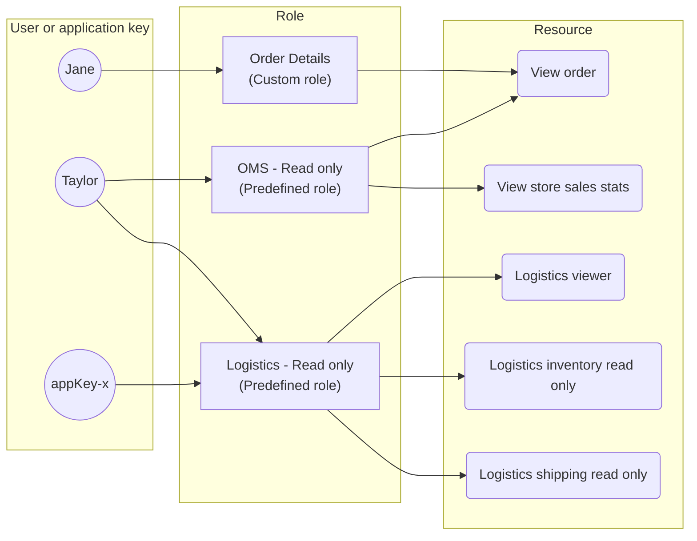

This guide provides an overview of the robust security measures implemented at VTEX. In the following sections, discover how our platform handles authentication, access control, logging, protection against attacks, and incident response. We also introduce our security certifications and [VTEX Shield](#vtex-shield), an add-on solution designed to further enhance store protection.

## Certifications

VTEX regularly audits its Information Security controls through independent professionals to ensure transparency and excellence in its practices. This external validation aligns policies and procedures with security standards and strengthens trust with customers and partners.

At the application layer, VTEX has the following accreditations:

* SOC 1 – Type 2: Reports covering internal controls over financial reporting systems
* SOC 2 – Type 2: Reports covering Security, Availability, Integrity, Confidentiality, and Privacy
* PCI – Validation of controls around cardholder data to reduce credit card fraud

See [Our Certifications](https://vtex.com/us-en/compliance/certifications) for more details.

At the data storage layer, AWS has several certifications for its data centers, including ISO 27001, FedRAMP authorization, PCI certification and SOC reporting. For more information on AWS's commitment to data protection go to [Data Protection and Privacy at AWS](https://aws.amazon.com/compliance/data-protection/?nc1=h_ls).

## Authentication

To access information within a VTEX account, authentication is required, along with the [necessary permissions](#authorization-and-access-control). The authentication flow ensures verified and authorized access by requiring valid credentials in the following scenarios:

* [Logging in to the VTEX Admin or to the store website](https://help.vtex.com/en/tutorial/authentication--21CkKHLKP1o41lUpGhuRUs#login)
* [Developing apps or integrations](https://developers.vtex.com/docs/guides/authentication)

By default, VTEX adopts logical segregation for each account's data, isolating it from other accounts. This means there is no integrated method for accessing data that crosses account boundaries, even for internal VTEX use. For more details, refer to the [Logical separation](https://developers.vtex.com/docs/guides/cloud-infrastructure#logical-separation) section of our [Cloud infrastructure](https://developers.vtex.com/docs/guides/cloud-infrastructure) guide.

### Two-factor authentication

Two-factor authentication (2FA) is mandatory for users to access VTEX Admin with email and password. There are two options for two-factor authentication:

* Using a key that's generated by an authentication app.
* Using a key sent by SMS.

If an Admin user has not set up 2FA yet, when they try to access the Admin using their email and password, a prompt that requires 2FA configuration is displayed.

This requirement only applies to email and password logins, not to other login methods such as Google, Facebook, or access code. Learn more at [Enabling two-factor authentication login](https://help.vtex.com/en/tutorial/enabling-2-factor-authentication-login--4Ae1fcQi12g8u4SkQKCqWQ).

### Password rules

VTEX Admin and store passwords have the following requirements:

* Minimum length of 8 characters.
* 6-digit MFA (Multi-factor authentication) token.
* Minimum of 1 uppercase character.
* Minimum of 1 digit.
* Minimum of 1 special character.
* It is not possible to repeat the last 4 passwords used.

Merchants can choose to [enforce password expiration](https://help.vtex.com/en/tutorial/authentication--21CkKHLKP1o41lUpGhuRUs#enforcing-password-expiration-for-admin-users) after a specific period for Admin users, which can be 15, 30, or 90 days.

Merchants can also choose to integrate an external identity provider, allowing them to define their own customized password policies. See [Login integrations](#login-integrations) for more information.

In the event of account lockouts due to multiple incorrect password attempts, legitimate users can still log in using other methods, such as receiving a token via email or using an [integrated social login](https://help.vtex.com/en/tutorial/configuring-login-with-facebook-and-google--tutorials_513) (Google or Facebook), thus avoiding possible brute force exploits of weak passwords.

### Login integrations

Native login integrations are available for Facebook (webstore) and Google (webstore and VTEX Admin). Learn more in the [Configuring login with Facebook and Google](https://help.vtex.com/en/tutorial/configuring-login-with-facebook-and-google--tutorials_513) documentation.

[Single sign-on (SSO)](https://developers.vtex.com/docs/guides/login-integration-guide) is supported with integration options for external identity providers on both the Admin and store website.

The Admin utilizes the [SAML 2.0 authentication protocol](https://developers.vtex.com/docs/guides/login-integration-guide-admin-saml2), enabling VTEX customers to integrate existing identity providers that support this standard. For the store website, integration with external identity providers is accomplished using the [OAuth 2.0 protocol](https://developers.vtex.com/docs/guides/login-integration-guide-webstore-oauth2).

## Authorization and access control

VTEX efficiently manages logical access, ensuring precise control and monitoring of access permissions for systems and data. Our practices adhere to security policies, including measures like the principle of least privilege and segregation of duties. Users are granted access only to what is strictly necessary for their roles, reducing the risk of exposing sensitive information and bolstering the security of systems and data.

### Roles and permissions

Every interaction with our platform, whether it is accessing a page in the Admin or making an API call, involves a request to our infrastructure. **License Manager** is the system that ensures the security of these operations, by verifying that a user or application key has the necessary permissions to perform actions on the platform. To simplify permission management, it is based on **roles** and **resources**.

A resource is an entity associated with an action or information within our infrastructure. For example, the _View order_ resource allows a user to view the Order details page in the Orders module. For details on each available resource, see [License Manager resources](https://help.vtex.com/en/tutorial/license-manager-resources--3q6ztrC8YynQf6rdc6euk3).

A [role](https://help.vtex.com/en/tutorial/roles--7HKK5Uau2H6wxE1rH5oRbc) determines the set of resources that a group of users can access on VTEX. Each administrative user can be associated with one or more roles. When creating a new role, you have the option of using one of the [predefined roles](https://help.vtex.com/en/tutorial/predefined-roles--jGDurZKJHvHJS13LnO7Dy) provided by VTEX or of [creating a customized one](https://help.vtex.com/en/tutorial/roles--7HKK5Uau2H6wxE1rH5oRbc) by selecting each required resource.

See below an example access control structure:

Learn more about how to effectively manage user roles and permissions at [Best practices for secure user management](https://help.vtex.com/faq/security-measures-for-creating-a-store-user-profiles--15YDwC9jGgqWi3rvcDaiGM).

## Logs

All operations on the platform are automatically logged. Platform errors are logged in SIEM (Security Information and Event Management) software, accessible to the VTEX team for product analysis and improvement purposes.

VTEX actively monitors application and infrastructure logs for patterns indicative of potential security risks, issuing alerts and implementing countermeasures upon detection. To maintain the privacy and security of our customers and ensure compliance with regulations, VTEX does not grant access to its internal systems.

For merchant access, our services record various operations, including their authors and timestamps, in [Audit](https://help.vtex.com/en/tutorial/searching-for-events-on-audit--5RXf9WJ5YLFBcS8q8KcxTA), a tool available in the VTEX Admin for searching and investigating store history using filters.

Explore the [list of events available in Audit](https://help.vtex.com/en/tutorial/events-available-in-audit--6r1Mzcu5NmkmmDLJlz9CCZ). If necessary, merchants can also request specific event logs from [Support](https://help.vtex.com/en/support).

## Protection against attacks

VTEX uses a comprehensive approach to mitigate ransomware attacks, employing measures such as advanced antivirus, firewalls, and content filters to block malware. Our platform includes protection against DDoS (Distributed Denial of Service) attacks and other threats. Learn more at our [Security FAQ](https://help.vtex.com/en/tutorial/risk-assessment--4K97IpqkpCpDYsZOSxtfkX).

We maintain regular backups of critical data, ensuring the ability to restore information without having to accept criminal demands. Security updates and awareness training for employees are priorities, along with constant monitoring of activities for suspicious behavior. These measures combined form a robust defense against the growing threat of ransomware.

### Web Application Firewall (WAF)

In addition to the standard protection measures implemented by VTEX, customers have the option of reinforcing the security of their stores by hiring a Web Application Firewall (WAF), through [VTEX Shield](#vtex-shield). The WAF offers an additional layer of protection, helping to filter and block malicious traffic before it reaches the store.

### Secure Socket Layer (SSL)

Secure Socket Layer (SSL) is a protocol designed to increase the security of data transmitted over the internet. SSL connections are particularly recommended for sending information such as credit card numbers, passwords and any other sensitive information over the internet.

VTEX generates an SSL certificate for your store and guarantees its automatic renewal – there is no need to request the purchase of an SSL certificate for the store. The certificate is issued via [Let's Encrypt](https://letsencrypt.org/) and its creation is VTEX's responsibility at the time of the store's go-live. Find out more at [Security certificate (SSL)](https://help.vtex.com/pt/tutorial/security-certificate-ssl--tutorials_1308).

## Penetration tests and vulnerability reports

Our Security team regularly performs vulnerability checks, including recurring scans and penetration tests. Merchants interested in conducting penetration tests on their stores must contract [VTEX Shield](https://help.vtex.com/en/tutorial/vtex-shield--2CVk6H9eY2CBtHjtDI7BFh) and follow the procedures outlined in the [Penetration tests and vulnerability notifications](https://help.vtex.com/en/tutorial/penetration-testing-and-vulnerability-notice--6jodF6s1I50Fg84ZwutOCb) guide.

Merchants are encouraged to share the pentest reports and vulnerability notifications with VTEX, allowing our Security team to promptly address any potential issues identified.

While VTEX Shield is mandatory for conducting penetration tests and sharing their results with our Security team, reporting vulnerabilities does not require VTEX Shield. Vulnerabilities will be assessed as long as they are reported in accordance with the procedures stated on [Reporting vulnerabilities](https://help.vtex.com/en/tutorial/penetration-testing-and-vulnerability-notice--6jodF6s1I50Fg84ZwutOCb#reporting-vulnerabilities).

## Security incident response

VTEX has a formalized protocol for Security Incident Response, covering the essential stages of the process: Preparation, Incident Identification, Containment, Eradication, Recovery and Post-Incident. This procedure also includes an integrated communication plan that is applied at all stages of the response. Learn more at our [Security Practices](https://vtex.com/us-en/security/security-practices/) document.

### Disaster Recovery Plan

VTEX has a Disaster Recovery plan focused on ensuring operational continuity and the availability of critical resources in emergency situations. This plan is tested at least once a year to ensure its effectiveness. It covers detailed guidelines on how to act in the face of unplanned incidents, characterized as crises, which can arise from natural disasters, cyber attacks or any other disruptive events.

We incorporate crucial recovery steps, including defining our standard RPO (Recovery Point Objective) and RTO (Recovery Time Objective) objectives, as well as carrying out backup tests, ensuring the plan's effectiveness and readiness in real scenarios.

Learn more about our standard RPO and RTO at the [Security FAQ](https://help.vtex.com/en/tutorial/risk-assessment--4K97IpqkpCpDYsZOSxtfkX) – you must have access to an account’s Admin to view this information.

### Business Continuity Plan

With a Business Continuity Plan, we address challenges from emergencies, ensuring a smooth transition and minimizing impacts. This plan establishes a solid foundation for the rapid and effective resumption of normal operations, regardless of the nature of the emergency. Learn more at our [Security Practices](https://vtex.com/us-en/security/security-practices/) document.

## VTEX Shield

[VTEX Shield](https://help.vtex.com/en/tutorial/vtex-shield--2CVk6H9eY2CBtHjtDI7BFh) is an add-on product that offers supplementary, customizable protection layers for stores that prioritize platform resilience and the security standards guaranteed by VTEX's existing security [certifications and practices](https://vtex.com/br-pt/security/security-practices/).

When requesting VTEX Shield, you can choose from the following features:

* [Security Monitor](https://help.vtex.com/en/tutorial/vtex-shield--2CVk6H9eY2CBtHjtDI7BFh#security-monitor)
* [Penetration tests](https://help.vtex.com/en/tutorial/vtex-shield--2CVk6H9eY2CBtHjtDI7BFh#penetration-tests)
* [Web Application Firewall (WAF)](https://help.vtex.com/en/tutorial/vtex-shield--2CVk6H9eY2CBtHjtDI7BFh#web-application-firewall-waf)

>ℹ If you are already a VTEX customer and want to adopt VTEX Shield for your business, please contact [Commercial Support](https://help.vtex.com/en/tracks/support-at-vtex--4AXsGdGHqExp9ZkiNq9eMy/3KQWGgkPOwbFTPfBxL7YwZ). Additional fees may apply. If you are not yet a customer but are interested in this solution, please complete our [contact form](https://vtex.com/us-en/contact/).
