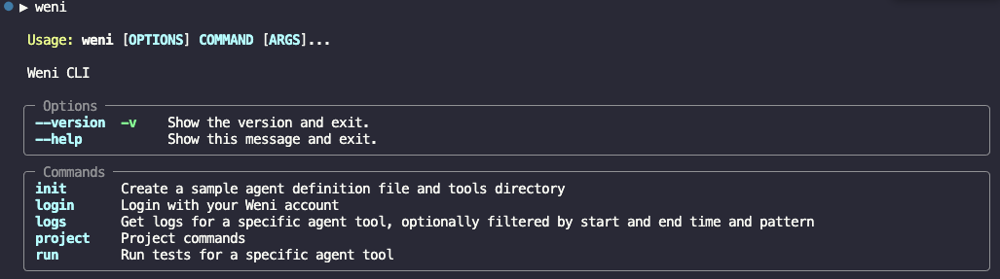

Weni by VTEX CLI is a solution that helps you improve your customer service by using personalized AI-powered agents. This command-line tool simplifies the creation and management of multiple AI agents. Integrated with the Weni platform, it enables the development and deployment of high-performance agents across various communication channels, such as WhatsApp, Instagram, Facebook, and more.

With the CLI, you can:
- Create, deploy, and manage multiple AI agents
- Add custom tools to the agents
- Update agent configuration and behavior

> ⚠️ To use the Weni by VTEX CLI, you must have: a Weni Platform account; an account at [weni.ai](https://weni.ai/en); and at least one project in your account.

The content is organized as follows:
- [Installing the CLI](#installing-the-cli)
- 

## Installing the CLI

There are two installation methods:

- A [quick installation](#install-via-pip) with `pip`.
- A [manual installation](#install-via-poetry) with `Poetry`, for development purposes.

#### Install via pip

To install the CLI using `pip`, open the terminal and run the following command:

```bash
pip install weni-cli
```

#### Install via Poetry

To install the CLI manually, follow these steps:

1. Clone the repository by running the following command:

```bash
git clone https://github.com/weni-ai/weni-cli.git
cd weni-cli
```

2. Install dependencies and make the CLI executable by running the following command:

```bash
poetry shell
poetry install
```

### Verifying Installation

To verify that Weni CLI is installed, type the following command in your terminal:

```bash
weni
```

If the installation was successful, your terminal should display something like this:



## Troubleshooting

If you encounter any issues:

1. Check our [GitHub Issues](https://github.com/weni-ai/weni-cli/issues)
2. Create a new issue with:
   - Your operating system
   - Python version (`python --version`)
   - Error message
   - Steps to reproduce

#### Getting Started

To start your first agent, follow the steps below:

1. Open the terminal and run the following command:

```bash
weni login
```

This should open your browser on the login page for authentication. If that does not happen, you can open the URL shown in the terminal.

2. Log in using your Weni by VTEX account and password.
3. List your projects by running the following command:

```bash
weni project list
```

This will show all projects you have access to and, next to each of them, its universally unique identifier (UUID).

4. Select the project you want to work on by running the following command:

```bash
weni project use your-project-uuid
```

Replace `your-project-uuid` with the UUID from the project list.

5. To verify you're working on the correct project, you can run the following command:

```bash
weni project current
```

You will see the project's UUID in the terminal output.

6. To create an agent, run the following command:

```bash
weni init
```

This will create the necessary folder structure and set up a pre-built CEP tool.

7. Create a file named `agent_definition.yaml` with your agent configuration:

```bash
agents:
  sample_agent:
    name: "CEP Agent"
    description: "Weni's CEP agent"
    instructions:
      - "You are an expert in providing addresses to the user based on a postal code provided by the user"
      - "The user will send a ZIP code (postal code) and you must provide the address for this code."
    guardrails:
      - "Don't talk about politics, religion, or any other sensitive topic. Keep it neutral."
    tools:
      - get_address:
          name: "Get Address"
          source: 
            path: "tools/get_address"
            entrypoint: "main.GetAddress"
          description: "Function to get the address from the postal code"
          parameters:
            - cep:
                description: "postal code"
                type: "string"
                required: true
```
