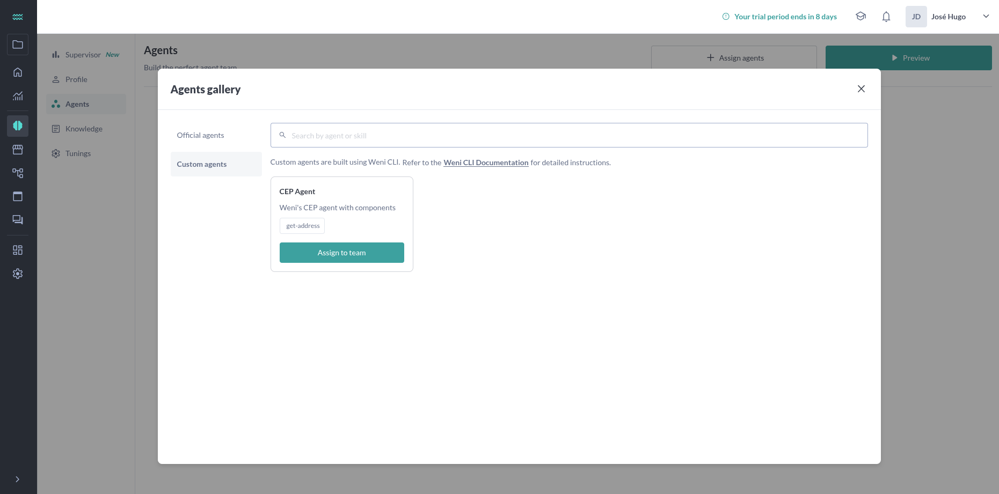
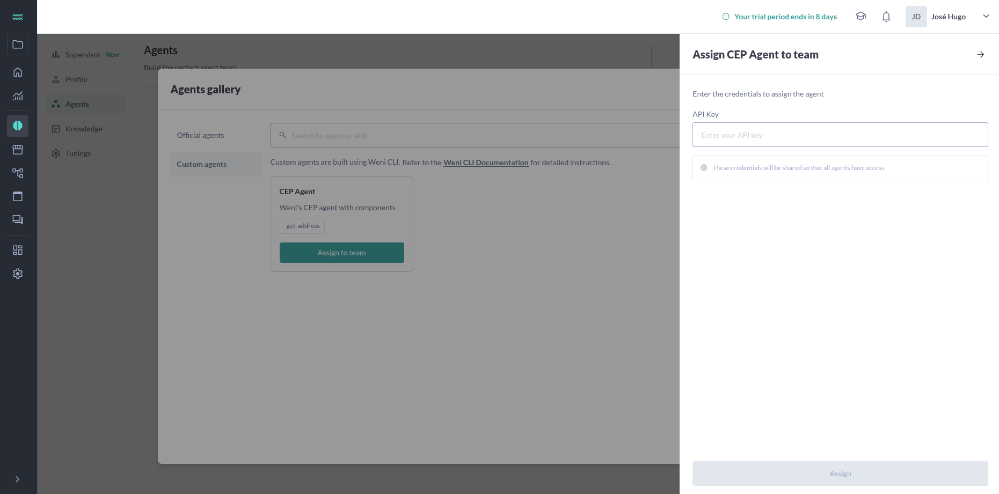

This article contains the core concepts of the Weni by VTEX CLI.

- [Active Agents](#active-agents)
- [Passive Agents](#passive-agents)
- [Contact Fields](#contact-fields)
- [Credentials](#credentials)
- [Tools](#tools)

## Active Agents

### Overview

Active Agents are designed to proactively engage based on predefined rules and conditions. Unlike Passive Agents, which primarily react to user input, Active Agents can initiate actions or communications when specific criteria are met, often triggered by changes in data or system events.

The command to deploy an Active Agent remains the same:
`weni project push agent_definition.yaml`

However, the structure of the `agent_definition.yaml` is different to accommodate the rule-based behavior and pre-processing capabilities.

### Creating an Active Agent

An Active Agent is also defined using a YAML file. Here's an example of the structure for an Active Agent:

```yaml title="agent_definition.yaml"
agents:
  my_agent:
    name: "Status do Pedido"
    description: "Agente de exemplo"
    rules:
      status_aprovado:
        display_name: "Status Aprovado"
        template: "template_status_aprovado"
        start_condition: "Quando o status estiver 'aprovado'"
        source:
          entrypoint: "main.StatusAprovado"
          path: "rules/status_aprovado"
      status_invoiced:
        display_name: "Status Invoiced"
        template: "template_status_invoiced"
        start_condition: "Quando o status estiver 'invoiced'"
        source:
          entrypoint: "main.StatusInvoiced"
          path: "rules/status_invoiced"
    pre_processing:
      source:
        entrypoint: "processing.PreProcessor"
        path: "pre_processors/processor"
      result_examples_file: "result_example.json"
```

#### YAML Elements

Below are the key elements specific to or different for Active Agent definitions:

`agents.<agent_id>`: The unique identifier for your agent.

`name`: The display name of your agent.

> Limit: Can have up to 55 characters.

`description`: A description of the agent's purpose and capabilities.

`rules`: A dictionary defining the rules that trigger the agent's actions. Each key within `rules` is a unique rule ID.

- `rules.<rule_id>.display_name`: The human-readable name for the rule.
- `rules.<rule_id>.template`: The template to be used when this rule is triggered. (Further details on templates might be needed here or in a separate section).
- `rules.<rule_id>.start_condition`: A description of the condition that must be met for this rule to activate.
- `rules.<rule_id>.source`: Defines the code to be executed when the rule is triggered.
  -`entrypoint`: The specific class and method (e.g., `main.StatusAprovado`) that will be executed.
  - `path`: The directory path where the rule's code is located (e.g., `rules/status_aprovado`).

`pre_processing`: Defines a pre-processing step that can transform or prepare data before rules are evaluated.
  - `pre_processing.source`: Defines the code for the pre-processing logic.
    -`entrypoint`: The class and method for pre-processing (e.g., `processing.PreProcessor`).
    - `path`: The directory path for the pre-processing code (e.g., `pre_processors/processor`).
  - `pre_processing.result_examples_file`: Required. Path to a JSON file containing examples of the data output from pre-processing. The format is an array of objects.

#### Result Example JSON Format

The `result_example.json` file should follow this structure:

```json title="result_example.json"
[
    {
        "urn": "<identifier_for_contact>",
        "data": {
            "key1": "value1",
            "key2": "value2"
            // ... other data fields relevant to the example
        }
    },
    {
        "urn": "<another_contact_identifier>",
        "data": {
            "fieldA": "dataA",
            "fieldB": "dataB"
        }
    }
    // ... more examples
]
```

Each object in the array represents a test case or an example scenario.

- `urn`: A unique identifier for the contact (e.g., a phone number, user ID).
- `data`: An object containing the data relevant to this specific example. The structure of this `data` object will depend on your agent's specific needs and the information it processes.

### Basic Structure

The project structure for an Active Agent might look like this, incorporating rules and pre-processing logic:

```
your-project-name/
├── rules/
│   ├── status_aprovado/
│   │   └── main.py
│   │   └── requirements.txt
│   └── status_invoiced/
│       └── main.py
│       └── requirements.txt
├── pre_processors/
│   └── processor/
│       └── processing.py
│       └── requirements.txt
├── agent_definition.yaml
└── result_example.json 
```

This structure helps organize the different components of your Active Agent.

## Passive Agents

This page describes Passive Agents, which are AI-powered workers designed to operate autonomously by reacting to user input or specific triggers within a defined context.

### Overview

Passive Agents are AI-powered workers designed to operate autonomously within specific contexts, using generative AI to make decisions based on specified problems. In the context of Weni by VTEX CLI, these agents are specifically optimized for customer service operations, serving as the frontline communication interface between companies and their customers by responding to inquiries and executing tasks based on their configured skills.

Key features:

- [x] Autonomous decision-making capabilities
- [x] Context-specific operations
- [x] Built-in generative AI processing
- [x] Customer service optimization

With Weni by VTEX CLI, you can define and deploy multiple agents that work together to solve real-world problems with precision, quality, and security. These agents can be equipped with various tools that enable them to interact with the external world within defined boundaries.

### Creating a Passive Agent

A Passive Agent consists of an agent definition. In Weni by VTEX CLI, this definition is made using a YAML file, where you can specify its behavior, instructions, and skills.

Here is an example of how you can define your agent in a YAML file:

``` yaml title="agent_definition.yaml"
agents:
  cep_agent:
    name: "CEP Agent"
    description: "Weni's CEP agent"
    instructions:
      - "You are an expert in providing addresses to the user based on a postal code provided by the user"
      - "The user will send a ZIP code (postal code) and you must provide the address corresponding to this code."
    guardrails:
      - "Don't talk about politics, religion or any other sensitive topic. Keep it neutral."
    tools:
      - get_address:
          name: "Get Address"
          source: 
            path: "tools/get_address"
            entrypoint: "main.GetAddress"
            path_test: "test_definition.yaml"
          description: "Function to get the address from the postal code"
          parameters:
            - cep:
                description: "postal code of a place"
                type: "string"
                required: true
                contact_field: true
```

#### YAML Elements

=== "Agent"

    `Name`

    :   The name of your agent that will be displayed in the Weni by VTEX Platform.  
        **Limit**: :octicons-alert-24: Maximum of 55 characters

    `Credentials`

    :   The credentials used in the tools you define for your agent. For more detailed information about this definition, see [Credentials](./credentials.md).

    `Description`

    :   Important information about your agent, where you can describe its purpose, capabilities, and other relevant details.

    `Instructions`

    :   Here you can define rules and guidelines that your agent should follow.  
        **Limit**: :octicons-alert-24: Minimum of 40 characters.

    `Guardrails`

    :   You can list boundaries and limitations for your agent, such as topics it should not discuss.  
        **Limit**: :octicons-alert-24: Minimum of 40 characters.

=== "Tool"

    `Name`

    :   The name of the tool that will be associated with the agent in the Weni by VTEX Platform.  
        **Limit**: :octicons-alert-24: Maximum of 40 characters

    `Source`

    :   The location or path where the tool can be found. It contains three important elements:
        
        - `path`: The directory path where your tool's code is located. This is typically a relative path from the root of your project.
        
        - `entrypoint`: The specific class that will be executed when the tool is called. It follows the format "file_name.ClassName". You can see a practical example of the tool implementation for this entrypoint in the [example](/core-concepts/tools) page, where the GetAddress class from this example is implemented.
        
        - `path_test`: The location of the test file for your tool, which contains test cases to validate the tool's functionality.

    `Description`

    :   Information about the tool, including its purpose and objectives.

    `Parameters`

    :   The parameters or variables used in your agent's tool.
        
        - `description`: A clear explanation of what the parameter is used for and what kind of data it expects.
        
        - `type`: The data type of the parameter (one of: string, number, integer, boolean, array).
        
        - `required`: A boolean value (true/false) indicating whether the parameter must be provided for the tool to function properly. If set to true, the agent will ask the user for this information if it's not available before proceeding with the request.
        
        - `contact_field`: Specifies if the parameter should be stored as a contact field in the user's profile for future reference. If set to true, the respective parameter will become information that persists for the user integrated with the Weni by VTEX Platform. This brings benefits to the user experience because in future interactions, your agent may not need to request this information from the user again. Read more about contact fields in [Contact Fields](./contact-fields.md).

### Basic Structure

The basic structure of your project should consist of your agent definition written in YAML and your agent's tools organized into directories. It is not mandatory to organize your tools in a 'tools' directory, but it is highly recommended as a best practice.

Based on the definition example below:

``` yaml title="agent_definition.yaml"
agents:
  cep_agent:
    name: "CEP Agent"
    description: "Weni's CEP agent"
    instructions:
      - "You are an expert in providing addresses to the user based on a postal code provided by the user"
      - "The user will send a ZIP code (postal code) and you must provide the address corresponding to this code."
    guardrails:
      - "Don't talk about politics, religion or any other sensitive topic. Keep it neutral."
    tools:
      - get_address:
          name: "Get Address"
          source: 
            path: "tools/get_address"
            entrypoint: "main.GetAddress"
            path_test: "test_definition.yaml"
          description: "Function to get the address from the postal code"
          parameters:
            - cep:
                description: "postal code of a place"
                type: "string"
                required: true
                contact_field: true
```

Your project should have the following structure:

```
your-project-name/
├── tools/
│   ├── get_address/main.py
└── agent_definition.yaml
```

## Contact Fields

### Overview

Contact fields are persistent information about contacts who interact with your agents. By enabling contact fields in your tools, you elevate the user experience to a new level, as your agents can interact with the Weni by VTEX Platform to accurately obtain information about the contact.

### How Contact Fields Work

When you mark a parameter as a contact field in your tool definition, that information becomes persistent in the user's profile within the Weni by VTEXPlatform. This creates several advantages:

1. **Improved User Experience**: Users don't need to repeatedly provide the same information in future interactions
2. **Personalized Interactions**: Agents can address users with personalized information from previous conversations
3. **Streamlined Conversations**: Reduces the number of questions agents need to ask, making interactions more efficient

### Implementing Contact Fields

To implement a contact field in your tool, you need to set the `contact_field` parameter to `true` in your agent definition YAML file:

```yaml
parameters:
  - tool_parameter:
      description: "User's full name"
      type: "string"
      required: true
      contact_field: true
```

When this parameter is processed during a conversation, the information provided by the user will be:

- [x] Stored in the Weni by VTEX Platform associated with that specific contact
- [x] Available for retrieval and update in future interactions
- [x] Accessible to all agents that have permission to view this contact field

### Best Practices

When implementing contact fields, consider the following best practices:

- **Only store relevant information**: Not every parameter is necessarily a contact field; focus on information that will be useful in future interactions. Consider whether the parameter contains information important enough to be persisted for the contact.
- **Use descriptive parameter names**: This helps maintain organization when multiple contact fields are in use
- **Validate data before storing**: Ensure the information is in the correct format before saving it as a contact field

### Example Use Cases

Contact fields are particularly useful for:

- **Personal information**: Names, addresses, preferences
- **Account details**: Customer IDs, subscription types
- **Context-specific data**: Preferred language, communication preferences
- **Historical information**: Previous purchases, service history

By effectively utilizing contact fields, you can create more intelligent, context-aware agents that provide a seamless experience for your users.

## Credentials

Credentials are confidential information that your agents can use when invoking a specific tool. To fully understand how to incorporate credentials into your agents, we recommend reading this entire content and the following complementary resources: [Agents](./agents.md) and [tools](./tools.md).

Credentials are extremely important at two stages of your agents' development cycle:

- [x] For local testing of tools during development
- [x] For your agent to be used in production on channels integrated with the Weni by VTEX platform, such as WhatsApp or any other

### Credential Structure

In your agent definition file (YAML), credentials are defined in the `credentials` section and follow this structure:

```yaml
agents:
  my_agent:
    credentials:
      API_KEY:
        label: "API Key"
        placeholder: "your-api-key-here"
        is_confidential: true
      API_SECRET:
        label: "API Secret"
        placeholder: "your-api-secret-here"
      BASE_URL:
        label: "Base URL"
        placeholder: "https://api.example.com"
        is_confidential: false
```

Each credential has the following attributes:

- **label**: Human-readable name that will be displayed in the Weni by VTEX Platform interface
- **placeholder**: Example text or hint about what should be entered
- **is_confidential**: Indicates whether the credential contains sensitive information (defaults to `true` if not specified)

### Credentials in Production Environment

When your agent is deployed on the Weni by VTEX Platform, credentials are securely managed by the system. This ensures that sensitive information, such as API keys and access tokens, is stored and transmitted securely.

#### How to Configure Credentials for Production

1. **Define credentials in the YAML file**: Specify all necessary credentials in the `credentials` section of your agent definition file.

2. **Deploy your agent**: When pushing your agent to the Weni by VTEX Platform using the CLI, the system will automatically detect the credentials defined in your YAML file.

3. **Configure values in the interface**: Administrators will be able to configure the actual credential values through the Weni by VTEX Platform interface, without needing to modify the code.

4. **Associate credentials with tools**: Ensure that each tool that needs credentials is correctly configured to access them through the `context.credentials` object.

> **Note**: When you assign your agent in the Weni by VTEX Platform, the credentials defined in your YAML file will be displayed in the interface for configuration. For example, if you have the following agent definition:
> 
> ```yaml
> agents:
>     cep_agent:
>         credentials:
>             api_key:
>                 label: "API Key"
>                 placeholder: "Enter your API key"
>         name: "CEP Agent"
>         description: "Weni's CEP agent with components"
>         instructions:
>         - "You are an expert in providing addresses to the user based on a postal code provided by the user"
>         - "The user will send a ZIP code (postal code) and you must provide the address corresponding to this code."
>         guardrails:
>         - "Don't talk about politics, religion or any other sensitive topic. Keep it neutral."
>         tools:
>         - get_address:
>             name: "Get Address"
>             source:
>                 path: "tools/get_address"
>                 entrypoint: "main.GetAddress"
>                 path_test: "test_definition.yaml"
>             description: "Function to get the address from the postal code"
>             parameters:
>                 - cep:
>                     description: "postal code of a place"
>                     type: "string"
>                     required: true
>                     contact_field: true
> ```
> 
> After running the command `weni project push agent_definition.yaml` to upload your agent to your project on the Weni by VTEX Platform, you'll find your agent in the Agent Builder gallery. When you select and assign this agent, you'll be prompted to enter the actual values for the credentials you defined (in this case, the API Key).


> 

> Enter you credentials:

> 

#### Security in Production

In the Weni by VTEX Platform, credentials are:

- Stored in encrypted form
- Never exposed in logs or user interfaces

### Credentials for Local Testing

During development and local testing of your tools, you'll need to provide credentials for your tools to work correctly without depending on the Weni by VTEX Platform infrastructure.

#### Configuring Credentials for Local Development

For local testing, the CLI reads a `.env` file located in the tool's `source.path` directory. Define the same credential names that are declared in your agent definition. This mirrors how credentials are injected in production.

For example, if your CEP Agent definition has the following credentials:

```yaml
agents:
  cep_agent:
    credentials:
      api_key:
        label: "API Key"
        placeholder: "Enter your API key"
    # Rest of the agent definition...
```

Create a `.env` file inside the tool folder (e.g. `tools/get_address/.env`) with:

```
api_key=your-development-api-key
```

## Tools

### What Are Tools?

Tools are powerful tools available to your agent that enable it to interact with the external environment and the real world. Think of tools as superpowers for your agent - you can create virtually any capability your agent needs by writing Python code that implements your specific business logic!

### Why Tools Matter

Tools transform your agent from a simple conversational interface into a powerful tool that can:

- Fetch real-time data from external APIs
- Perform complex calculations and data processing
- Interact with databases and storage systems
- Execute custom business logic specific to your needs
- Integrate with third-party services and platforms
- Automate tasks and workflows

### Using Tools in Your Agent

Once you've created a tool, you can relate it to your agent by defining it in your agent's YAML configuration file, as demonstrated in the [Agents](./agents.md) documentation page. The agent will automatically detect when to use the tool based on the context of the conversation.

By creating custom tools, you can extend your agent's capabilities to handle specific tasks relevant to your use case, making your agent truly tailored to your business needs.

### Tool Example: Address Lookup

Here's an example of a tool that allows an agent to interact with the real world to precisely obtain information about a postal code (CEP in Brazil):

```python
from weni import Tool
from weni.context import Context
from weni.responses import TextResponse
import requests

class GetAddress(Tool):
    def execute(self, context: Context) -> TextResponse:
        
        cep = context.parameters.get("cep", "")

        print(cep)

        address_response = self.get_address_by_cep(cep=cep)

        print(address_response)

        return TextResponse(data=address_response)
    
    def get_address_by_cep(self, cep):
        url = f"https://viacep.com.br/ws/{cep}/json/"
        
        response = requests.get(url)
        
        return response.json()
```

### Code Explanation

=== "For Beginners"

    If you're new to programming, here's a simpler explanation of what this code does:

    1. **Imports**: First, we bring in the tools we need:
       - `Tool`: The base class that gives our tool its core functionality
       - `Context`: Holds information about the conversation
       - `TextResponse`: Helps us send text back to the user
       - `requests`: A tool that lets us get information from websites

    2. **Class Definition**: We create a new tool called `GetAddress` that can look up addresses.

    3. **Execute Method**: This is the main part that runs when someone uses the tool:
       - It gets the postal code (CEP) that the user provided
       - It prints the CEP to help with debugging
       - It calls another function to find the address for that CEP
       - It returns the address information to the user

    4. **Helper Method**: The `get_address_by_cep` function:
       - Takes a postal code as input
       - Creates a web address (URL) to look up that postal code
       - Sends a request to a website that knows about addresses
       - Gets back information about the address and returns it

    Think of this tool like a helper that knows how to look up addresses in a phone book when you give it a postal code!

=== "For Experienced Developers"

    For those familiar with Python and API development:

    1. **Imports**: We import the necessary Weni by VTEX framework classes (`Tool`, `Context`, `TextResponse`) and the `requests` library for HTTP operations.

    2. **Class Definition**: We define a `GetAddress` class that inherits from the base `Tool` class, which provides the framework integration.

    3. **Execute Method**: This is the entry point that the Weni by VTEX framework calls:
       - It extracts the "cep" parameter from the context object using a get() with a default empty string
       - It includes debug print statements for logging
       - It delegates the actual API call to a separate method for better separation of concerns
       - It returns a `TextResponse` object with the JSON data from the API

    4. **Helper Method**: The `get_address_by_cep` method:
       - Constructs the ViaCEP API endpoint URL with string interpolation
       - Makes a GET request to the external API
       - Returns the parsed JSON response directly
       - Note that this implementation is minimal and lacks error handling for production use

    This implementation follows a simple separation of concerns pattern but could be enhanced with error handling, input validation, response formatting, and proper logging for production use.

### Creating Your Own Tools

To create your own tool:

1. **Define Your Tool Class**: Create a new Python class that inherits from `Tool`
2. **Implement the Execute Method**: Override the `execute(self, context: Context)` method with your business logic
3. **Add Helper Methods**: Separate concerns by breaking down complex logic into helper methods
4. **Implement Error Handling**: Add robust error handling for API calls, data processing, and edge cases
5. **Add Logging**: Include appropriate logging for monitoring and debugging
6. **Write Tests**: Create comprehensive test cases using the test file specified in `path_test`
7. **Configure Your Tool**: Add your tool to your agent's YAML configuration with appropriate parameters and any credentials required by your tool.

### Tools with Credentials

When your tool needs to interact with external services that require authentication, you'll need to use credentials or secrets. The Weni by VTEX framework provides a secure way to manage these credentials through the `Context` object.

#### How to Access Credentials

Credentials are accessed through the `Context` object that is passed to your tool's `execute` method. This ensures that sensitive information is handled securely and isn't hardcoded in your tool's code.

Here's an example of how to modify our `GetAddress` tool to use credentials for an API that requires authentication:

```python
from weni import Tool
from weni.context import Context
from weni.responses import TextResponse
import requests

class GetAddressWithAuth(Tool):
    def execute(self, context: Context) -> TextResponse:
        cep = context.parameters.get("cep", "")
        
        api_key = context.credentials.get("api_key")
        
        address_response = self.get_address_by_cep(cep=cep, api_key=api_key)
        
        return TextResponse(data=address_response)
    
    def get_address_by_cep(self, cep, api_key):
        url = f"https://viacep.com.br/ws/{cep}/json/"
        
        headers = {
            "Authorization": f"Bearer {api_key}"
        }
        
        response = requests.get(url, headers=headers)
        
        return response.json()
```

#### Configuring Credentials in Your Agent Definition

To make credentials available to your tool, you need to define them in your agent's YAML configuration file. Here's an example:

```yaml
agents:
  cep_agent:
   credentials:
      api_key:
        label: "API Key"
        placeholder: "Api Key"
    name: "CEP Agent"
    description: "Weni's CEP agent"
    instructions:
      - "You are an expert in providing addresses to the user based on a postal code provided by the user"
      - "The user will send a ZIP code (postal code) and you must provide the address corresponding to this code."
    guardrails:
      - "Don't talk about politics, religion or any other sensitive topic. Keep it neutral."
    tools:
      - get_address:
          name: "Get Address"
          source: 
            path: "tools/get_address"
            entrypoint: "main.GetAddressWithAuth"
            path_test: "test_definition.yaml"
          description: "Function to get the address from the postal code"
          parameters:
            - cep:
                description: "postal code of a place"
                type: "string"
                required: true
                contact_field: true
```

> **Highly Recommended**: For a comprehensive understanding of how credentials work in production environments and local testing, please read the [Credentials](./credentials.md) documentation page. This will help you properly manage sensitive information and understand the different approaches for development and production environments.

#### Best Practices for Handling Credentials

When working with credentials in your tools:

1. **Never hardcode credentials** in your tool's code.
2. **Always access credentials through the Context object**.
3. **Use environment variables** for local development and testing.
4. **Implement proper error handling** for cases where credentials might be missing or invalid.

By following these practices, you can create secure tools that interact with authenticated services while keeping sensitive information protected.

### Best Practices for Tools

When creating tools, follow these best practices:

- **Single Responsibility**: Each tool should have a clear, focused purpose
- **Comprehensive Error Handling**: Implement robust error handling for all external calls and edge cases
- **Input Validation**: Validate all input parameters before processing
- **Security Considerations**: Handle sensitive data appropriately and follow security best practices
- **Testability**: Design your tools to be easily testable with both unit and integration tests
- **Version Control**: Use a GitHub repository to version your tools, allowing you to track changes, collaborate with others, and easily roll back to previous versions if needed
