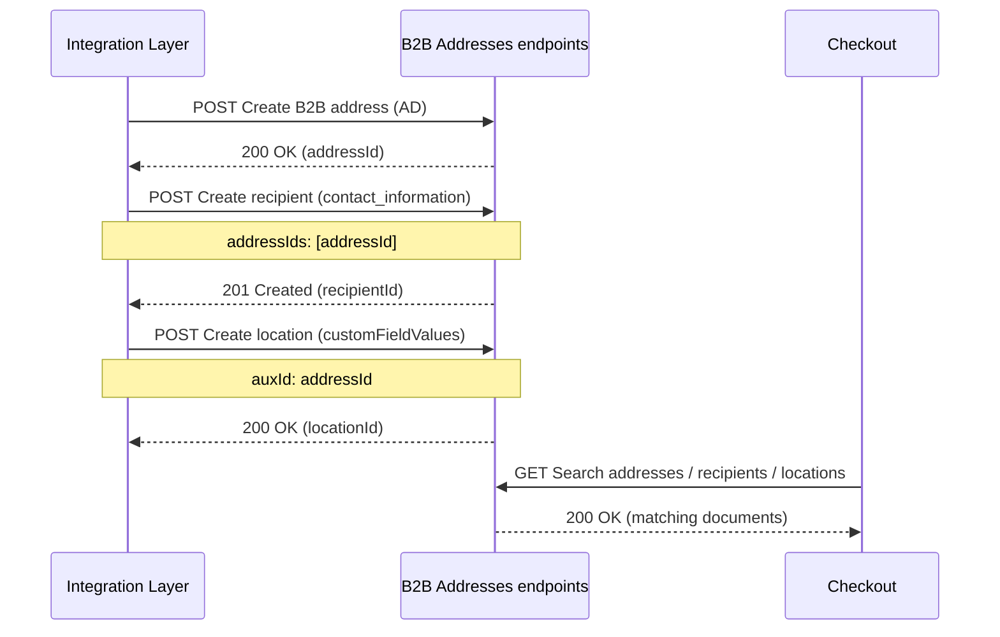

> ⚠️ This feature is only available for stores using B2B Buyer Portal, which is currently available to selected accounts.

The [B2B Addresses API](https://developers.vtex.com/docs/api-reference/b2b-addresses) allows you to provision and maintain the shipping and billing destinations used by buyer organizations during checkout and order fulfillment. It exposes three related entities, each backed by a different [Master Data](https://developers.vtex.com/docs/guides/master-data-introduction) data entity:

| Entity | Data entity | Master Data version | Description |
| :---- | :---- | :---- | :---- |
| **Addresses** | `AD` | [v1](https://developers.vtex.com/docs/api-reference/masterdata-api) | Shipping (`commercial`) and billing (`invoice`) locations tied to a buyer organization. |
| **Recipients** | `contact_information` | [v2](https://developers.vtex.com/docs/api-reference/master-data-api-v2) | People who can receive orders at one or more B2B addresses. |
| **Locations** | `customFieldValues` | [v2](https://developers.vtex.com/docs/api-reference/master-data-api-v2) | Specific delivery points within an address, such as a dock, department, or internal area. |

>ℹ️ Because the entities live in different Master Data versions, the available query syntax, pagination conventions, and metadata fields differ per entity. The relevant differences are highlighted in the integration notes for each entity below.

This guide focuses on how these entities relate and on the integration-level details (linking IDs, required setup, query constraints). For the full operation set, parameters, and payload schemas, see the [B2B Addresses API reference](https://developers.vtex.com/docs/api-reference/b2b-addresses).

## Before you begin

### Required features

- The store must have [B2B Buyer Portal](https://help.vtex.com/docs/tutorials/b2b-buyer-portal) enabled.
- The buyer organization and [organizational units](https://developers.vtex.com/docs/api-reference/organization-units-api) must already exist. Their IDs are required when creating addresses and locations.
- For locations, the underlying [custom checkout field setting](https://developers.vtex.com/docs/guides/custom-fields-integration) (`customFieldId`) must already be configured, which is the native behavior for B2B Buyer Portal.

## How it works

A typical end-to-end integration uses the API in three entities, each independent but linked through IDs:

- **Address** — created first, its `id` becomes the anchor for the other entities.
- **Recipient** (optional) — references one or more addresses through `addressIds`. At checkout, recipients linked to the chosen address are offered as order recipients.
- **Location** (optional) — references a single address through `auxId`, plus a contract and a custom field setting.

## Addresses

A B2B address represents a shipping or billing destination owned by a buyer organization. Stored in the `AD` Master Data v1 entity.

### Linking IDs

| Field | Purpose |
| :---- | :---- |
| `id` | Address UUID returned on creation. Reuse it as `addressIds` (in recipients) and `auxId` (in locations). The `Id` field returned by `POST` is prefixed (`AD-<uuid>`), use the unprefixed `DocumentId` / `id` value when linking. |
| `userId` | ID of the buyer organization that owns the address. This is the `id` returned by the [Create contract](https://developers.vtex.com/docs/api-reference/b2b-contracts-api#post-/api/dataentities/CL/documents) request. |

### Field constraints

Below are constraints that apply to the requests [Create B2B address](https://developers.vtex.com/docs/api-reference/b2b-addresses#post-/api/dataentities/AD/documents) and [Update B2B address](https://developers.vtex.com/docs/api-reference/b2b-addresses#patch-/api/dataentities/AD/documents/-addressId-). 

> ⚠️ Sending invalid values can break checkout autofill.

- `country`: three-letter [ISO 3166-1 alpha-3](https://en.wikipedia.org/wiki/ISO_3166-1_alpha-3) code (for example, `BRA`, `USA`).
- `state`: two-letter code (for example, `FL`, `SP`); full names are not accepted.
- `postalCode`: string in the country's exact format (for example, `02999`, not `2999`); nine-digit formats are not accepted.
- `receiverName`: required, but slated to be deprecated in favor of [Recipients](#recipients). Fill it with any value (for example, `.`).
- `geoCoordinates` (optional): array of two doubles (`[lat, lon]`) or `[]`.

### Querying

[Address search](https://developers.vtex.com/docs/api-reference/b2b-addresses#get-/api/dataentities/AD/search) uses Master Data v1 syntax (`_where`, `_fields`, `_sort`). Pagination is controlled by the `REST-Range` request header (max 100 documents per page); the response includes the total count in `REST-Content-Range`.

>⚠️ Avoid wildcard (`*`) and `keyword` searches at scale — they can temporarily block the endpoint and return `503 Service Unavailable`. See [Querying documents in Master Data v1](https://developers.vtex.com/docs/guides/querying-documents-in-master-data-v1) and [Pagination in the Master Data API](https://developers.vtex.com/docs/guides/pagination-in-the-master-data-api).

### Operations

- `POST` [Create B2B address](https://developers.vtex.com/docs/api-reference/b2b-addresses#post-/api/dataentities/AD/documents)
- `GET` [Search B2B addresses](https://developers.vtex.com/docs/api-reference/b2b-addresses#get-/api/dataentities/AD/search)
- `GET` [Get B2B address by ID](https://developers.vtex.com/docs/api-reference/b2b-addresses#get-/api/dataentities/AD/documents/-addressId-)
- `PATCH` [Update B2B address](https://developers.vtex.com/docs/api-reference/b2b-addresses#patch-/api/dataentities/AD/documents/-addressId-)
- `DELETE` [Delete B2B address](https://developers.vtex.com/docs/api-reference/b2b-addresses#delete-/api/dataentities/AD/documents/-addressId-)

## Recipients

A recipient is a person who can be selected as the order recipient at checkout — they may differ from the user placing the order. Stored in the `contact_information` Master Data v2 entity.

### Linking IDs

| Field | Purpose |
| :---- | :---- |
| `addressIds` | Array of B2B address IDs the recipient is associated with. At checkout, the chosen shipping address narrows which recipients are offered. |
| `profileId` | Optional reference to buyer by UUID. |

### Integration notes

- Search and get-by-id requests **must** include `_schema=v1` in the query string.
- `firstName` and `lastName` are required.
- On partial update, the `addressIds` array is **replaced**, not merged. Send the full desired list to add or remove links.
- Deleting a recipient does not affect the addresses referenced through `addressIds`.
- To find every recipient associated with a given address, query with `_where=addressIds={{addressId}}`.

### Operations

- `POST` [Create recipient](https://developers.vtex.com/docs/api-reference/b2b-addresses#post-/api/dataentities/contact_information/documents)
- `GET` [Search recipients](https://developers.vtex.com/docs/api-reference/b2b-addresses#get-/api/dataentities/contact_information/search)
- `GET` [Get recipient by ID](https://developers.vtex.com/docs/api-reference/b2b-addresses#get-/api/dataentities/contact_information/documents/-recipientId-)
- `PATCH` [Update recipient](https://developers.vtex.com/docs/api-reference/b2b-addresses#patch-/api/dataentities/contact_information/documents/-recipientId-)
- `DELETE` [Delete recipient](https://developers.vtex.com/docs/api-reference/b2b-addresses#delete-/api/dataentities/contact_information/documents/-recipientId-)

## Locations

A location is a specific delivery point within a B2B address (for example, `Dock 3456`, a department, or an internal area). Locations are values of a [custom checkout field](https://developers.vtex.com/docs/guides/custom-fields-integration), stored in the `customFieldValues` Master Data v2 entity.

### Linking IDs

| Field | Purpose |
| :---- | :---- |
| `contractId` | Buyer organization contract the location belongs to. |
| `customFieldId` | ID of the location setting (custom field configuration). It must already exist, this API does not create the setting itself. To discover the `customFieldId` for your account, list the existing settings with `GET` [Search custom field settings](https://developers.vtex.com/docs/api-reference/custom-fields-api#get-/api/dataentities/customFieldSettings/search) and pick the one matching the location feature. |
| `auxId` | ID of the B2B address the location belongs to (the `id` returned by the addresses endpoint). |

### Integration notes

- `value` has a maximum length of 22 characters.
- Search requires `_schema=v1`, `_where`, and `_fields`.
- Build the `_where` filter by combining the linking IDs with `AND`: start from `contractId` and `customFieldId` (the contract and location setting), then optionally add `auxId` to narrow down to a specific address.
- To move a location to another address, update its `auxId`. To rename it, update its `value`.
- Deleting a location does not affect its address (`auxId`) or contract (`contractId`).

### Operations

- `POST` [Create location](https://developers.vtex.com/docs/api-reference/b2b-addresses#post-/api/dataentities/customFieldValues/documents)
- `GET` [Search locations](https://developers.vtex.com/docs/api-reference/b2b-addresses#get-/api/dataentities/customFieldValues/search)
- `GET` [Get location](https://developers.vtex.com/docs/api-reference/b2b-addresses#get-/api/dataentities/customFieldValues/documents/-locationId-)
- `PATCH` [Update location](https://developers.vtex.com/docs/api-reference/b2b-addresses#patch-/api/dataentities/customFieldValues/documents/-locationId-)
- `DELETE` [Delete location](https://developers.vtex.com/docs/api-reference/b2b-addresses#delete-/api/dataentities/customFieldValues/documents/-locationId-)

## Related resources

- [B2B Buyer Portal integration overview](https://developers.vtex.com/docs/guides/b2b-buyer-portal-integration-overview)
- [B2B Addresses API reference](https://developers.vtex.com/docs/api-reference/b2b-addresses)
- [Custom Fields integration](https://developers.vtex.com/docs/guides/custom-fields-integration)
