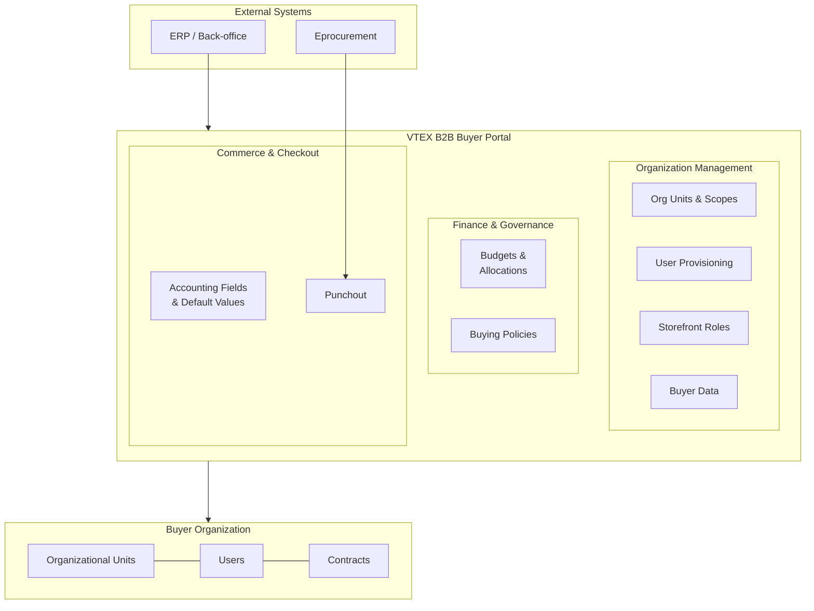

> ⚠️ B2B Buyer Portal is currently available to select accounts.

B2B Buyer Portal is a set of features that enables merchants to offer B2B ecommerce experiences on top of their existing B2C store setup. It provides buyer organizations with the [Organization Account](https://help.vtex.com/docs/tutorials/organization-account), a self-service admin panel. In this panel they can manage users, organizational structure, budgets, purchasing rules, and checkout configurations.

This guide provides an overview of the integration capabilities available in B2B Buyer Portal and the APIs that support them. Each section introduces a feature area, explains its purpose, and links to the detailed integration guide or API reference.

## Table of contents

- [Architecture overview](#architecture-overview)
- [Organization management](#organization-management)
  - [Organizational units and scopes](#organizational-units-and-scopes)
  - [User provisioning](#user-provisioning)
  - [Storefront roles and permissions](#storefront-roles-and-permissions)
  - [Buyer data and contact information](#buyer-data-and-contact-information)
- [Budgets and allocations](#budgets-and-allocations)
  - [Capabilities](#capabilities)
  - [Key APIs](#key-apis)
- [Buying policies](#buying-policies)
  - [Capabilities](#capabilities-1)
  - [Key APIs](#key-apis-1)
- [Accounting fields](#accounting-fields)
  - [Capabilities](#capabilities-2)
  - [Key APIs](#key-apis-2)
  - [Default values](#default-values)
- [Punchout](#punchout)
  - [Capabilities](#capabilities-3)
  - [Key APIs](#key-apis-3)
- [Permissions](#permissions)

## Architecture overview

B2B Buyer Portal integrations are built around the following core concepts:

- **[Organizational Units](https://help.vtex.com/en/docs/tutorials/organization-units)** represent the hierarchical structure of a buyer organization, such as departments, divisions, or subsidiaries. They are the central entity that allows users to scope most buyer portal features.
- **Contracts** bind organizational units to commercial conditions, including product assortments, payment methods, and addresses.
- **Storefront users** are members of the buyer organization who interact with the store, each assigned specific roles and permissions.
- **Storefront roles** control what actions each user can perform, from placing orders to managing budgets.

The diagram below illustrates how these concepts relate to each other and to the key integration areas.

## Organization management

Organization management covers the structure, identity, and access control of a buyer organization. It includes creating and managing organizational units, provisioning users, assigning roles, and storing enriched buyer data.

These capabilities form the foundation of every B2B Buyer Portal integration since most other features (budgets, buying policies, custom fields) operate within the context of organizational units and depend on users having the right storefront roles.

### Organizational units and scopes

Organizational units represent the hierarchical structure of a buyer organization. A unit can be a department, division, regional office, or any other grouping that reflects how the company organizes its purchasing operations.

Each organizational unit also supports **scopes**, which allow administrators to restrict which attributes, such as contracts, payment methods, addresses, credit cards, collections, and accounting fields, are visible and available to users within that unit.

> ℹ️ For more information about scopes, see [Scopes overview](https://help.vtex.com/en/docs/tutorials/scopes-overview).

| Capability | Description |
| :--- | :--- |
| Create and manage units | Create, list, move, edit, and delete organizational units that represent the buyer's company structure. |
| Hierarchical organization | Organize units into parent-child relationships to model the company's hierarchy. |
| Scope configuration | Restrict which contracts, payment methods, addresses, and other attributes are available per unit. |
| User assignment | Link storefront users to their respective organizational units. |

| API | Purpose |
| :--- | :--- |
| [Organization Units API](https://developers.vtex.com/docs/api-reference/organization-units-api) | Create, list, move, edit, delete organizational units, and manage scopes. |

### User provisioning

User provisioning covers the process of creating B2B users in VTEX and linking them to organizational units. This integration is essential when onboarding buyer organizations from external platforms or ERPs and when automating user lifecycle management.

The provisioning flow includes registering storefront credentials in VTEX ID, assigning users to organizational units, granting storefront roles, and saving enriched buyer data in the Shopper entity.

| Capability | Description |
| :--- | :--- |
| Create storefront users | Register users in VTEX ID with unique usernames and optional login emails. |
| Assign users to units | Link storefront users to their respective organizational units. |
| Assign storefront roles | Grant role-based permissions that control what each user can do. |

| API | Purpose |
| :--- | :--- |
| [VTEX ID API](https://developers.vtex.com/docs/api-reference/vtex-id-api) | Create storefront users and manage authentication identifiers. |
| [Organization Units API](https://developers.vtex.com/docs/api-reference/organization-units-api) | Allocate users to organizational units. |

> ℹ️ For the full step-by-step integration, see [B2B user provisioning](https://developers.vtex.com/docs/guides/b2b-user-provisioning).

### Storefront roles and permissions

Storefront roles provide a structured authorization model for B2B stores. They control which actions each user can perform, from placing orders and approving purchases to managing organizational settings and budgets.

The system ships with predefined roles (such as Buyer, Order Approver, and Organizational Unit Admin) and fine-grained resource keys that can be combined as needed.

| Capability | Description |
| :--- | :--- |
| Role assignment | Assign one or more predefined roles to storefront users via API. |
| Permission verification | Check whether a user has access to a specific storefront resource. |
| Role revocation | Remove roles from users when their responsibilities change. |

| API | Purpose |
| :--- | :--- |
| [Storefront Roles API](https://developers.vtex.com/docs/api-reference/storefront-roles-api) | Assign, revoke, and query storefront roles and resource permissions. |

> ℹ️ For the full list of available roles, resources, and required permissions, see [Storefront Roles](https://developers.vtex.com/docs/guides/storefront-roles).

### Buyer data and contact information

VTEX provides dedicated APIs for managing enriched buyer profiles and contact information associated with B2B organizations. These APIs support scenarios where merchants need to store, query, or update buyer-specific data beyond what is captured during user provisioning, such as managing tokenized payment cards or organizational contact details.

| API | Purpose |
| :--- | :--- |
| [B2B Buyer Data API](https://developers.vtex.com/docs/api-reference/b2b-buyer-data-api) | Manage enriched buyer profile data. |
| [B2B Contact Information API](https://developers.vtex.com/docs/api-reference/b2b-contact-information-api) | Manage contact details associated with buyer organizations. |
| [Card Token Vault API](https://developers.vtex.com/docs/api-reference/card-token-vault-api) | Store and manage tokenized payment card data for B2B buyers. |

## Budgets and allocations

Budgets allow buyer organizations to define spending envelopes and distribute them across allocations tied to specific entities such as cost centers, users, or addresses. During checkout, the system queries applicable allocations so that orders can be funded according to the organization's financial rules.

### Capabilities

| Capability | Description |
| :--- | :--- |
| Budget provisioning | Create and manage budgets with total amounts, validity periods, auto-reset, and carry-over settings. |
| Allocation management | Subdivide budgets into allocations linked to specific entities (cost centers, users, PO numbers). |
| Checkout lookup | Query applicable allocations at checkout to determine how an order should be funded. |
| Balance tracking | Track remaining balances and spending history through transactions and statements. |

### Key APIs

| API | Purpose |
| :--- | :--- |
| [Budgets API](https://developers.vtex.com/docs/api-reference/budgets-api) | Create, update, query, and delete budgets and allocations. |

> ℹ️ For the complete integration flow, see [Budgets and allocations](https://developers.vtex.com/docs/guides/budgets-and-allocations).

## Buying policies

Buying policies enable buyer organizations to define dynamic authorization rules that control whether orders are automatically approved, denied, or sent for manual review. The system evaluates rules hierarchically across organizational units, using a priority-based mechanism.

### Capabilities

| Capability | Description |
| :--- | :--- |
| Rule configuration | Register custom rule expressions with bypass, deny, or sequential workflow behaviors. |
| Hierarchical evaluation | Evaluate rules across organizational unit dimensions in priority order. |
| Manual authorization | Support approval or denial workflows through score-based callbacks. |

### Key APIs

| API | Purpose |
| :--- | :--- |
| [Buying Policies API](https://developers.vtex.com/docs/api-reference/buying-policies-api) | Create and manage authorization rules and process order approval callbacks. |

> ℹ️ For details on rule evaluation, score thresholds, and required permissions, see [Buying Policies](https://developers.vtex.com/docs/guides/buying-policies).

## Accounting fields

Accounting fields is the B2B Buyer Portal feature that allows stores to capture additional business-specific information during checkout, such as Cost Center, PO Number, or Location. Fields can be applied at the order, item, or address level and support predefined option lists or free-form input.

Under the hood, accounting fields are powered by two APIs: the [Custom Fields API](https://developers.vtex.com/docs/api-reference/custom-fields-api), which handles field configuration, value management, and orderForm application, and the [Default Values API](https://developers.vtex.com/docs/api-reference/default-values-api), which handles pre-configured checkout defaults.

### Capabilities

| Capability | Description |
| :--- | :--- |
| Field configuration | Define field structure, type, level, and requirements per contract. |
| Value management | Create predefined values for option-type fields. |
| OrderForm application | Apply field values to shopping carts during checkout, individually or in batch. |
| Integration with budgets and policies | Use field value IDs as matching criteria in budget allocations and buying policy expressions. |

### Key APIs

| API | Purpose |
| :--- | :--- |
| [Custom Fields API](https://developers.vtex.com/docs/api-reference/custom-fields-api) | Create field settings, manage values, and apply fields to orderForms. |

> ℹ️ For the full integration flow, see [Custom Fields integration](https://developers.vtex.com/docs/guides/custom-fields-integration).

### Default values

Default values allow buyer organization administrators to pre-configure checkout preferences for each organizational unit, such as the default shipping address, billing address, credit card, and accounting field selections. When a buyer logs in, the system automatically loads these defaults, reducing manual input at checkout.

| Capability | Description |
| :--- | :--- |
| Default configuration | Define default addresses, credit cards, and accounting fields per organizational unit. |
| Automatic application | Defaults are resolved and applied to the shopper session at login. |

| API | Purpose |
| :--- | :--- |
| [Default Values API](https://developers.vtex.com/docs/api-reference/default-values-api) | Create, update, retrieve, and delete default value configurations. |

> ℹ️ For the complete integration flow, see [Default Values integration](https://developers.vtex.com/docs/guides/default-values-integration).

## Punchout

Punchout enables integration between external eprocurement systems and the VTEX store, allowing procurement users to authenticate and browse the supplier's catalog directly from their procurement platform. The integration supports two authentication flows: one for users who already exist in VTEX and one for pre-authenticated users managed by the integrator.

### Capabilities

| Capability | Description |
| :--- | :--- |
| Seamless login | Authenticate procurement users into the store via one-time tokens, without manual credential input. |
| Pre-authenticated flow | Support delegated login for users who don't exist in VTEX, trusting the integrator for authorization. |
| Cart transfer | Customize the Punchout cart screen so buyers can transfer their cart back to the eprocurement system for approval, with optional per-item extensions. |

### Key APIs

| API | Purpose |
| :--- | :--- |
| [Punchout API](https://developers.vtex.com/docs/api-reference/punchout-api) | Start and finish punchout login flows using one-time tokens. |

> ℹ️ For the full login integration, see [Punchout login integration](https://developers.vtex.com/docs/guides/punchout-login-integration). For cart transfer customization, see [Punchout cart integration](https://developers.vtex.com/docs/guides/punchout-cart-integration). For a conceptual overview, see [Punchout](https://developers.vtex.com/docs/guides/punchout).

## Permissions

All B2B Buyer Portal integrations require appropriate [License Manager resources](https://help.vtex.com/en/tutorial/license-manager-resources--3q6ztrC8YynQf6rdc6euk3). Each feature has specific permission requirements documented in its respective integration guide. Make sure to assign these permissions to dedicated integration roles rather than shared roles for secure, auditable access.

For machine authentication, see [Authentication overview](https://developers.vtex.com/docs/guides/authentication-overview).
