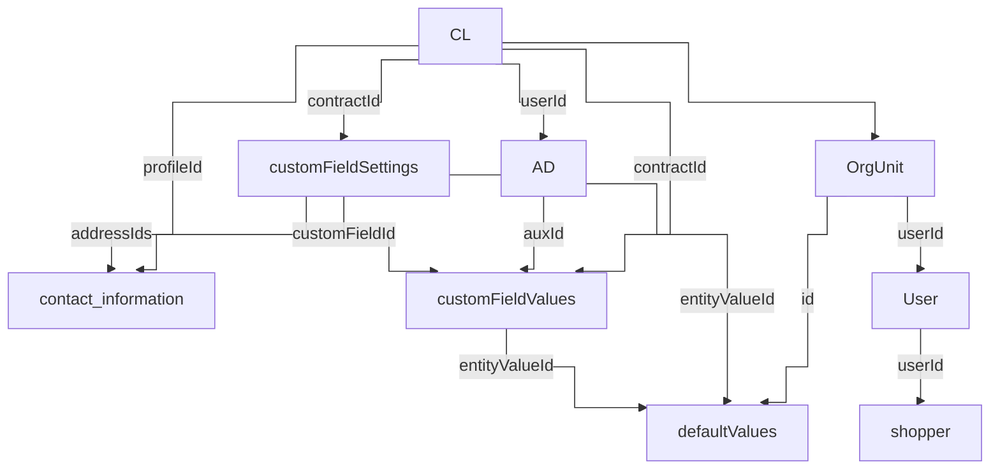

> ⚠️ This feature is only available for stores using B2B Buyer Portal, which is currently available to selected accounts.

**[B2B Buyer Portal](https://help.vtex.com/docs/tutorials/b2b-buyer-portal)** persists buyer organization data across several [Master Data](https://help.vtex.com/en/docs/tutorials/master-data) entities. Understanding how those entities relate to each other is essential for building reliable integrations, particularly when orchestrating multi-step operations such as contract creation, address provisioning, or user onboarding.

This guide maps all seven Master Data entities used by B2B Buyer Portal, their fields, logical relationships, and common integration patterns. For the full operation set, parameters, and payload schemas, see the API reference linked in each section.

## Before you begin

- The store must have [B2B Buyer Portal](https://help.vtex.com/docs/tutorials/b2b-buyer-portal) enabled.
- Familiarize yourself with [Master Data v1](https://developers.vtex.com/docs/api-reference/masterdata-api) and [Master Data v2](https://developers.vtex.com/docs/api-reference/master-data-api-v2) query syntax. Different entities use different versions, so query parameters, pagination conventions, and schema requirements vary.

## Entity overview

B2B Buyer Portal uses seven Master Data entities, each covering a distinct domain:

| Entity | Master Data name | Master Data version | Domain |
| :--- | :--- | :--- | :--- |
| Contract | `CL` | v1 | Root entity for a buyer organization's commercial conditions. |
| Address | `AD` | v1 | Shipping and billing destinations linked to a contract. |
| Buyer data | `shopper` | v1 | Enriched profile data for storefront users with purchase permission. |
| Custom field settings | `customFieldSettings` | v2 | Field definitions (type, level, requirements) per contract. |
| Custom field values | `customFieldValues` | v2 | Values filled in for custom fields, optionally tied to an address. |
| Recipients | `contact_information` | v2 | People authorized to receive shipments at a given address. |
| Default values | `defaultValues` | v1 | Pre-configured checkout defaults per organizational unit. |

## Entity relationships

The diagram shows logical references between entities. Edge labels are the field names used as foreign keys in the child record.

[`OrgUnit`](https://developers.vtex.com/docs/guides/b2b-buyer-portal-integration-overview#organizational-units-and-scopes) and storefront [`User`](https://developers.vtex.com/docs/guides/b2b-buyer-portal-integration-overview#user-provisioning) records are not Master Data entities. They appear here because several Master Data entities reference organizational unit IDs or VTEX user IDs.

> ℹ️ All relationships are logical references managed at the application layer. Master Data does not enforce referential integrity, so deleting a parent document does not cascade to its children.

## Key linking fields

Use this table when orchestrating multi-step flows. It lists only the fields that connect entities. For every other attribute, see the API reference for that entity.

| Child entity | Linking field | Points to | Parent / target |
| :--- | :--- | :--- | :--- |
| `AD` (address) | `userId` | `CL.id` | Contract that owns the address |
| `customFieldSettings` | `contractId` | `CL.id` | Contract the field belongs to |
| `customFieldValues` | `contractId` | `CL.id` | Contract the value belongs to |
| `customFieldValues` | `auxId` | `AD.id` | Address, when the value is a location |
| `customFieldValues` | `customFieldId` | `customFieldSettings.id` | Field definition, required for locations |
| `contact_information` (recipient) | `profileId` | `CL.id` | Contract that owns the recipient |
| `contact_information` (recipient) | `addressIds` | `AD.id` (array) | Addresses the recipient can receive at |
| `defaultValues` | `id` | Org unit ID | Organizational unit (set explicitly, not auto-generated) |
| `defaultValues` | `entityValueId` | `AD.id` or `customFieldValues.id` | Default shipping/billing address or custom field value |
| `shopper` (buyer data) | `userId` | VTEX user ID | Storefront user from VTEX ID, not the contract |

## Common integration patterns

- **Contract-first provisioning:** Involves creating or resolving a contract (`CL`) before addresses, custom fields, or recipients. Child records reference `CL.id` through `userId`, `contractId`, or `profileId`.
- **Address and destination setup:** Consists of creating addresses (`AD`), then optionally attaching recipients (`contact_information`) and locations (`customFieldValues` through `auxId` and a location-type custom field setting).
- **User onboarding:** Requires creating the storefront user in VTEX ID, assigning [organizational units and roles](https://developers.vtex.com/docs/guides/b2b-user-provisioning), then persisting buyer data in `shopper` linked by `userId`.

## Entities by domain

The subsections below describe each entity's role in the model and where to find implementation details. Field-level attributes are documented in the API reference for each entity.

### Contract (`CL`)

The contract is the **root** of every buyer organization. Its `id` anchors addresses, custom fields, and recipients. Commercial conditions such as assortment, pricing, and payment restrictions live on this record.

- **Integration guide:** [Contracts (B2B Buyer Portal integration overview)](https://developers.vtex.com/docs/guides/b2b-buyer-portal-integration-overview#contracts)
- **API reference:** [B2B Contracts API](https://developers.vtex.com/docs/api-reference/b2b-contracts-api)

### Addresses, recipients, and locations

Three entities work together for checkout destinations:

| Concept | Data entity | Role in the model |
| :--- | :--- | :--- |
| Address | `AD` | Shipping (`commercial`) or billing (`invoice`) destination. `AD.id` is reused when linking recipients and locations. |
| Recipient | `contact_information` | Person selectable as order recipient. Scoped to a contract via `profileId`, optionally narrowed to specific addresses via `addressIds`. |
| Location | `customFieldValues` | Delivery point within an address (dock, department, area). Linked through `auxId` and a location-type custom field setting. |

- **Integration guide:** [B2B Addresses integration](https://developers.vtex.com/docs/guides/b2b-addresses-integration)
- **API reference:** [B2B Addresses API](https://developers.vtex.com/docs/api-reference/b2b-addresses)

### Custom field settings and values

Custom fields (accounting fields) are split across two entities:

| Concept | Data entity | Role in the model |
| :--- | :--- | :--- |
| Settings | `customFieldSettings` | Defines field name, type, level (`order`, `item`, `address`), and requirements per contract. |
| Values | `customFieldValues` | Stores predefined options or location records. Location values reference both a contract and an address (`auxId`). |

- **Integration guide:** [Custom Fields integration](https://developers.vtex.com/docs/guides/custom-fields-integration)
- **API reference:** [Custom Fields API](https://developers.vtex.com/docs/api-reference/custom-fields-api)

> ℹ️ Search and get operations on v2 entities (`customFieldSettings`, `customFieldValues`, `contact_information`) require `_schema=v1` in the query string. See the integration guides above for filter patterns.

### Buyer data (`shopper`)

The `shopper` entity stores enriched profile attributes for a **storefront user**. It links to VTEX ID through `userId`, not to a contract. User provisioning creates the VTEX user first, then persists buyer data.

- **Integration guide:** [B2B user provisioning](https://developers.vtex.com/docs/guides/b2b-user-provisioning)
- **API reference:** [B2B Buyer Data API](https://developers.vtex.com/docs/api-reference/b2b-buyer-data-api)

### Default values (`defaultValues`)

Default values pre-fill checkout for an organizational unit. The document `id` equals the org unit ID. Each entry in the `defaultValues` array maps an `entity` path (for example, `address/shipping`, `customFieldValues/{fieldName}`) to an `entityValueId` pointing at an address or custom field value record.

- **Integration guide:** [Default Values integration](https://developers.vtex.com/docs/guides/default-values-integration)
- **API reference:** [Default Values API](https://developers.vtex.com/docs/api-reference/default-values-api) and [Master Data API v1](https://developers.vtex.com/docs/api-reference/masterdata-api) (`defaultValues` data entity)

## Next steps

- [B2B Buyer Portal integration overview](https://developers.vtex.com/docs/guides/b2b-buyer-portal-integration-overview): Capability map across contracts, organization management, addresses, accounting fields, and more.
- [B2B Addresses integration](https://developers.vtex.com/docs/guides/b2b-addresses-integration): Addresses, recipients, and locations.
- [Custom Fields integration](https://developers.vtex.com/docs/guides/custom-fields-integration): Custom checkout field settings and values.
- [Default Values integration](https://developers.vtex.com/docs/guides/default-values-integration): Checkout defaults per organizational unit.
- [B2B user provisioning](https://developers.vtex.com/docs/guides/b2b-user-provisioning): Storefront users, org units, roles, and buyer data.
