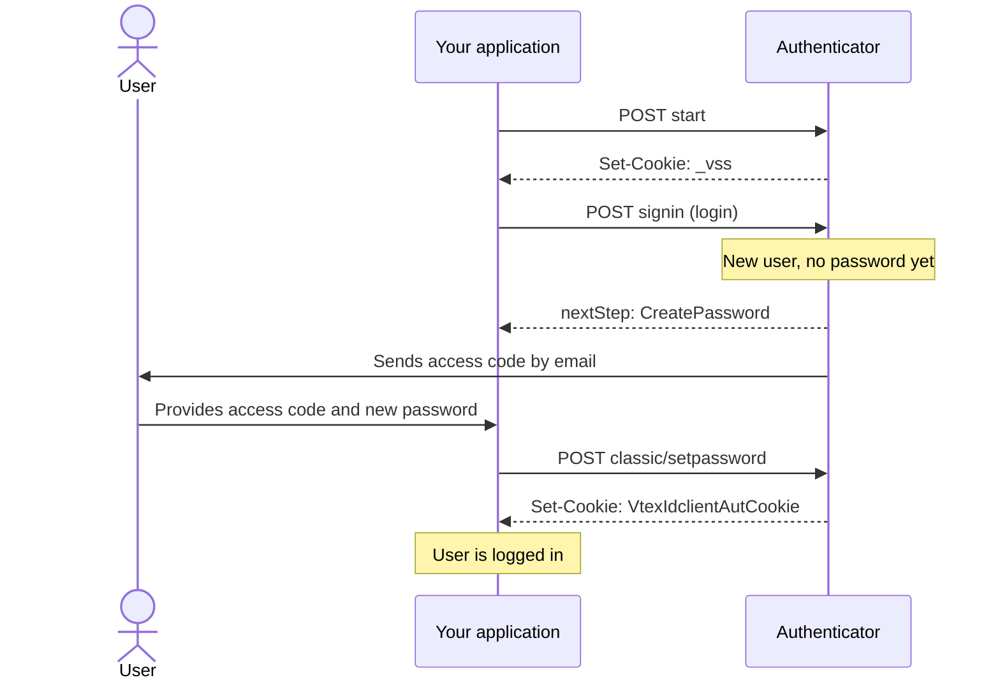

> ⚠️ This feature is available only for stores using [B2B Buyer Portal](https://help.vtex.com/docs/tutorials/b2b-buyer-portal), currently available for selected accounts.

This guide explains how a storefront user created through [B2B user provisioning](https://developers.vtex.com/docs/guides/b2b-user-provisioning) completes their first login by defining a password, including how to:

* Start a login attempt.
* Trigger the access code sent to the user's email.
* Set the user's first password and have them logged in.

>ℹ️ This guide covers users created with the default `isLegacyPassword=false`. Users migrated from a legacy platform with `isLegacyPassword=true` have a separate first-login flow, described in [B2B password migration](https://developers.vtex.com/docs/guides/b2b-password-migration).

## Before you begin

* The user must already exist in Authenticator, created with an email identifier through `POST` [Create storefront user](https://developers.vtex.com/docs/api-reference/authenticator-api#post-/api/authenticator/v1/storefront/users). Without a registered email, the user never receives an access code and can't complete this flow. See [B2B user provisioning](https://developers.vtex.com/docs/guides/b2b-user-provisioning).
* These endpoints are called on your storefront domain (`https://{accountName}.myvtex.com` or a custom domain), unlike `POST` [Create storefront user](https://developers.vtex.com/docs/api-reference/authenticator-api#post-/api/authenticator/v1/storefront/users), which uses application credentials (`AppKey`/`AppToken`) on `vtexcommercestable.com.br`. The steps below use session cookies instead: the `_vss` cookie set by Start, then the `VtexIdclientAutCookie` cookie set once login completes.

## How it works



The first-login process follows these main steps:

1. [Start login attempt](#step-1---start-login-attempt): Starts the login attempt and obtains the session cookie required for the following steps.
2. [Sign in](#step-2---sign-in): Checks the user's password status. This call automatically sends the access code to the user's email.
3. [Set password](#step-3---set-password): Sets the user's first password using the received access code, logging them in.

## Step 1 - Start login attempt

Starts a login attempt. This is always the first call, regardless of whether the user already has a password.

The response sets the `_vss` cookie, which holds the state of the login attempt for 10 minutes. Forward this cookie on every following call in this sequence. If you're calling these endpoints from a server rather than a browser, capture the cookie from the response manually, since it won't be forwarded automatically as it would be by a browser's cookie manager.

>ℹ️ For more information, see `POST` [Start login attempt](https://developers.vtex.com/docs/api-reference/authenticator-api#post-/api/authenticator/v1/pub/authentication/start).

### Request example

```shell
curl -X POST "https://{{accountName}}.myvtex.com/api/authenticator/v1/pub/authentication/start?an={{accountName}}" \
  --form "accountName={{accountName}}" \
  --form "scope={{accountName}}" \
  --form "returnUrl=https://{{accountName}}.myvtex.com" \
  --form "callbackUrl=https://{{accountName}}.myvtex.com" \
  --form "user=user@example.com"
```

### Response example

`200 OK`, no relevant body. What matters is the `Set-Cookie: _vss=...` header. Capture this value, you'll need it for every following step.

## Step 2 - Sign in

Checks whether the user already has a password. For a newly created user, this automatically sends the access code by email. You don't need to call any other endpoint to trigger it.

>ℹ️ For more information, see `POST` [Sign in](https://developers.vtex.com/docs/api-reference/authenticator-api#post-/api/authenticator/v1/bff/storefront/signin).

### Request example

```shell
curl -X POST "https://{{accountName}}.myvtex.com/api/authenticator/v1/bff/storefront/signin?an={{accountName}}" \
  -H "Cookie: _vss={{vssCookie}}" \
  --form "login=user@example.com"
```

### Response example

For a new user with no password yet:

```json
{
  "nextStep": "CreatePassword",
  "maskedEmail": "use***@example.com",
  "maskedPhone": null
}
```

`nextStep` values you may see:

| Value | Meaning |
| :---- | :---- |
| `CreatePassword` | The user has an email, no password yet, and the access code was just sent. Continue to [Step 3 - Set password](#step-3---set-password). |
| `PasswordLogin` | The user already has a password. This guide doesn't cover the returning-user login flow. |
| `CreatePasswordWithoutContactInfo` | The user has no email or phone on file, meaning `POST` [Create storefront user](https://developers.vtex.com/docs/api-reference/authenticator-api#post-/api/authenticator/v1/storefront/users) was called without an email identifier. Fix the user's record before proceeding. |

## Step 3 - Set password

The user submits the access code received by email along with their new password.

>ℹ️ For more information, see `POST` [Set password](https://developers.vtex.com/docs/api-reference/authenticator-api#post-/api/authenticator/v1/pub/authentication/classic/setpassword). Keep `expireSessions=true` to invalidate any existing session for this user as soon as the password changes.

### Request example

```shell
curl -X POST "https://{{accountName}}.myvtex.com/api/authenticator/v1/pub/authentication/classic/setpassword?expireSessions=true&an={{accountName}}" \
  -H "Cookie: _vss={{vssCookie}}" \
  --form "login=user@example.com" \
  --form "accesskey={{accessCode}}" \
  --form "newPassword={{newPassword}}"
```

### Response example

`200 OK`, empty body (`{}`). The `Set-Cookie: VtexIdclientAutCookie` header is also set, so the user is logged in immediately after setting their password.

## Error reference

| `authStatus` | Meaning | What to do |
| :---- | :---- | :---- |
| `InvalidToken` | The `_vss` cookie is missing or expired (10-minute validity). | Redo [Step 1 - Start login attempt](#step-1---start-login-attempt). |
| `InvalidEmail` | The `login` field was empty on Sign in. | Validate the input before sending. |
| `WrongCredentials` | The `accesskey` field was empty on Set password. | Check the value sent. |
| `BlockedUser` | Rate limit triggered by attempts without recaptcha. | Wait, and/or implement recaptcha. |
