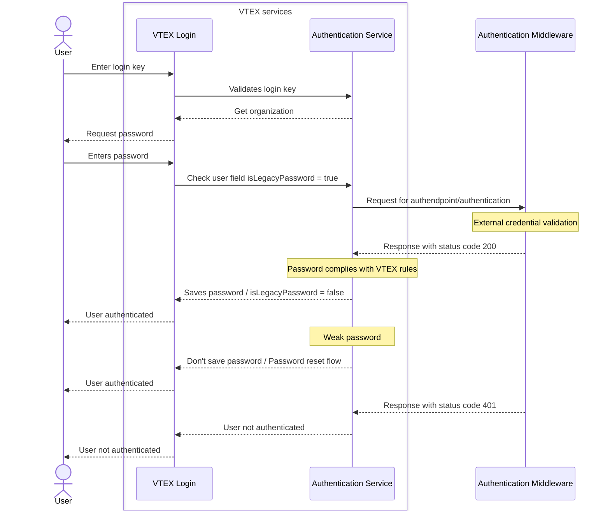

> ⚠️ This feature is available only for stores using [B2B Buyer Portal](https://help.vtex.com/docs/tutorials/b2b-buyer-portal), currently available for selected accounts.

This guide explains how to migrate your B2B user base from a legacy platform to VTEX without forcing buyers to reset their passwords, including how to:

* Build and register an external authentication middleware.
* Configure password migration in your VTEX account.
* Provision legacy users with the appropriate flag.

With password migration, credentials are migrated per user on demand at their first login, rather than all at once upfront.

## Before you begin

Before setting up password migration, make sure you're familiar with the [B2B user provisioning](https://developers.vtex.com/docs/guides/b2b-user-provisioning) flow, since provisioning users with a legacy password follows the same process with one additional parameter.

## Password migration flow



After following the implementation steps, on a user's first login:

1. VTEX forwards their credentials to your middleware.
2. If the middleware returns `200 OK`, VTEX validates the password against the VTEX password policy.
   * If the policy passes, the password is stored in VTEX ID, `isLegacyPassword` is set to `false`, and the user is logged in.
   * If the policy fails, the user is directed to define a new compliant password via the Password Reset Flow. The user is still authenticated in this session.
3. If the middleware returns `401 Unauthorized`, the user is not authenticated and a generic error is returned.

From this point on, all authentication for migrated users happens entirely within VTEX, and the middleware isn't called again for that user.

The middleware is the compatibility layer between VTEX and your legacy system. It handles hash format differences, rate limits, retries, and user lookup rules, isolating VTEX from legacy quirks.

## Implementation

The implementation follows these main steps:

1. [Build the authentication middleware](#step-1---build-the-authentication-middleware): Deploy an HTTPS service that VTEX will call to validate legacy credentials.
2. [Configure password migration on VTEX](#step-2---configure-password-migration-on-vtex): Register the middleware endpoint and HMAC credentials in your VTEX account.
3. [Provision legacy users](#step-3---provision-legacy-users): When creating storefront users, set `isLegacyPassword=true` so their first login is validated against your middleware.

### Step 1 \- Build the authentication middleware

You must deploy and maintain an HTTPS service that VTEX will call to validate legacy credentials. Your middleware must:

* Receive VTEX authentication requests at `POST /authentication`.
* Verify that the request comes from VTEX IPs (see [http://ips.vtex.com](http://ips.vtex.com)).
* Validate the HMAC signature on every request.
* Validate the credentials against the legacy identity platform.
* Return only one of the supported response codes.

#### Client registration

Before VTEX can send authenticated requests to your middleware, it must register itself as a client to obtain a shared secret. VTEX does this by calling `POST /register` on your middleware. See `POST` [Register client](https://developers.vtex.com/docs/api-reference/b2b-password-migration-protocol#post-/register) for the protocol specification.

> ℹ️ Your middleware generates and returns the `ClientId` and `Secret`. VTEX then uses these to sign every subsequent request. Treat the `Secret` as a credential: Don't log it, and don't reuse it across environments.

**Request example**

```shell
curl -X POST "https://your-middleware.com/register" \
  -H "Content-Type: application/json" \
  -d '{
    "Store": "store-name"
  }'
```

**Response example**

```json
{
  "Store": "store-name",
  "ClientId": "<generated-client-identifier>",
  "Secret": "<base64-key>"
}
```

#### Authentication request contract

Once registered, VTEX sends credential validation requests to your middleware as specified in  `POST` [Validate legacy credentials](https://developers.vtex.com/docs/api-reference/b2b-password-migration-protocol#post-/authentication).

> ⚠️ The request to your middleware will always be made from one of the VTEX IPs listed at [http://ips.vtex.com](http://ips.vtex.com). Although VTEX can't enforce this, we strongly recommend that your middleware checks the IP origin. If the IP is not from VTEX, your middleware should not respond.

**Request example**

```shell
curl -X POST "https://your-middleware.com/authentication" \
  -H "Content-Type: application/json; charset=utf-8" \
  -H "X-VTEX-Client-Id: {{clientId}}" \
  -H "X-VTEX-Timestamp: {{timestamp}}" \
  -H "X-VTEX-Nonce: {{nonce}}" \
  -H "X-VTEX-Content-SHA256: {{bodyHash}}" \
  -H "Authorization: HMAC-SHA256 SignedHeaders=X-VTEX-Client-Id;X-VTEX-Timestamp;X-VTEX-Nonce;X-VTEX-Content-SHA256&Signature={{signature}}" \
  -d '{
    "username": "{{username}}",
    "password": "{{password}}"
  }'
```

#### Response contract

Your middleware must return **only** the following HTTP status codes:

| Status | Meaning |
| :---- | :---- |
| `200 OK` | Credentials are valid; user is authorized. |
| `401 Unauthorized` | Credentials are invalid (user not found or wrong password). |
| `403 Forbidden` | Request is not authenticated (invalid or missing HMAC). |

VTEX treats any other HTTP status code as a technical error, returning a generic error to the shopper and triggering controlled retry logic on the server side.

> ⚠️ "User not found" and "wrong password" scenarios must both return `401`, indistinguishably. This prevents user enumeration. Don't include response body content that reveals credential validity, user existence, or internal errors. VTEX ignores response bodies entirely.

#### HMAC request authentication

All requests from VTEX to your middleware are signed using HMAC-SHA256. Your middleware must validate this signature before processing any credential check.

* **Signature algorithm:** HMAC-SHA256
* **Signature encoding:** Base64

##### Canonical string

VTEX and your middleware must sign the exact same canonical string. Your middleware must reconstruct it from the incoming request to compute and compare the expected signature.

Canonical string format (`\n` separators, UTF-8 encoded):

```text
{HTTP_METHOD}\n
{PATH}\n
{X-VTEX-Client-Id}\n
{X-VTEX-Timestamp}\n
{X-VTEX-Nonce}\n
{SHA256_OF_BODY}
```

Where:

* `HTTP_METHOD` is  `POST`.
* `PATH` is `/authentication` and any provided query strings, if present (no scheme or host).
* `SHA256_OF_BODY` is the base64-encoded SHA-256 digest of the raw request body bytes as received. Don't parse or re-serialize the JSON.

##### Signature computation

```text
signature = HMAC(UTF8(canonicalString), secret)
```

##### Authorization header

```text
Authorization: HMAC-SHA256 SignedHeaders=X-VTEX-Client-Id;X-VTEX-Timestamp;X-VTEX-Nonce;X-VTEX-Content-SHA256&Signature={{signature}}
```

##### Middleware verification steps

VTEX recommends the following verification steps are implemented in the middleware:

1. Validate that all required headers are present.
2. Validate timestamp within ±300s (recommended).
3. Validate that the nonce has not been seen before for this `ClientId` within the clock skew window.
4. Reconstruct the canonical string from the incoming request.
5. Compute the expected HMAC-SHA256 signature and compare using constant-time comparison.
6. Only then proceed to validate credentials against the legacy system.

#### Latency and timeouts

Your middleware must respond within **3 seconds** (hard requirement). Design targets are p95 ≤ 1s and p99 ≤ 2.5s. HMAC verification must be performed before any legacy lookup. It adds negligible overhead (typically \< 10ms).

Enforce an internal timeout for the legacy validation call (recommended: 2.0–2.5s). If the legacy system doesn't respond in time, return a technical error (any status code other than 200, 401, or 403).

#### Security requirements

* The endpoint must be HTTPS (TLS 1.3). HTTP is not allowed.
* TLS certificates must be valid and issued by a trusted CA. Expired or self-signed certificates are not accepted in production.
* Use a high-entropy secret (recommended: 32+ random bytes / 256-bit, encoded as Base64).
* Never log the `Secret`, passwords, or signatures.
* Don't reuse secrets across environments (for example, staging vs. production).

### Step 2 \- Configure password migration on VTEX

Once your middleware is deployed, configure the external authentication endpoint and HMAC credentials in your VTEX account using the following endpoints.

#### Upserting the configuration

Use `PUT` [Upsert password migration configuration](https://developers.vtex.com/docs/api-reference/vtex-id-api#put-/api/authenticator/v1/tenants/features/-featureId-) to register your middleware's URL on VTEX and enable legacy credential routing for your account.

> ⚠️ Treat `Secret` as a credential: Don't log it, don't share it, and don't reuse it across environments.

**Request example**

```shell
curl -X PUT "https://{{accountName}}.vtexcommercestable.com.br/api/authenticator/v1/tenants/features/PasswordMigration" \
  -H "X-VTEX-API-AppKey: {{X-VTEX-API-AppKey}}" \
  -H "X-VTEX-API-AppToken: {{X-VTEX-API-AppToken}}" \
  -H "Content-Type: application/json" \
  -d '{
    "clientId": "your-client",
    "idpEndpoint": "https://your-middleware.com/authentication",
    "secret": "{{base64Secret}}"
  }'
```

#### Enabling or disabling the feature

Use `PATCH` [Enable or disable password migration](https://developers.vtex.com/docs/api-reference/vtex-id-api#patch-/api/authenticator/v1/tenants/features/-featureId-) to enable or disable password migration for your account without removing the configuration.

Set the `enabled` parameter to `true` to enable or `false` to disable password migration.

**Request example**

```shell
curl -X PATCH "https://{{accountName}}.vtexcommercestable.com.br/api/authenticator/v1/tenants/features/PasswordMigration" \
  -H "X-VTEX-API-AppKey: {{X-VTEX-API-AppKey}}" \
  -H "X-VTEX-API-AppToken: {{X-VTEX-API-AppToken}}" \
  -H "Content-Type: application/json" \
  -d '{
    "enabled": false
  }'
```

#### Deleting the configuration

Use `DELETE` [Delete password migration configuration](https://developers.vtex.com/docs/api-reference/vtex-id-api#delete-/api/authenticator/v1/tenants/features/-featureId-) to remove the password migration configuration from your account entirely.

**Request example**

```shell
curl -X DELETE "https://{{accountName}}.vtexcommercestable.com.br/api/authenticator/v1/tenants/features/PasswordMigration" \
  -H "X-VTEX-API-AppKey: {{X-VTEX-API-AppKey}}" \
  -H "X-VTEX-API-AppToken: {{X-VTEX-API-AppToken}}"
```

### Step 3 \- Provision legacy users

When creating storefront users who should authenticate via password migration on their first login, follow the same flow described in [B2B user provisioning](https://developers.vtex.com/docs/guides/b2b-user-provisioning), setting `isLegacyPassword=true` in the query parameter of the `POST` [Create storefront user with username](https://developers.vtex.com/docs/api-reference/vtex-id-api#post-/api/authenticator/storefront/users) request instead of the default `false`.

> ⚠️ Once you create a user, you can't edit or remove it. If you upload incorrect data, create a new user with a new username.

**Request example**

```shell
curl -X POST "https://{{accountname}}.vtexcommercestable.com.br/api/authenticator/storefront/users?isLegacyPassword=true" \
  -H "X-VTEX-API-AppKey: {{X-VTEX-API-AppKey}}" \
  -H "X-VTEX-API-AppToken: {{X-VTEX-API-AppToken}}" \
  -H "Content-Type: application/json" \
  -d '{
    "identifiers": [
      {
        "type": "username",
        "value": "john_doe_buyer"
      },
      {
        "type": "email",
        "value": "john.doe@company.com"
      }
    ]
  }'
```

**Response example**

```json
{
  "userId": "f0a15a42-f7fc-4b09-a9ab-fabc76d9f332",
  "identifier": "john_doe_buyer"
}
```

After creating the user, continue with the remaining provisioning steps: assign the user to an organizational unit using `POST` [Assign user to organizational unit](https://developers.vtex.com/docs/api-reference/vtex-id-api#post-/api/vtexid/organization-units/-organizationUnit-/users), assign roles using `POST` [Assign storefront roles to user](https://developers.vtex.com/docs/api-reference/storefront-permissions-api#post-/api/license-manager/storefront/users), and save buyer data using `POST` [Create new document](https://developers.vtex.com/docs/api-reference/master-data-api-v2#post-/api/dataentities/-dataEntityName-/documents).

## Password storage after migration

After your middleware returns `200 OK`, VTEX promotes the password as follows:

1. Our system validates the plaintext password against the current VTEX password policy.
2. If the policy passes, the password is stored in VTEX ID, `isLegacyPassword` is set to `false`, and the user is logged in normally.
3. If the policy fails, VTEX doesn't store the weak password. The user is directed to define a new compliant password via the Password Reset Flow. `isLegacyPassword` remains `true` until a compliant password is set. The user is still authenticated in this session.

If the user is already promoted (`isLegacyPassword=false`), VTEX doesn't call the legacy endpoint again and uses standard VTEX authentication. If multiple concurrent login attempts occur, the system converges to a single promoted state without corrupting credentials.

> ⚠️ Plaintext passwords are never logged or persisted outside of the credential storage operation. Technical failures return generic errors to avoid account enumeration signals.
