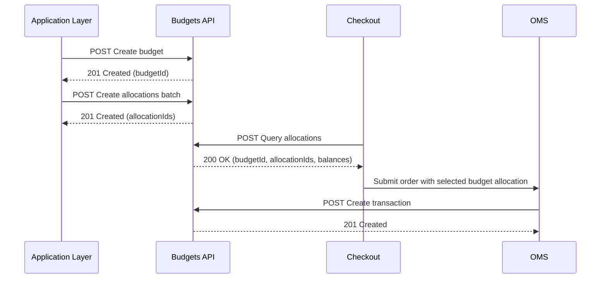

>⚠️ The Budgets feature is only available for B2B Buyer Portal. Authorization from the Commerce Engineer of the account is required for usage.

The [Budgets API](https://developers.vtex.com/docs/api-reference/budgets-api) allows buyers to track spending across different parts of your organization by creating **budgets** and subdividing them into **allocations** that are attached to specific entities, such as users, addresses, or business accounting fields like cost center or purchase order number.

This integration guide explains how to provision budgets for a given business context, distribute those budgets into allocations, and query allocations at checkout time so your ecommerce and back-office systems can consistently track spending rules. It focuses on the **Budget** and **Allocations** endpoints of the [Budgets API](https://developers.vtex.com/docs/api-reference/budgets-api).

>ℹ️ The budget functionality is intended for buyers using the Organization Account interface. Integration is only required when the merchant needs to create budgets on behalf of the buyer, support budget consumption, or implement a headless checkout.

## Prerequisites

Before integrating with the Budgets API, make sure the following requirements are met.

### Permissions required

To use the Budgets API, the integration **must** have the required License Manager permissions. Without these permissions, all API requests will fail with a 403 Forbidden response.

- **ManageBudgets**: Required to create, update, delete, and query budgets and allocations.  
- **ViewBudget**: Required for read-only access to budgets.

Assign these permissions to dedicated integration roles rather than shared roles to ensure secure, auditable access.

## How it works

To use the Budgets API, follow this lifecycle:

1. Create a budget for a B2B unit.  
2. Create allocations under that budget, each linked to a specific entity, such as a user, address, cost center, and so on.
    >ℹ️ During order processing, Checkout and OMS consume allocations through Transactions or Reservations + Transactions, decreasing available balances.
3. Retrieve statements for audits and reporting, not covered in this guide.

Each budget and allocation has:

- A total amount and remaining balance.  
- A validity window defined by start and end dates.  
- A status, for example, ACTIVE or INACTIVE, that controls whether it can be used.

>ℹ️ Budgets and allocations are always scoped by `contextType` and `contextId`, which represent the B2B business context that owns the budget. For B2B scenarios, contextType must be UNIT. Use a stable, unique identifier from your master data as `contextId` to correlate budgets with your external systems.

A typical end-to-end integration looks as follows:

1. Your Integration Layer or back-office creates or updates budgets and allocations via the Budgets API, on behalf of the buyer.  
2. Checkout receives an order, identifies the relevant entities such as cost center, buyer, address, and so on, and calls the Query allocations endpoint to retrieve applicable allocations.  
3. Checkout determines how much to deduct from each allocation based on your buyer’s business rules.  
4. Checkout sends the selected budgets and allocation IDs to OMS.  
5. OMS creates Transactions and Refunds when needed against those allocations.

>⚠️ If you deactivate or delete a budget or allocation that is still referenced by your ERP or checkout integration, queries may stop returning it, and purchases may be blocked unexpectedly.

### End-to-end integration sequence



## Budget provisioning flow

The budget provisioning flow creates and maintains the main spending envelope for a given business context, such as a B2B unit. A budget defines the total amount available over a period and can include optional initial allocations created in a single call.

### When to use this flow

Use this flow in the following scenarios:

- Create or synchronize budgets from an external application.  
- Change the budget amount, description, or period.  
- Activate or deactivate a budget without removing its historical data.

### Main endpoints involved

* `POST` \- [Create budget](https://developers.vtex.com/docs/api-reference/budgets-api#post-/api/budgets/-contextType-/-contextId-?endpoint=post-/api/budgets/-contextType-/-contextId-)  
* `GET` \-  [List budgets](https://developers.vtex.com/docs/api-reference/budgets-api#get-/api/budgets/-contextType-/-contextId-?endpoint=get-/api/budgets/-contextType-/-contextId-)  
* `GET` \-  [Get budget](https://developers.vtex.com/docs/api-reference/budgets-api#get-/api/budgets/-contextType-/-contextId-/-budgetId-?endpoint=get-/api/budgets/-contextType-/-contextId-/-budgetId-)  
* `PUT` \-  [Update budget](https://developers.vtex.com/docs/api-reference/budgets-api#put-/api/budgets/-contextType-/-contextId-/-budgetId-?endpoint=put-/api/budgets/-contextType-/-contextId-/-budgetId-)  
* `PUT`  \-  [Update budget status](https://developers.vtex.com/docs/api-reference/budgets-api#put-/api/budgets/-contextType-/-contextId-/-budgetId-/status?endpoint=put-/api/budgets/-contextType-/-contextId-/-budgetId-/status)  
* `DELETE` \- [Delete budget](https://developers.vtex.com/docs/api-reference/budgets-api#delete-/api/budgets/-contextType-/-contextId-/-budgetId-?endpoint=delete-/api/budgets/-contextType-/-contextId-/-budgetId-)

### Instructions

Follow the steps below to create and manage a budget for a given business context (for example, a B2B unit) using the Budgets API.

1. **Choose the budget context:**  
     
   * Decide which context type and ID will own the budget, for example, contextType \= UNIT, contextId \= "unit-123". For B2B scenarios, contextType must be UNIT.  
   * Ensure the same values are used consistently by all systems that will interact with this budget. 
2. **Create the budget by calling the** [POST Create budget](http://replace-by-correct-link.create-budget.com/post/api/budgets/-contextType-/-contextId-) **endpoint with the required fields:**
   * name, description, and amount required.  
     * cycleConfiguration start and end dates, auto-reset, carry-over.  
     * Optional allocations array if you want to create initial allocations in the same request.
3. **Store the budget identifier by** saving the returned id and keep it associated with your External Service budget identifier.    
4. **List and retrieve budgets**
   * Use [GET List budgets](http://replace-by-correct-link.list-budgets.com/get/api/budgets/-contextType-/-contextId-) to list budgets for a context with pagination.  
   * Use [GET Get budget](http://replace-by-correct-link.get-budget.com/get/api/budgets/-contextType-/-contextId-/-budgetId-) to retrieve full details, including balance and allocations.
5. **Update the budget by using the** [PUT Update budget](http://replace-by-correct-link.update-budget.com/put/api/budgets/-contextType-/-contextId-/-budgetId-) endpoint to update fields such as name, description, amount, or cycleConfiguration.
6. **Control budget availability**  
     
   * Use [PUT Update budget status](http://replace-by-correct-link.update-budget-status.com/put/api/budgets/-contextType-/-contextId-/-budgetId-/status) to activate or inactivate a budget.  
   * Use [DELETE Delete budget](http://replace-by-correct-link.delete-budget.com/delete/api/budgets/-contextType-/-contextId-/-budgetId-) only when you are sure the budget is no longer required.

### Request example — Create budget

```shell
curl -X POST "https://{{accountName}}.{{environment}}.com/api/budgets/UNIT/unit-123" \
  -H "X-VTEX-API-AppKey: {{appKey}}" \
  -H "X-VTEX-API-AppToken: {{appToken}}" \
  -H "Content-Type: application/json" \
  -H "Accept: application/json" \
  -d '{
  "name": "Q2 Marketing Budget",
  "description": "Quarterly budget for unit-123 marketing activities",
  "amount": 50000,
  "cycleConfiguration": {
    "startDate": "2025-04-01T00:00:00.0000000Z",
    "endDate": "2025-04-08T00:00:00.0000000Z",
    "autoResetOnPeriodEnd": true,
    "carryOverBalance": true
  },
 "notificationSettings": {
        "enable": false,
        "thresholds": [
            {
                "type": "PERCENT",
                "Value": 99
            }
        ],
        "recipients": [
            {
                "type": "Email",
                "identifier": "user1@email.com"
            }
        ]
    }
}
'
```

### Response example

```json
{
    "id": "0197c1e3-a82f-7746-8614-bf518e625a92",
    "name": "Q2 Marketing Budget",
    "description": "Quarterly budget for unit-123 marketing activities",
    "balance": {
        "amount": 50000,
        "balanceAdjustment": 0,
        "remaining": 50000
    },
    "cycleConfiguration": {
        "startDate": "2025-04-01T00:00:00.0000000Z",
        "endDate": "2025-04-08T00:00:00.0000000Z",
        "autoResetOnPeriodEnd": true,
        "carryOverBalance": true,
        "nextRenewal": "2025-04-08T00:00:00.0000000Z"
    },
    "notificationSettings": {
        "enable": false,
        "thresholds": [
            {
                "type": "PERCENT",
                "Value": 99
            }
        ],
        "recipients": [
            {
                "type": "Email",
                "identifier": "user1@email.com"
            }
        ]
    },
    "status": "ACTIVE",
    "contextType": "UNIT",
    "contextId": "093f29ac-7a1b-4d6b-a79a-48f89cf73d14"
}
```

## Allocation management flow

The allocation management flow subdivides a budget into one or more **allocations**, each tied to a specific entity such as a cost center, a user, or a shipping address. Each allocation has its own amount, optional notification settings, and status.

Allocations allow you to define fine-grained spending rules while still tracking the total budget for the broader context.

### When to use this flow

* To distribute a budget across multiple entities, such as cost centers or projects.  
* To adjust the amount, status, or notification rules for existing allocations.

### Main endpoints involved

* [POST Create allocations batch](http://replace-by-correct-link.create-allocations-batch.com/post/api/budgets/-contextType-/-contextId-/-budgetId-/allocations/batch)  
* [GET List budget allocations](http://replace-by-correct-link.list-allocations.com/get/api/budgets/-contextType-/-contextId-/-budgetId-/allocations)  
* [GET Get allocation](http://replace-by-correct-link.get-allocation.com/get/api/budgets/-contextType-/-contextId-/-budgetId-/allocations/-allocationId-)  
* [PUT Update allocation](http://replace-by-correct-link.update-allocation.com/put/api/budgets/-contextType-/-contextId-/-budgetId-/allocations/-allocationId-)  
* [DELETE Delete allocation](http://replace-by-correct-link.delete-allocation.com/delete/api/budgets/-contextType-/-contextId-/-budgetId-/allocations/-allocationId-)

### Step-by-step

1. **Create allocations for a budget**  
     
   * Use [POST Create allocations batch](http://replace-by-correct-link.create-allocations-batch.com/post/api/budgets/-contextType-/-contextId-/-budgetId-/allocations/batch).  
   * The body contains an allocations array. Each allocation includes:  
     * linkedEntity: Linked entity information such as id \= "cost-center-001", type \= "CostCenter".  
     * amount: allocation amount.  
     * referenceId: ID of the related resource, such as a contract.  
     * Optional notificationSettings.
2. Call the [GET List budget allocations](http://replace-by-correct-link.list-allocations.com/get/api/budgets/-contextType-/-contextId-/-budgetId-/allocations) endpoint to retrieve allocations with pagination.  
3. **Call the**  [GET Get allocation](http://replace-by-correct-link.get-allocation.com/get/api/budgets/-contextType-/-contextId-/-budgetId-/allocations/-allocationId-) **endpoint to retrieve full allocation details.**
4. **Call the** [PUT Update allocation](http://replace-by-correct-link.update-allocation.com/put/api/budgets/-contextType-/-contextId-/-budgetId-/allocations/-allocationId-) **endpoint to update fields such as** amount, referenceId, or notificationSettings. 
5. Call the [DELETE Delete allocation](http://replace-by-correct-link.delete-allocation.com/delete/api/budgets/-contextType-/-contextId-/-budgetId-/allocations/-allocationId-) endpoint to delete an allocation while preserving its history.

### Request example — Create allocations batch

```shell
curl -X POST "https://{{accountName}}.{{environment}}.com/api/budgets/UNIT/unit-123/ffc4575e-5e5c-420e-bcb7-bf4a271f5d60/allocations/batch" \
  -H "X-VTEX-API-AppKey: {{appKey}}" \
  -H "X-VTEX-API-AppToken: {{appToken}}" \
  -H "Content-Type: application/json" \
  -H "Accept: application/json" \
  -d '{
  "allocations": [
    {
      "linkedEntity": {
        "id": "PO-number-2025-001-01",
        "type": "PO Number"
      },
      "referenceId": "21795f6f-5378-11f0-b37f-842fce820b77",
      "contractId": "21795f6f-5378-11f0-b37f-842fce820b77",
      "amount": 2040
    },
    {
      "linkedEntity": {
        "id": "PO-number-2025-002-02",
        "type": "PO Number"
      },
      "referenceId": "21795f6f-5378-11f0-b37f-842fce820b77",
      "amount": 2040,
      "notificationSettings": [
        {
          "type": "AMOUNT",
          "threshold": 121,
          "recipients": [
            {
              "email": "user1@email.com"
            }
          ]
        }
      ]
    }
  ]
}

```

### Response example

```json
{
    "budgetId": "0197c1eb-3f62-73e1-93a2-6fa5d37b74f1",
    "allocations": [
        {
            "id": "0197c1f8-082a-776a-ade2-992badbcc96a",
            "budgetId": "0197c1eb-3f62-73e1-93a2-6fa5d37b74f1",
            "linkedEntity": {
                "id": "cost-center-001",
                "type": "CostCenter"
            },
            "balance": {
                "amount": 30000,
                "balanceAdjustment": 0,
                "remaining": 30000
            },
            "status": "ACTIVE",
            "referenceId": "contract-2025-CC001",
            "contextType": "UNIT",
            "contextId": "093f29ac-7a1b-4d6b-a79a-48f89cf73d14"
        }
    ]
}
```

## Checkout allocation lookup flow

The checkout allocation lookup flow allows Checkout or any other consuming system to discover which allocations apply to a given purchase. It uses the Query allocations endpoint to match a combination of entities, such as cost centers, users, or addresses, against existing allocations.

Checkout identifies and groups applicable allocations, while OMS processes transactions and refunds. If configured, [Order Authorization](https://developers.vtex.com/docs/api-reference/buying-policies-api#post-/commercial-authorizations/-orderAuthId-/callback) can enforce budget rules.

### When to use this flow

* Determine which budgets and allocations should fund a given order.  
* Centralize budget logic in the Budgets API instead of hardcoding it in Checkout or OMS.  
* Support complex scenarios where multiple entities determine the applicable budget.

### Endpoint involved

* [POST Query allocations](http://replace-by-correct-link.query-allocations.com/post/api/budgets/-contextType-/-contextId-/allocations/query)

### Instructions

1. Identify the context for the order by determining the contextType and contextId that represent its business context.

2. Identify the relevant entities that influence budget selection, such as user ID, shipping address, and accounting fields like purchase order number or project code, and define for each entity its id and semantic type (for example, User, Address, CostCenter, or PO Number).  
     
3. **Call the Query allocations endpoint**  
     
   * Use [POST Query allocations](http://replace-by-correct-link.query-allocations.com/post/api/budgets/-contextType-/-contextId-/allocations/query).  
   * The request body contains an items array with all entities to match.

   

4. Interpret the response by reading the items array returned by the API, which includes budgetId, allocationId, the linkedEntity, and budget and allocation balance information, and decide how much to deduct from each allocation based on its applicability to the order, item, or address.  
     
5. Pass the result to OMS by including the selected budgetId and allocationId values in the order so that OMS can create transactions.

### Request example — Query allocations

```shell
curl -X POST "https://{{accountName}}.{{environment}}.com/api/budgets/UNIT/unit-123/allocations/query" \
  -H "X-VTEX-API-AppKey: {{appKey}}" \
  -H "X-VTEX-API-AppToken: {{appToken}}" \
  -H "Content-Type: application/json" \
  -H "Accept: application/json" \
  -d '{
    "items": [
      {
        "id": "cost-center-001",
        "type": "CostCenter"
      },
      {
        "id": "user-789",
        "type": "User"
      },
      {
        "id": "PO-456",
        "type": "PO Number"
      }
    ]
  }'
```

### Response example

```json
{
    "items": [
        {
            "budgetId": "ffc4575e-5e5c-420e-bcb7-bf4a271f5d60",
            "allocationId": "41b9ec1e-af0a-45f6-b3fb-351f700a63aa",
            "linkedEntity": {
                "id": "cost-center-001",
                "type": "CostCenter"
            },
            "budgetBalance": {
                "amount": 50000,
                "balanceAdjustment": 0,
                "remaining": 50000
            },
            "cycleConfiguration": {
   "startDate": "2025-04-01T00:00:00.0000000Z",
   "endDate": "2025-04-08T00:00:00.0000000Z",
   "autoResetOnPeriodEnd": true,
   "carryOverBalance": true
},
            "allocationBalance": {
                "amount": 30000,
                "balanceAdjustment": 0,
                "remaining": 30000
            }
        }
    ]
}
```
