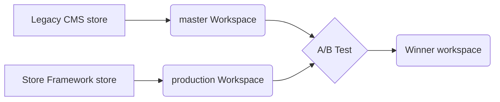

In this guide, you'll learn how to perform A/B testing between your Legacy CMS store and your Store Framework store. This test helps you determine which workspace delivers the highest conversion rate for your store.

The A/B test compares two versions of your store: the live Legacy CMS store in the `master` workspace and the Store Framework store in the `production` workspace, capable of receiving user traffic but not yet live.



## Before you begin

- **Install the VTEX IO CLI:** The CLI allows you to log in to your VTEX account, manage workspaces, and develop new apps. For installation instructions, refer to the [Installing VTEX IO CLI](https://developers.vtex.com/docs/guides/vtex-io-documentation-vtex-io-cli-installation-and-command-reference) guide.
- **Have a Store Framework theme ready:** Ensure that you have a Store Framework theme ready for your store. If you haven't started building with Store Framework yet, follow the [Storefront track](https://developers.vtex.com/docs/guides/getting-started-3) for step-by-step guidance on creating your store from scratch.
- **Verify your Edition App version:** Confirm that your `development` workspace has the `vtex.edition-store@5.x` Edition app installed by running  `vtex edition get`  in your terminal. If it's not installed, [open a ticket with the VTEX support team](https://help-tickets.vtex.com/smartlink/sso/login/zendesk?_ga=2.222513819.1487123273.1647865109-1001456323.1619912759) to request its installation in the new Development workspace.

## Instructions

### Step  1 - Setting up the Legacy CMS

After creating your Store Framework theme and making changes in your `development` workspace, set up the Legacy CMS environment to conduct the test. This setup allows you to evaluate your changes with real user traffic.

1. [Create a production workspace](https://developers.vtex.com/docs/guides/vtex-io-documentation-creating-a-production-workspace) to test your changes with some user traffic.

2. Run the `vtex use master` command in your terminal to perform the steps below in the `master` workspace. The `master` workspace must be set to the `vtex.edition-business@0.x` [Edition app](https://developers.vtex.com/docs/guides/vtex-io-documentation-edition-app).

3. Install the `vtex.colossus-legacy-proxy@@1.8.9-hkignore` app by running the following command. This app is responsible for routing requests within the VTEX IO environment during an A/B test between IO and Legacy CMS. 

    ```bash
    vtex install vtex.colossus-legacy-proxy@@1.8.9-hkignore
    ```
    
    > ❗️ Ensure the app version is `1.8.9-hkignore`. Using a different version will prevent the store from responding correctly. Note that the `vtex.colossus-legacy-proxy@1.8.9-hkignore` directs traffic to the `master` workspace in Legacy CMS Portal, while the `vtex.colossus-legacy-proxy@2.x` version routes traffic to the VTEX IO workspace.

### Step 2 - Requesting an A/B test

Now that you have set up the Legacy CMS environment for testing, you can request an A/B test. This step lets you compare the performance and user experience between your Legacy CMS environment and the VTEX IO environment, helping you make informed decisions about your store.

1. [Open a ticket with the VTEX support team](https://help-tickets.vtex.com/smartlink/sso/login/zendesk?_ga=2.222513819.1487123273.1647865109-1001456323.1619912759) to request the redirection of the `production` workspace to be rendered in VTEX IO. Please provide the following information in your ticket:
  
    - Account name
    - `production` workspace
    - Indicate whether the store features a distinct storefront for mobile devices.

2. Once the `production` workspace is ready, you can configure the A/B test as outlined in the [Running native A/B tests](https://developers.vtex.com/docs/guides/vtex-io-documentation-running-native-ab-testing) guide.

### Step 3 - Validating if the A/B test is running

To ensure the A/B test is active, send a `GET` request to the following API: `http://platform.io.vtex.com/{{accountName}}/_abtest/parameters`.

    >⚠️ Include the `VtexIdclientAutCookie` header from the account you want to get the information. For example: `VtexIdclientAutCookie: {{VtexIdclientAutCookie}}`

The response should look something like this, indicating traffic distribution:

```json
"master": {
  "A": 9000,
  "b": 1
},
"wsio": {
  "A": 1000,
  "b": 1
}
```

This example shows that the `master` is receiving 90% of the traffic, and the `wsio` workspace is receiving 10%.

### Step 4 - Migrating your changes

After completing the A/B test and deciding to migrate your store to Store Framework, [open a ticket to the VTEX support team](https://help-tickets.vtex.com/smartlink/sso/login/zendesk?_ga=2.222513819.1487123273.1647865109-1001456323.1619912759).
