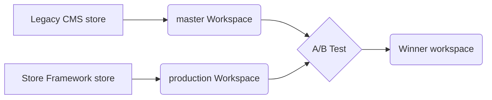

In this guide, you will learn how to perform A/B testing between store workspaces in CMS Legacy and VTEX IO to confirm which workspace has the highest conversion rate for your store.

The A/B test compares two store versions: the live Legacy CMS store in the `master` workspace and the Store Framework store in the `production` workspace, capable of receiving user traffic but not yet live.



## Before you begin

1. **Install the VTEX IO Command-line Interface (CLI):** This command-line interface allows you to log in to your VTEX account, manage workspaces, and develop new apps. To install it, refer to the [Installing VTEX IO CLI](https://developers.vtex.com/docs/guides/vtex-io-documentation-vtex-io-cli-installation-and-command-reference) guide.

2. **Have a Store Framework Theme ready:** To proceed with the test, ensure you have a Store Framework theme prepared for your store. If you haven't started building with Store Framework yet, follow the [Storefront track](https://developers.vtex.com/docs/guides/getting-started-3) for step-by-step guidance on creating your store from scratch.

3. **Check Edition App Version:** Verify that your `development` workspace has the `vtex.edition-store@5.x` Edition app installed by running  `vtex edition get`  in your terminal. If it's not installed, [Open a ticket to the VTEX support team](https://help-tickets.vtex.com/smartlink/sso/login/zendesk?_ga=2.222513819.1487123273.1647865109-1001456323.1619912759) to request its installation in the new Development workspace.

## Instructions

### Step  1 - Setting up the Legacy CMS

After creating your Store Framework theme and making changes in your `development` workspace, it's time to set up the Legacy CMS environment for testing purposes. This step allows you to evaluate your changes with real user traffic and verify that everything works as expected.

1. [Create a production workspace](https://developers.vtex.com/docs/guides/vtex-io-documentation-creating-a-production-workspace) to test your changes with some user traffic.

2. Run the `vtex use master` command in your terminal to perform the steps below in the `master` workspace. The `master` workspace must be set to the `vtex.edition-business@0.x` [Edition app](https://developers.vtex.com/docs/guides/vtex-io-documentation-edition-app).

3. Install the `vtex.colossus-legacy-proxy@@1.8.9-hkignore` app by running the following command:

```bash
vtex install vtex.colossus-legacy-proxy@@1.8.9-hkignore
```

#### `vtex.colossus-legacy-proxy@1.8.9-hkignore`

The app’s version must be `vtex.colossus-legacy-proxy@1.8.9-hkignore`. If not, the store won’t respond to the request. **Do not uninstall this app, as it's essential for proper store rendering.**

The `vtex.colossus-legacy-proxy` app routes requests from the store website within the VTEX IO environment. For example, during an A/B test between IO and Legacy CMS Portal, the store is placed inside the IO environment, and this app is configured in a workspace to route requests for the website to render the store. The `vtex.colossus-legacy-proxy@1.8.9-hkignore` points to the `master` workspace that is in Legacy CMS Portal, and the `vtex.colossus-legacy-proxy@2.x` points to the `development` workspace in the VTEX IO.

### Step 2 - Requesting an A/B test

Now that you've successfully set up the Legacy CMS environment for testing, it's time to request an A/B test. This step lets you compare the performance and user experience between your Legacy CMS environment and the VTEX IO environment, helping you make informed decisions about your store.

1. [Open a ticket to the VTEX support team](https://help-tickets.vtex.com/smartlink/sso/login/zendesk?_ga=2.222513819.1487123273.1647865109-1001456323.1619912759) requesting the redirection of the `production` workspace to be rendered in VTEX IO. Please provide the following information in your ticket:
  
    - Account name
    - `production` workspace
    - Indicate whether the store features a distinct storefront for mobile devices.

2. Once the `production` workspace is rendering in the VTEX IO, you can enable the A/B test between the workspaces described in the [Running native A/B tests](https://developers.vtex.com/docs/guides/vtex-io-documentation-running-native-ab-testing) guide.

### Step 3 - Validating if the A/B test is running

In this step, you will ensure that your A/B test is actively comparing the performance of your Legacy CMS environment with the VTEX IO environment.

1. To ensure the A/B test is working, send a `GET` request to the following API: `http://platform.io.vtex.com/{{accountName}}/_abtest/parameters`.

    >⚠️ The Header must have `VtexIdclientAutCookie` from the account you want to get the information. For example: `VtexIdclientAutCookie: {{VtexIdclientAutCookie}}`

2. The response indicates that the `master` is with 90% of the traffic, and the `wsio` production workspace is with 10%.

```json
"master": {
  "A": 9000,
  "b": 1
},
"wsio": {
  "A": 1000,
  "b": 1
}
```

The response indicates that the `master` is with 90% of the traffic and the `wsio` `production` workspace is with 10%.

## Next Step

After finishing the A/B test and want to migrate your store to IO, [open a ticket to the VTEX support team](https://help-tickets.vtex.com/smartlink/sso/login/zendesk?_ga=2.222513819.1487123273.1647865109-1001456323.1619912759)  requesting the migration of your `development` workspace to the IO.
