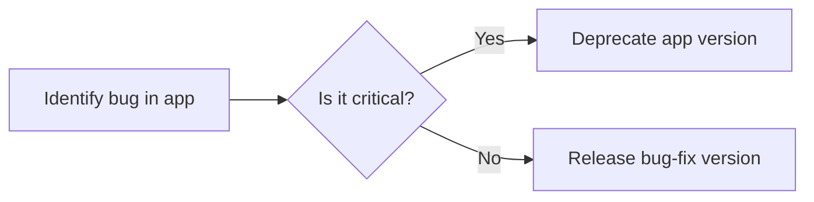

A deprecated version of an app or a deprecated app is one that developers discourage its use. It can be because it leads to errors or a better alternative exists.

If you're unsure whether you should deprecate an app version, consider the following scenario: Imagine you've developed the app `mystore.store-theme`, and the latest version published is `mystore.store-theme@1.0.1`. You've developed a new feature and are ready to release the improved version `mystore.store-theme@1.2.0`. You publish the app, but later that day, you discover a critical bug in this new version. In such situations, you have two main options to consider:

- **Release a bug-fix version:** If the bug is simple, not affecting sales significantly, and you can swiftly address it, releasing a new version with the bug fix may be the best course of action.
- **Deprecate the buggy app version:** However, If the bug is critical or will require considerable time and resources, we recommend deprecating the buggy app version and downgrading it to the latest stable version.

By deprecating the app version with the issue, you choose to revert the store to a more stable state. In this scenario, the VTEX IO platform will automatically uninstall `mystore.store-theme@1.2.0` and revert it to the previous stable version, `mystore.store-theme@1.0.1`. This approach allows you to restore normal store operations while giving you the time and space to work on the fix without disrupting sales and users.



## Instructions

To deprecate an app version, take the following steps:

1. Open the terminal and use the [VTEX IO CLI](https://developers.vtex.com/docs/guides/vtex-io-documentation-vtex-io-cli-installation-and-command-reference) to log in to the account corresponding to the `vendor` of the app you intend to deprecate.
 ```sh
 vtex login {vendorAccount}
 ```
2. Execute the following command, replacing the placeholders with your app's information:

 ```sh
 vtex deprecate {vendorAccount}.{appName}@{appVersion}
 ```
 > The deprecated app will be uninstalled and downgraded to its latest stable version in every VTEX account. Note that this process can take some time.

3. (Optional) If you want to immediately install the latest stable version of the app in any account, run the following command:
 
 ```sh
 vtex update {vendorAccount}.{appName}
 ```

Keep in mind that the deprecation won't delete the app or version from the VTEX IO registry, meaning that it will still be possible to manually install it in any account by running `vtex install {vendorAccount}.{appName}@{appVersion}`.

## Reversing deprecation 

If you realize that the deprecation was unnecessary and you want to republish a given version, you can reverse the deprecation by running the following command:

```sh
 vtex undeprecate {vendorAccount}.{appName}@{appVersion}
```
