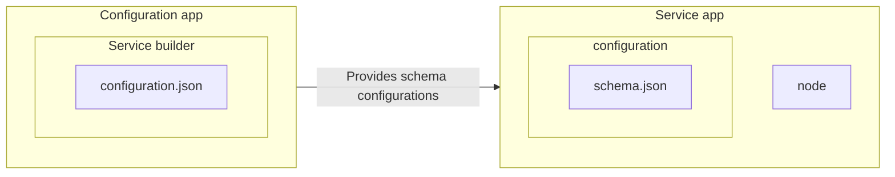

This guide will walk you through the process of creating standalone apps dedicated to configuring services within the VTEX IO platform. By following these steps, you can enhance the adaptability and versioning of your VTEX IO apps.

To complete this guide, we will develop apps with two distinct purposes:

- **Service apps:** These applications provide specific functionalities to other apps or users within the VTEX platform. They are what other apps configure to leverage particular features or services. Service apps are developed using either the `node`, `dotnet` or `graphql` builder.
- **Configuration apps:** These independent applications are designed to configure Service apps. Their primary role is to define how a service app should behave, specifying settings and adapting its functionality to meet the needs of other apps or users. Configuration apps use the `configuration` builder, which separates service configuration code into an independent app, decoupled from the platform.

In the diagram below, you can see how Service and Configuration apps interact with each other. Service apps expose their schema configurations via the `schema.json` file, and Configuration apps utilize this information to manage and deliver configurations via the `configuration.json` file. This separation of concerns enhances organization and modularity in application development, especially in the context of configuration management.



## Instructions

### Step 1 - Creating a Service app

In this initial stage, you will create a Service app to house the service configurations for another VTEX IO app.

1. Open the terminal and use the [VTEX IO CLI](https://developers.vtex.com/docs/guides/vtex-io-documentation-vtex-io-cli-installation-and-command-reference/) to log in to your VTEX account.

   ```sh
   vtex login {accountName}
   ```

2. Start a new VTEX IO app project by running the following command.

   ```sh
   vtex init
   ```

3. Select the `service-example` option.
4. Open the app project in your preferred code editor.

### Step 2 - Configuring the Service App

Now, declare that your app can receive configurations through requests. Follow the instructions below based on your scenario:

<details>
<summary>Node service</summary>

In the `node/service.json` file, add `"settingsType": "workspace"` to define which routes will be able to receive configurations through requests. For example:

```json
"routes": {
  "status": {
    "path": "/_v/status/:code",
    "public": true,
    "settingsType": "workspace"
  },
}
```

It is also possible to define your configurations through event listening. In this case, you should add in the `node/service.json` file something similar to the example below, replacing the values according to your needs:

```json
"events": {
  "eventHandler": {
    "sender": "appEmittingTheEvent",
    "keys": ["topic"],
    "settingsType": "workspace"
  },
}
```

</details>

<details>
<summary>GraphQL app</summary>

If you are developing a GraphQL app, add the `@settings` directive to all queries that can receive configurations.

A [GraphQL Directive](https://graphql.org/learn/queries/#directives) is a way of changing how the query will be performed. When you add the `settings` directive, the system knows it must search for configurations for that service. Under the hood, this directive is including one extra step to the query, which is responsible for finding all the configurations and adding them to the context.

Take the [`graphql-example`](https://github.com/vtex-apps/graphql-example) app as an example. In this app's root directory, you'll see the following file `grapqhl/schema.graphql`. Now, if you open it and add the `@settings` directive to the query `book`, you'll have something like:

```diff
 type Query {
-    book(id: ID!): Book
+    book(id: ID!): Book @settings(settingsType: "workspace")
 }

+ @settings(settingsType: "workspace")
```

</details>

### Step 3 - Declaring policies and permissions

In the `manifest.json` file, add the `read-workspace-apps` [policy](https://developers.vtex.com/docs/guides/vtex-io-documentation-policies) to the `"policies"` list. This policy is responsible for allowing the service app to read the data from the configuration app.

```json
"policies": [
  {
    "name": "read-workspace-apps"
  }
]
```

### Step 4 - Setting up the `configuration` builder

1. Open the app's `manifest.json` file and add the `configuration` builder to the `builders` list. Also, update the `name` and `vendor` fields according your scenario. For example:

   ```diff
    {
      "name": "vtex.most-amazing-service-ever",
      "version": "0.0.0",
      "builders": {
        "node": "4.x",
   +    "configuration": "0.x"
      }
    }
   ```

2. Create a `configuration` folder in your app's root directory.
3. Create a file named `schema.json` inside the `configuration` folder. This file will hold information about the settings structure that the Service app is going to accept from other apps on the platform.
4. In the `configuration/schema.json` file, create a JSON Schema according to your scenario. The JSON Schema will be used to identify new configurations coming from apps and define the expected format of a new configuration. For example:

   ```json
   {
     "type": "object",
     "properties": {
       "id": { "type": "number" },
       "name": { "type": "string" }
     }
   }
   ```

   In the example above, the accepted configuration is an object with two keys: `id` and `name`, where the first is a number, and the second is a string.

### Step 5 - Deploying the Service app

Save your changes and then [deploy your new Service app](https://developers.vtex.com/docs/guides/vtex-io-documentation-making-your-new-app-version-publicly-available).

### Step 6 - Linking the Configuration app to the Service app

Once your Service app is deployed, it is ready to receive configurations from other apps.

1. Start a new Configuration app project.
2. Add the recently created Service app as a new builder to the `manifest.json` file of your new Configuration app. For example:

   ```diff
   {
     "name": "vtex.amazing-configuration",
     "version": "0.0.0",
     "builders": {
   +    "vtex.most-amazing-service-ever": "0.x",
     }
   }
   ```

  Ensure that the name of the builder matches the Service you want your app to configure, and the version matches the desired Service app version.
2. Create a new folder named after your Service app and create a new file named `configuration.json` within it (e.g., `vtex.most-amazing-service-ever/configuration.json`).
3. In the `configuration.json`, define which service configurations are expected according to the JSON schema structure previously defined in the Service app. For example:

   ```json
   {
     "name": "little foot",
     "id": 19
   }
   ```

4. Save your changes and then [publish your new Configuration app version](https://developers.vtex.com/docs/guides/vtex-io-documentation-publishing-an-app/).

## Reading the received Service app configurations

Understanding how to access configurations received by the Service app is crucial. As mentioned earlier, these configurations originate from other apps within the context of their respective requests.

To retrieve the configurations received by the Service app, use the following command:

```js
const settings = ctx.vtex.settings;
```

The `ctx` can be either a `EventContext` or a `ServiceContext`.

The received configurations are structured as an array of objects, as demonstrated in the example below:

```json
[
  {
    "vtex.amazing-configuration": {
      "name": "little foot",
      "id": 1
    },
    "declarer": "vtex.amazing-configuration@0.0.0+build1580823094"
  }
]
```

Each element in this array consists of:

- An object containing the `name` of the app that configures the service (e.g., `vtex.amazing-configuration`) and the configuration schema's settings, adhering to the structure defined in the Service app's `schema.json` file.
- The `declarer` key, which holds the full name of the app responsible for these configurations.

Note that multiple apps can configure the same service. Hence, each element in this array represents a configuration originating from a different app.

## Troubleshooting

If you are developing a configuration app and the service that your app is configuring is not installed or linked in the same workspace you're working at, you may run into some errors. That happens because, when creating a new configuration app, the configuration builder first looks for the schema of that configuration in all the apps installed in your current workspace. Consequently, if the configuration builder cannot find this specific configuration, linking your app may fail.

To avoid errors, remember to always have the service you're configuring linked or installed in the same workspace you're developing your configuration app.

To publish your Configuration app without installing the service in the `master` workspace, you can `link` or `install` the Service app in an alternative branch and then use the `-w` flag when publishing:

```sh
vtex publish -w {alternativeBranchName}
```
