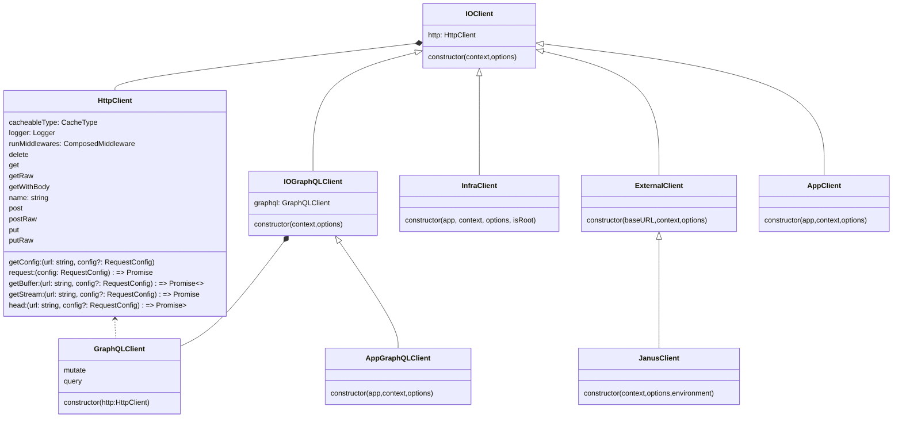

If you need to integrate your VTEX IO app with external services that aren't covered by [VTEX IO's native Clients](https://developers.vtex.com/docs/guides/vtex-io-documentation-clients), creating custom clients can be a powerful solution. Custom clients extend the functionality of VTEX IO Client types, offering benefits like caching and versioning. This guide will walk you through the process of creating custom clients for your VTEX IO apps.

> ⚠️ Note that direct communication with APIs is generally discouraged in favor of implementing a dedicated Client. By creating custom Clients, you can extend the capabilities of your VTEX IO applications, opening up opportunities to integrate with a wide range of services seamlessly.

As you develop your custom Client, you will define methods within it. These Client methods are functions responsible for handling the logic needed to execute specific actions. They facilitate interactions with services and APIs, managing requests and responses effectively.

Once you've created your custom Client, you can seamlessly integrate it into your VTEX IO app to execute the implemented methods. While you have the flexibility to incorporate data-handling logic within your Client's methods (e.g., field mapping or data filtering), it's essential to keep the core responsibilities of the Client well-organized.

## Before you begin

Before diving into Client development, make sure you have the following prerequisites in place:

- **VTEX IO development workspace:** Ensure you have a VTEX IO development workspace set up. For more information, refer to [Creating a Development workspace](https://developers.vtex.com/docs/guides/vtex-io-documentation-creating-a-development-workspace).
- **TypeScript Familiarity:** This guide assumes you have a basic understanding of TypeScript, as we'll be using the `node` [Builder](https://developers.vtex.com/docs/guides/vtex-io-documentation-builders) to develop with TypeScript. For more information, refer to [Typescript's official documentation](https://www.typescriptlang.org/docs/).
- **Understanding of Clients:** Clients play a crucial role in facilitating interactions between your application and both external and internal services. For more information, refer to [Clients](https://developers.vtex.com/docs/guides/vtex-io-documentation-clients).

## Instructions

In this guide, we will create an example custom Client for communicating with GitHub APIs. We'll implement the following methods within our Client:

- `getRepo`: Fetches a GitHub repository given the owner and repository name.
- `getUser`: Retrieves GitHub user data based on a specified GitHub username.
- `createTag`: Creates a new tag on GitHub, considering the repository owner, repository, and tag data.
- `searchRepos`: Searches for GitHub repositories using a specified query.

### Step 1 - Setting up your VTEX IO app

1. Start a new VTEX IO app using the `node` builder and open the project using your preferred code editor.
2. Install the `@vtex/api` package by running the following command:

   ```sh
   yarn add @vtex/api
   ```

3. Open the app's `manifest.json` file and add the necessary [Policies](https://developers.vtex.com/docs/guides/vtex-io-documentation-policies). Policies are a set of permissions granted to an app, allowing or forbidding it to execute a given set of actions, such as making requests to an external resource. For this example, we will use the `outbound-access` policy to communicate with GitHub APIs (`api.github.com`).

    ```json
    "policies": [
      {
        "name": "outbound-access",
        "attrs": {
          "host": "api.github.com",
          "path": "*"
        }
      },
    ]
    ```

    > ⚠️ Note that incorrect policies may result in request blocking.

### Step 2 - Creating a custom Client

1. Create a folder named `clients` inside the `node` directory.
2. Create a TypeScript file for your Client in the `node/clients` directory. Choose a name that easily identifies your Client (e.g., `github.ts`).
3. Implement the Typescript class that extends the appropriate [Client type](#client-types) from `@vtex/api`. In this example, we will create the `GithubClient`. Also, since we are communicating with GitHub's external APIs, we will use `ExternalClient`.
4. Use [`InstanceOptions`](#instanceoptions) as needed, configuring options like authentication, timeout, caching, and more based on your requirements.

   ```ts
   //node/clients/github.ts
   import { 
    ExternalClient, 
    IOContext, 
    InstanceOptions 
   } from "@vtex/api";

   export default class GithubClient extends ExternalClient {
     constructor(context: IOContext, options?: InstanceOptions) {
       super("https://api.github.com", context, {
        ...options,
        retries: 2,
        headers: {
          Accept: 'application/vnd.github.machine-man-preview+json',
          Authorization: 'Bearer my.cool.jwt'
        }
       });
     }

     // We will add the Client-related methods here
   }
   ```

Ensure to export the Client from its module (either [default or named export](https://medium.com/@etherealm/named-export-vs-default-export-in-es6-affb483a0910)).

### Step 3 - Implementing Client methods

Within your Client TypeScript file, implement the methods for your Client. You can leverage the methods provided by the [HttpClient](#httpclient-methods) to build your own methods. For example:

   ```ts
   //node/clients/github.ts
   public getRepo({owner, repo}: GitRepo) {
    return this.http.get<ReposGetResponse>(this.routes.repo({owner, repo}),{
      metric: 'git-repo-get',
      headers: {
        Accept: 'application/vnd.github.nebula-preview+json'
      }
    })
   }
   ```

Refer to the image below, which showcases the complete code of our example:


### Step 4 - Exporting custom clients

Now that you've created your custom Client, you need to organize and export it for use in your VTEX IO service. Follow these steps:

1. Create an `index.ts` file in the `node/clients` folder.
2. Inside the `index.ts` file, import the custom client you created in the previous step. For example:

    ```ts
    import GithubClient from "./github.ts";
    ```

3. Define a class called `Clients` that extends `IOClients`. This class is used to organize and configure your custom Clients. Within the Clients class, declare a `get` property for each of your custom Clients. This property allows you to access a specific Client by name. In our example, we've created a client named `github` that uses the `GithubClient` class.

    ```ts
    import { IOClients } from "@vtex/api";
    import GithubClient from "./github.ts";

    export class Clients extends IOClients {
      public get status() {
        return this.getOrSet("github", GithubClient);
      }
    }
    ```

Now that you have developed and exported your custom Client to communicate with the desired service, your Clients can be accessed and used within your VTEX IO service to perform various tasks, such as interacting with external APIs like GitHub. Learn how to use clients effectively in the [Using Node Clients](https://developers.vtex.com/docs/guides/using-node-clients) guide.

## Client types

The [`@vtex/api`](https://github.com/vtex/node-vtex-api/) package provides a structured way to create clients.

| Type               | Use case                                                         |
| ------------------ | ---------------------------------------------------------------- |
| `AppClient`        | Communication with other IO Services via HTTP calls.             |
| `AppGraphQLClient` | Communication with other IO GraphQL services.                    |
| `ExternalClient`   | Communication with external APIs.                                |
| `JanusClient`      | Communication with VTEX Core Commerce APIs through Janus Router. |
| `InfraClient`      | Communication with VTEX IO Infra services.                       |

Refer to the diagram below to better understand the relationship between Client types.



Note that `context` is of type `IOContext` and `options` is of type [`InstanceOptions`](#instanceoptions).

## `InstanceOptions`

The `InstanceOptions` table below provides a detailed description of the available options for configuring your `HttpClient` instance:

| Option                          | Description                                                                         |
| ------------------------------- | ----------------------------------------------------------------------------------- |
| `authType`                      | Specifies the authentication type.                                                  |
| `timeout`                       | Sets the request timeout duration in milliseconds.                                  |
| `memoryCache`                   | Configures a memory cache layer for caching data.                                   |
| `diskCache`                     | Configures a disk cache layer for caching data.                                     |
| `baseURL`                       | Defines the base URL for making requests.                                           |
| `retries`                       | Specifies the number of times a request should be retried in case of failure.       |
| `exponentialTimeoutCoefficient` | Configures the coefficient for exponential timeout backoff strategy.                |
| `initialBackoffDelay`           | Sets the initial delay before starting exponential backoff retries in milliseconds. |
| `exponentialBackoffCoefficient` | Configures the coefficient for exponential backoff retries.                         |
| `metrics`                       | Specifies an object for accumulating metrics related to requests.                   |
| `concurrency`                   | Defines the maximum number of concurrent requests.                                  |
| `headers`                       | Sets default headers to be sent with every request.                                 |
| `params`                        | Sets default query string parameters to be sent with every request.                 |
| `middlewares`                   | Configures an array of middleware functions for request processing.                 |
| `verbose`                       | Enables or disables verbose logging for requests and responses.                     |
| `name`                          | Defines a custom name for the instance.                                             |
| `serverTimings`                 | Sets server timings for measuring request and response times.                       |
| `httpsAgent`                    | Configures the HTTPS agent for making requests over SSL/TLS.                        |

## `HttpClient` methods

Below is a table outlining the methods available in the `HttpClient` class:

| Method                             | Description                                                                                       |
| ---------------------------------- | ------------------------------------------------------------------------------------------------- |
| `get(url: string, config?: RequestConfig)`               | Sends an HTTP GET request.                       |
| `getRaw(url: string, config?: RequestConfig)` | Sends an HTTP GET request.                   |
| `getWithBody(url: string, data?: any, config?: RequestConfig)` | Sends an HTTP GET request with a request body.  |
| `getBuffer(url: string, config?: RequestConfig)` | Sends an HTTP GET request and resolves with the response data as a buffer along with the headers. |
| `getStream(url: string, config?: RequestConfig)` | Sends an HTTP GET request and resolves with the response as a readable stream (of type `IncomingMessage`). |
| `put(url: string, data?: any, config?: RequestConfig)`               | Sends an HTTP PUT request.                       |
| `putRaw(url: string, data?: any, config?: RequestConfig)` | Sends an HTTP PUT request.                   |
| `post(url: string, data?: any, config?: RequestConfig)`               | Sends an HTTP POST request.                       |
| `postRaw(url: string, data?: any, config?: RequestConfig)` | Sends an HTTP POST request.                   |
| `patch(url: string, data?: any, config?: RequestConfig)`               | Sends an HTTP PATCH request.                       |
| `head(url: string, config?: RequestConfig)`              | Sends an HTTP HEAD request and resolves when the request is complete.                              |
| `delete(url: string, config?: RequestConfig)`             | Sends an HTTP DELETE request.                       |
