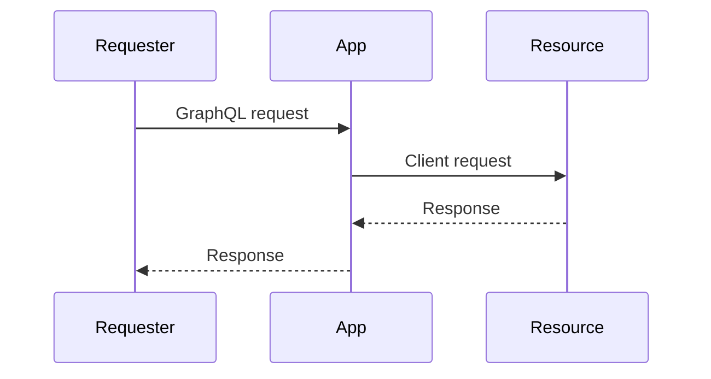

When developing a [service app](https://developers.vtex.com/docs/guides/vtex-io-documentation-service), you may need to expose an API so that other systems, such as other VTEX IO apps or external integrations, can interact with it. There are two options for developing APIs: [REST](https://restfulapi.net/) and [GraphQL](https://graphql.org/). REST is commonly used for interacting with other services and external integrations, while GraphQL is usually recommended for interactions with frontend apps and systems.

This guide will show you how to create an API using GraphQL and VTEX IO.

> ℹ️ For details about REST API development, see [Developing services in VTEX IO](https://developers.vtex.com/docs/guides/developing-services-on-vtex-io).

## Before you begin

Make sure to check the technical requirements to follow this guide:

- [VTEX IO CLI is installed](https://developers.vtex.com/docs/guides/vtex-io-documentation-vtex-io-cli-install) on your computer.
- Access to a VTEX store with a [development workspace](https://developers.vtex.com/docs/guides/vtex-io-documentation-creating-a-development-workspace) and the Admin environment.
- Knowledge of GraphQL and related concepts, such as [queries](https://graphql.org/learn/queries/), [schema](https://graphql.org/learn/schema/), and [resolvers](https://graphql.org/learn/execution/).
- Experience developing in the [TypeScript](https://www.typescriptlang.org/) language.

## App behavior

The basic behavior of a service app with a GraphQL API works as follows:

1. A requester (store user, another app, external service, etc.) makes a GraphQL request to an app instantiated in a VTEX store.
2. Upon receiving the request, the app executes it through a resolver function.
3. The resolver uses a [VTEX client](https://developers.vtex.com/docs/guides/vtex-io-documentation-clients) to call the desired resource ([VTEX API](https://developers.vtex.com/docs/guides/getting-started-list-of-rest-apis), another app, external service, etc.).
4. The app receives the response from the resource and continues executing the resolver.
5. The resolver generates the response body of the request based on the received data.
6. The app returns the GraphQL request to the requester with the response body.



## Implementation

The next sections explain how to implement a GraphQL API in a service app. This example shows how to display mocked data about live users accessing product pages. The implementation includes creating the GraphQL schema, a [custom client](https://developers.vtex.com/docs/guides/vtex-io-documentation-how-to-create-and-use-clients), and a resolver function.

### 1. Start with a template

We recommend downloading a VTEX IO app template to your computer if you are developing an app from scratch. There are two main options for app templates in this case:

- [graphql-example](https://github.com/vtex-apps/graphql-example): Service template with basic implementation of GraphQL and Node.
- [service-example](https://github.com/vtex-apps/service-example): Service template with basic implementation of Node, without GraphQL.

The next steps of this guide will use the service-example template to demonstrate how to implement a GraphQL API from scratch.

You can clone the repository using the following command in a terminal:

```sh
git clone https://github.com/vtex-apps/service-example
```

### 2. Add the GraphQL builder

Open the `manifest.json` file in your app root and add the [GraphQL builder](https://developers.vtex.com/docs/guides/vtex-io-documentation-graphql-builder). The builder interprets the GraphQL schema in your TypeScript code in the `node` folder.

> ℹ️ Your app may already have the GraphQL builder configured. If that's the case, you only need to check if it uses the latest builder version (1.x).

```json mark=3
"builders": {
  "node": "7.x",
  "graphql": "1.x"
}
```

### 3. Define the GraphQL schema

In the `graphql` folder, add the `.graphql` files to define the GraphQL schema. You can add the entire schema in a single file or use multiple files, including subfolders. To better organize your project, we recommend using the following structure:

- Add your endpoints (queries, mutations, or subscriptions) in the `schema.graphql` file.
- Add the directives in the `directives.graphql` file.
- Create a `types` subfolder and add one `.graphql` file for each type to be defined in the schema.

```txt
graphql
┣ 📂 types
    ┣ 📄 a_type.graphql
    ┗ 📄 b_type.graphql
┣ 📄 directives.graphql
┗ 📄 schema.graphql
```

#### Type example

```graphql graphql/types/ProductView.graphql
type ProductView {
  slug: String
  liveUsers: Int
}
```

#### Query schema example

```graphql graphql/schema.graphql
type Query {
  getSku(topN: Int): String
}
```

> ℹ️ GraphQL has many more functionalities you can add to the schema, such as mutations, subscriptions, and directives. See the [official GraphQL documentation](https://graphql.org/learn/) for details.

### 4. Declare the list of Clients

Your app will likely access an external resource such as [VTEX APIs](https://developers.vtex.com/docs/guides/getting-started-list-of-rest-apis), an endpoint from another app, or a service external to VTEX. Within VTEX services, these interactions are handled through [clients](https://developers.vtex.com/docs/guides/vtex-io-documentation-clients).

Instead of calling endpoints directly in your resolver functions, you should define and use clients to encapsulate your HTTP logic and keep your resolvers clean and focused.

#### Using VTEX native clients

VTEX provides built-in clients for commonly used services, such as Catalog, OMS, and Checkout.

Here's an example of how to add the Catalog client to your app:

1. Open the terminal.
2. Install the `@vtex/clients` package in the `node` folder of your app:

    ```sh
    cd node
    yarn add @vtex/clients
    ```

3. Open `node/clients/index.ts` and extend the `IOClients` class to register the `catalog` client:

    ```ts node/clients/index.ts mark=2,6:8
    import { IOClients } from '@vtex/api'
    import { Catalog } from '@vtex/clients'

    // Extend the default IOClients implementation with our own custom clients.
    export class Clients extends IOClients {
      public get catalog() {
        return this.getOrSet('catalog', Catalog)
      }
    }
    ```

This setup allows you to access the `catalog` client in your resolvers through the app's context.

#### Using external resources

To access routes and resources not available through the native clients, you need to [develop your custom client](https://developers.vtex.com/docs/guides/vtex-io-documentation-how-to-create-and-use-clients). Similar to native clients, you must register each custom client in the `Clients` class located in `node/clients/index.ts` so it can be accessed across your app.

### 5. Define the resolvers

Resolvers are the functions that are executed when a GraphQL endpoint is called. A resolver function must have the same name as its corresponding endpoint. Follow the steps below to define your resolvers:

1. In the `node` folder, create another folder called `resolvers`.
2. In the new folder, add the TypeScript files that will contain resolver code. We recommend creating a `.ts` file for each resolver.
3. In the created files, add the resolver code. The following example shows a resolver that you can use as a reference:

```ts node/resolvers/products.ts
export const getSku = async (
  _: any,
  { code }: { code: number },
  { clients: { catalog } }: Context
) =>
  catalog
    .getSkuById(code.toString())
    .then((data) => data.Name)
```

### 6. Instantiate the resolvers

After defining your resolver functions, add them to the `Service` class of the `node/index.ts` file. You should add a `graphql` field containing the resolvers for each implemented endpoint.

```ts node/index.ts mark=3,9:15
import type { ClientsConfig, ServiceContext, RecorderState } from '@vtex/api'
import { LRUCache, method, Service } from '@vtex/api'
import { productList } from './resolvers/products'

...

export default new Service({
  clients,
  graphql:{
    resolvers: {
      Query: {
        getSku,
      },
    },
  },
})
```

### 7. Add the policies

If your app accesses external endpoints and resources, add the required policies to your `manifest.json`:

```json manifest.json mark=2:8
"policies": [
  {
    "name": "outbound-access",
    "attrs": {
      "host": "portal.vtexcommercestable.com.br",
      "path": "/api/catalog/*"
    }
  }
],
```

### 8. Link your app

To test your app, [link](https://developers.vtex.com/docs/guides/vtex-io-documentation-linking-an-app) it to the VTEX platform so it can run and accept requests.

Open a terminal and switch to a [development workspace](https://developers.vtex.com/docs/guides/vtex-io-documentation-creating-a-development-workspace). Then, use the `vtex link` command.

```shell
vtex link
```

### 9. Test your endpoints

With your app running, you can test the implemented endpoints by making requests. One way to do this is using the VTEX [GraphQL IDE](https://developers.vtex.com/docs/guides/graphql-ide) in the Admin panel:

1. Install the GraphQL IDE app by running `vtex install vtex.admin-graphql-ide` in your terminal.
2. Open the VTEX Admin in the workspace to which your app was linked. In your browser, go to `https://{workspace}--{account}.myvtex.com/admin`.
3. Go to **Store Settings** > **Storefront** and click **GraphQL IDE**.
4. Select the linked VTEX IO app.
5. Write the query to test your endpoint. Here is an example:

    ```graphql
    {
      getSku(code: 1)
    }
    ```

6. Run the query by clicking the `Play` ▶️ button in the top-left corner. You should see the result of your query on the right side of the window. Here is an example:

    ```json
    {
      "data": {
        "getSku": "50 ml"
      }
    }
    ```
