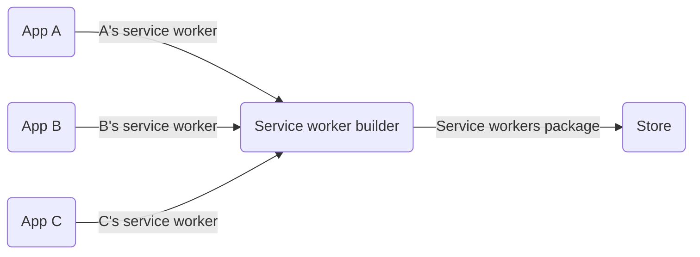

The Service Worker builder is responsible for fetching service workers exported by the account's installed apps and bundling them into a single file.

Service Workers function as JavaScript intermediaries, facilitating interactions between web apps, browsers, and the network. By intercepting, caching, and modifying navigation, they enable efficient offline experiences and enhance the overall performance of web applications.

This article explores how to leverage the Service Worker builder to bundle multiple service workers into a single file for your store. This feature allows stores to work simultaneously with several service workers, eliminating the constraints of being limited to just one.



## Instructions

Follow these instructions to create an app using the Service Worker builder. If you are editing an already-existing app, ensure the Service Worker builder is declared in the `manifest.json`'s builders list, as shown below.
 
 ```diff
  "builders": {
     "docs": "0.x",
 +   "service-worker": "0.x"
 ```

1. Run the `vtex init` command in your terminal, using the VTEX IO CLI:
 ```sh
 vtex init
 ```
2. Select the `service-worker-example` option and confirm that you want to download the app to the destination you just chose:
 
 > ℹ️ Once you select the `service-worker-example` option, the CLI will prompt you for important information about the app, such as a value for the `vendor`, `name`, `title`, and `description`.
3. Open the Service Worker Example app in your preferred code editor.
4. In the `service-workers` folder, declare your app's desired event handlers in the appropriate files. If the folder does not exist, create it. You can find more information regarding which event handler each file expects to receive in the [Service Worker Example app's documentation](https://github.com/vtex-apps/service-worker-example/blob/main/docs/README.md) (README file). For example:
 ```ts
 function exampleSWInstall() {
   // eslint-disable-next-line no-console
   console.log('[example-sw] Install of service worker')
 }
 
 export default 
 ```
5. [Link your app](https://developers.vtex.com/docs/guides/vtex-io-documentation-linking-an-app).
6. Open the store website on your browser and inspect it.
7. In the `Console` tab, check if a message similar to `[service-worker-example] Install of service worker` is displayed. If you see this message, the app's service worker development was successful.
8. [Deploy your app](https://developers.vtex.com/docs/guides/vtex-io-documentation-10-making-your-app-publicly-available#validating-the-deploy) once you are satisfied with the changes made.

Your app's service worker will be automatically fetched and bundled with others exported by the apps installed in your VTEX account that also use the Service Worker builder.
