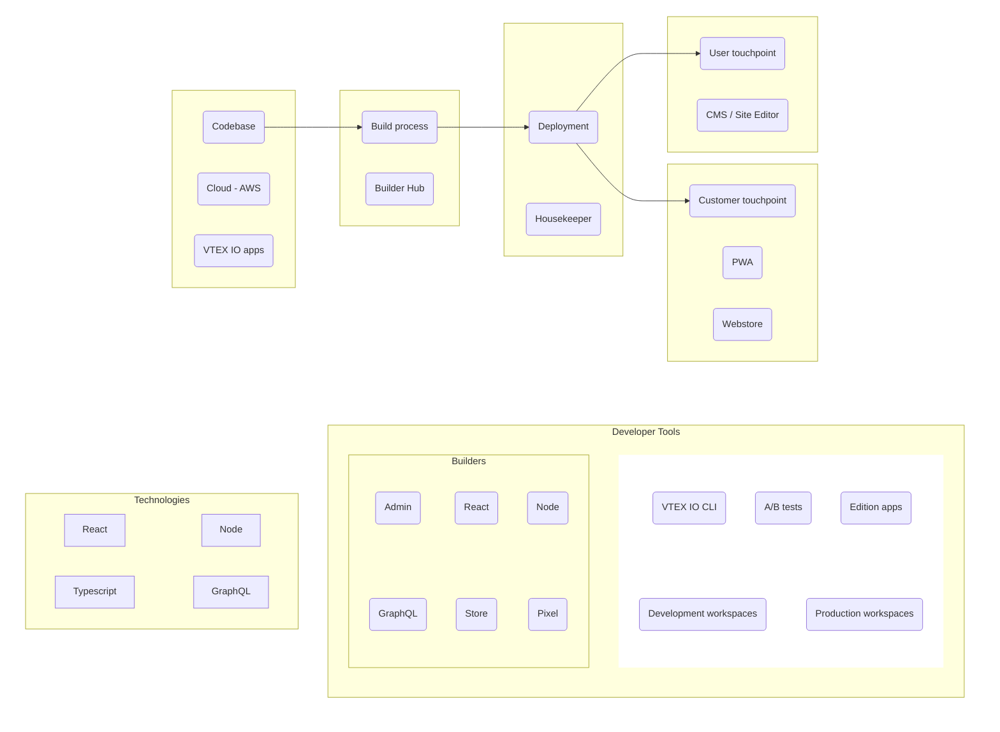

Store Framework is a front-end development framework designed to enhance and simplify the creation of ecommerce websites within VTEX. Built on the [VTEX IO development platform](https://developers.vtex.com/docs/guides/vtex-io-documentation-what-is-vtex-io) and [React](https://reactjs.org/) technology, the framework offers native storefront components in JSON format.

Store Framework relies on the following pillars:

| Aspect | Description |
|---|---|
| Composability | Assemble pre-built and custom components to create a storefront tailored to specific business needs. |
| Flexibility and customization | Adapt storefronts to unique design requirements and functional preferences. |
| Workspaces | Create multiple store versions and test them to guarantee reliability and deploy changes safely. |
| A/B tests | Experiment with different versions of a storefront to enhance user experience and performance. |
| VTEX IO cloud infrastructure | Develop in a fully managed auto-scalable infrastructure. |

## Store Framework architecture



The diagram shows a typical Store Framework architectural flow, which includes the following components:

* **Codebase:** The source code for Store Framework and VTEX IO apps is cloud-native.
* **Build process:** The process of converting the source code into a deployable application, based on [VTEX IO Builders](https://developers.vtex.com/docs/guides/vtex-io-documentation-builders).
* **Deployment:** The process of deploying the application to a production environment.
* **Business user touchpoint:** where administrative users interact with storefront settings, on CMS and Site Editor.
* **Customer touchpoint:** where customers interact with the storefront, usually on a webstore or PWA.

### Developer Tools

Developers using Store Framework can count on a set of tools:

* [VTEX IO CLI](https://developers.vtex.com/docs/guides/vtex-io-documentation-vtex-io-cli-installation-and-command-reference): Interact with the VTEX platform using our command-line tool.
* [A/B tests](https://developers.vtex.com/docs/guides/ab-tests): Compare traffic between two workspaces.
* [Edition App](https://developers.vtex.com/docs/guides/vtex-io-documentation-edition-app): Streamline your setup by installing a preset bundle of settings, policies, backend and frontend apps.
* [Development workspaces](https://developers.vtex.com/docs/guides/vtex-io-documentation-creating-a-development-workspace): Test and preview your code in workspaces dedicated to development, without affecting the live store.
* [Production workspaces](https://developers.vtex.com/docs/guides/vtex-io-documentation-creating-a-production-workspace): Run tests and quality assurance in a workspace that is ready to handle live traffic.
* [Builders](https://developers.vtex.com/docs/guides/vtex-io-documentation-builders): Connect your apps to our services quickly using VTEX IO Builders.

### Technologies

To work with this framework, you should be familiar with the following technologies:

* [VTEX IO](https://developers.vtex.com/docs/guides/vtex-io-documentation-what-is-vtex-io)
* [React](https://reactjs.org/)
* [Node.js](https://nodejs.org/en)
* [TypeScript](https://www.typescriptlang.org/)
* [GraphQL](https://graphql.org/)

## Quickstart

This quickstart guide is a brief introduction to the VTEX Store Framework. For more detailed step-by-step documentation, check [Store Framework - Getting started](https://developers.vtex.com/docs/guides/getting-started-3).

### 1. Initial settings

1. [Install VTEX IO CLI](https://developers.vtex.com/docs/guides/vtex-io-documentation-vtex-io-cli-install). You will need it to run commands in the following steps.
2. Log in to your VTEX account:

   ```sh
   vtex login {accountName}
   ```

3. Open a [support ticket](https://help.vtex.com/support?/cultureInfo=en-us) to set up your account’s Edition app to `vtex.edition-store@3.x` or higher. Refer to the [Edition App article](https://developers.vtex.com/docs/guides/vtex-io-documentation-edition-app) to identify the most suitable version for your scenario.
4. Install Intelligent Search (if the account’s Edition app is `vtex.edition-store@4.x` or lower) and integrate it with your store’s catalog according to [this guide](https://developers.vtex.com/docs/guides/vtex-io-documentation-2-prerequesites#step-2-implementing-the-vtex-intelligent-search).

### 2. Setting up the project

1. Navigate to a local file directory where you want our [boilerplate store theme](https://github.com/vtex-apps/store-theme) to be saved:

   ```sh
   cd {folderName}
   ```
   
2. Start a new project:

   ```sh
   vtex init
   ```
   
3. Select `store` by navigating with your arrow keys and pressing `Enter`. When prompted to confirm, type `y` to clone the `minimum-boilerplate-theme` to your folder.
4. Create a workspace:

   ```sh
   vtex use {workspaceName}
   ```
   
5. Navigate to the `minimum-boilerplate-theme` directory:

   ```sh
   cd minimum-boilerplate-theme
   ```

6. Link your local repository with the workspace:

   ```sh
   vtex link
   ```
   
7. Access your workspace:

   ```sh
   vtex browse
   ```

Now you can make changes to the local repository and test them live in the workspace without altering the store's final public version.

## Next steps

### Customizing your theme

<Flex>

<WhatsNextCard
title="Building your own store theme"
description="Learn how to create your store theme from scratch."
linkTo="https://developers.vtex.com/docs/guides/vtex-io-documentation-6-buildingyourownstoretheme"
linkTitle="See more"
/>

<WhatsNextCard
title="Building pages"
description="Create custom pages for your ecommerce."
linkTo="https://developers.vtex.com/docs/guides/vtex-io-documentation-building-a-product-details-page"
linkTitle="See more"
/>

<WhatsNextCard
title="Using components"
description="Leverage from premade components to build your store theme."
linkTo="https://developers.vtex.com/docs/guides/vtex-io-documentation-building-a-carousel-using-slider-layout"
linkTitle="See more"
/>

<WhatsNextCard
title="Styling"
description="Customize your store's style."
linkTo="https://developers.vtex.com/docs/guides/vtex-io-documentation-contributing-with-new-css-handles"
linkTitle="See more"
/>

</Flex>

### Deploying your changes

<Flex>

<WhatsNextCard
title="Making your theme content public"
description="Publish your new store theme."
linkTo="https://developers.vtex.com/docs/guides/vtex-io-documentation-making-your-theme-content-public"
linkTitle="See more"
/>

<WhatsNextCard
title="Going live"
description="Make your store available to shoppers."
linkTo="https://developers.vtex.com/docs/guides/vtex-io-documentation-go-live"
linkTitle="See more"
/>

</Flex>
