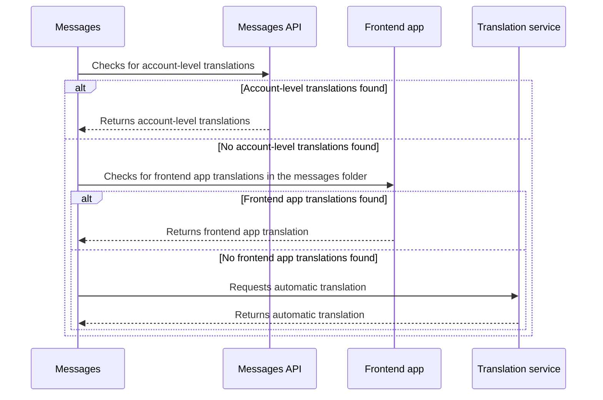

This guide outlines the internationalization process for creating a multi-language ecommerce store using Store Framework.

Internationalization is crucial for reaching global markets and providing a seamless shopping experience for customers from different locales. This guide covers how Store Framework handles internationalization for both storefront content and catalog data, highlighting the tools and libraries used for translations.

## Before you begin

Before starting the internationalization process, check the distinction between frontend app messages and catalog data.

In general, **storefront content** can be sourced from either **frontend React apps** or the **[Catalog API](https://developers.vtex.com/docs/api-reference/catalog-api#overview)**. Specifically, app messages are translatable strings defined within a frontend app, while catalog messages come from external data in the Catalog API. Keep this distinction in mind, since internationalization is handled differently for each.

## Frontend app messages

A Store Framework storefront consists of multiple frontend apps built with VTEX IO and React. For translations, Store Framework uses the [react-intl](https://www.npmjs.com/package/react-intl) library and the VTEX IO Messages app.

Moreover, developers can designate text components as translatable messages when developing a frontend app using the `<Formatted*>` component from the `react-intl` library. This designation enables translatable messages to be automatically translated by an automatic translation service based on the user's locale.

### Automatic translations

Using the automatic translation service, the Messages app can translate frontend app messages based on the user's locale. The user's current locale and the resulting translated messages are available at the root of the component tree, accessible to every component.

However, automatic translations may not always be culturally accurate. To address this, the Messages app provides features for managing custom translations. If preferred, you can also [disable the automatic translation service](https://developers.vtex.com/docs/guides/vtex-io-documentation-disabling-automatic-translation).

### Customizing automatic translations

To address potential cultural inaccuracies in automatic translations, the Messages app provides features for managing custom translations. Developers can override an automatic translation with more specific or representative content for the store, such as a special login message for Spanish-speaking users in Argentina.

You can implement custom translations at either the app or account level:

- **App-level translations**: Developers can set custom translations for each locale within the frontend app's `/messages` folder. The app applies these translations by default to any store that uses it. To learn how to set messages during the development of a React app, see [Translating the component](https://developers.vtex.com/docs/guides/vtex-io-documentation-8-translating-the-component).
- **Account-level translations**: Developers can overwrite a message imported from a frontend app with a completely custom message by making the appropriate GraphQL API request to the Messages app. To learn how to overwrite a message from a frontend app, see [Translating storefront content](https://developers.vtex.com/docs/guides/storefront-content-internationalization).

> ℹ️ The Messages app is a standalone translation application and shouldn't be confused with a string repository. It requires a source language, source content, and a destination language. The output will be the source content translated into the destination language.

### Translation decision flow

When translating a message, the Messages app follows a specific decision flow:

1. Check for custom account-level translations.
2. If the Messages app doesn't find any custom definitions, it checks for frontend app translations in the app's `/messages` folder.
3. If it still doesn't find a translation there, the Messages app falls back to the automatic translation service.

Translating an app into every language can be daunting, so we recommend providing precise translations for your target audience and relying on automatic translation for the rest.

After detecting a user's locale, every message from your frontend component marked as translatable will be automatically translated using the automatic translation service, the frontend app's messages, or custom content personalized via a GraphQL mutation at the account level.

## Catalog data

Catalog messages include product names and product descriptions from the store catalog.

> ℹ️ We recommend using the [Catalog Multi-Language API](https://developers.vtex.com/docs/api-reference/catalog-api#get-/api/catalog/pvt/product/-productId-/language) to manage catalog translations. It gives you granular control over translations for products, SKUs, categories, brands, and other entities, while integrating natively with Intelligent Search and supporting Translation Management Systems (TMS). To learn how to implement it, see the [Catalog multi-language integration guide](https://developers.vtex.com/docs/guides/catalog-multi-language-integration-guide).

All data from the Catalog API is already translatable by default. You can override these automatic translations by sending the appropriate GraphQL query to the Catalog API or the Messages app. To learn how to overwrite a catalog message via the GraphQL API, follow the [Translating Catalog content](https://developers.vtex.com/docs/guides/catalog-internationalization) guide.

>⚠️ Simultaneous use of the Catalog Multi-Language API and the GraphQL (Messages) approach isn't supported for catalog entities. After activating the Catalog Multi-Language feature for your account, you'll no longer be able to manage translations using GraphQL.
