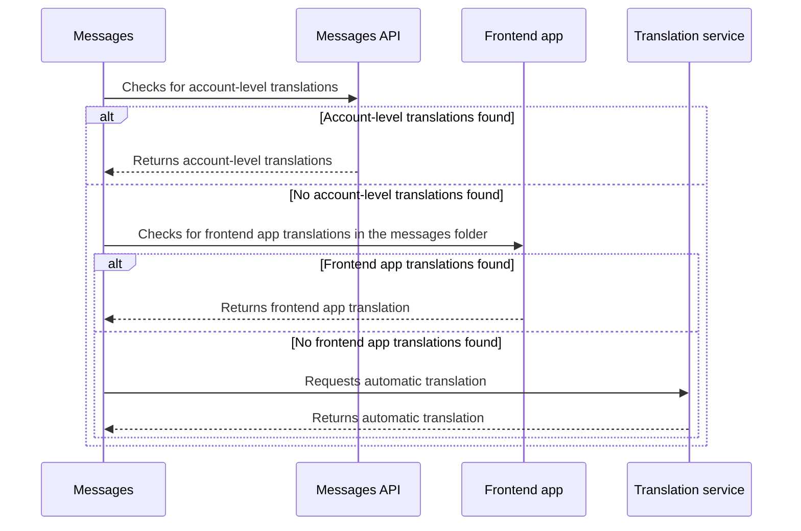

This guide outlines the internationalization process for creating a multi-language ecommerce store using Store Framework.

Internationalization is crucial for reaching global markets and providing a seamless shopping experience for customers from different locales. This guide covers how Store Framework handles internationalization for both storefront content and catalog data, highlighting the tools and libraries used for translations.

## Before you begin

Before starting the internationalization process, understand the distinction between frontend app messages and catalog data.

In general, **storefront content** can be sourced from either **frontend React apps** or the **[Catalog API](https://developers.vtex.com/docs/api-reference/catalog-api#overview)**. More precisely, app messages are translatable strings defined within a frontend app, while catalog messages comprise external data from the Catalog API. Therefore, consider these differences when translating storefront content, as internationalization is handled differently for each case.

## Frontend app messages

A Store Framework storefront consists of multiple frontend apps built with VTEX IO and React. For translations, Store Framework uses the [react-intl](https://www.npmjs.com/package/react-intl) library and the VTEX IO Messages app. 

Moreover, developers can designate text components as translatable messages when developing a frontend app using the `<Formatted*>` component from the `react-intl` library. This enables translatable messages to be automatically translated by an automatic translation service based on the user's locale.

### Automatic translations

By leveraging the automatic translation service, the Messages app can automatically translate frontend app messages according to the user's locale. The user's current locale and the translated messages, obtained from the automatic translation system, become accessible at the root of the component tree and available to each component.

However, automatic translations may not always be culturally accurate. To address this, the Messages app provides functionalities to manage custom translations. If preferred, it is also possible to [disable the automatic translation service](https://developers.vtex.com/docs/guides/vtex-io-documentation-disabling-automatic-translation).

### Customizing automatic translations

To address potential cultural inaccuracies in automatic translations, the Messages app provides functionalities to manage custom translations. Developers can override an automatic translation with more specific or representative content for their store, such as a special login message for Spanish-speaking users in Argentina.

Custom translations can be implemented at either the app or account level:

- **App-level translations**: Developers can set personalized translations for each locale within the frontend app's `/messages` folder. These translations are applied, by default, to any store using the app. To learn how to set messages during the development of a React app, please follow this [guide](https://developers.vtex.com/docs/guides/vtex-io-documentation-8-translating-the-component).
- **Account-level translations**: Developers can overwrite a message imported from a frontend app with a completely customized message, making the appropriate GraphQL API request to the Messages app. To learn how to overwrite a message from a frontend app, please follow this [guide](https://developers.vtex.com/docs/guides/storefront-content-internationalization).

> The Messages app is a standalone translation application and should not be confused with a string repository. It requires providing a source language, source content, and destination language. The output will be the translation of the source content from the source language to the destination language.

### Translation decision flow

When translating a message, the Messages app follows a specific decision flow:

1. Check for custom account-level translations.
2. If no custom definitions are found, it checks for frontend app translations in the app's `/messages` folder.
3. If a specific translation is still not found, the Messages app falls back to the automatic translation service.

As translating an app to every language can be daunting, it is recommended to structure precise translations for the target audience and rely on automatic translation for other languages.

Note that after detecting a user locale, every message from your frontend component set as translatable will be automatically translated either by the automatic translation service, the frontend app's messages, or custom content personalized through a GraphQL mutation at the account level.

## Catalog data

Catalog messages include product names and product descriptions from the store catalog.

> ℹ️ We recommend using the [Catalog Multi-Language API](https://developers.vtex.com/docs/guides/catalog-multi-language-integration-guide) to manage catalog translations. It provides granular control over translations for products, SKUs, categories, brands, and other entities, while integrating natively with Intelligent Search and supporting Translation Management Systems (TMS). To learn how to implement it, see the [Catalog multi-language integration guide](https://developers.vtex.com/docs/guides/catalog-multi-language-integration-guide).

All data from the Catalog API is already set as translatable. The GraphQL approach is to override automatic catalog translation by sending the appropriate GraphQL query to the Catalog API or the Messages app. To learn how to overwrite a catalog message via the GraphQL API, please follow the [Translating Catalog content](https://developers.vtex.com/docs/guides/catalog-internationalization) guide.

> ⚠️ The simultaneous use of both the Catalog Multi-Language API and the GraphQL (Messages) approach is not supported for catalog entities. Once the Catalog Multi-Language feature is activated for your account, you will no longer be able to manage translations using GraphQL.
