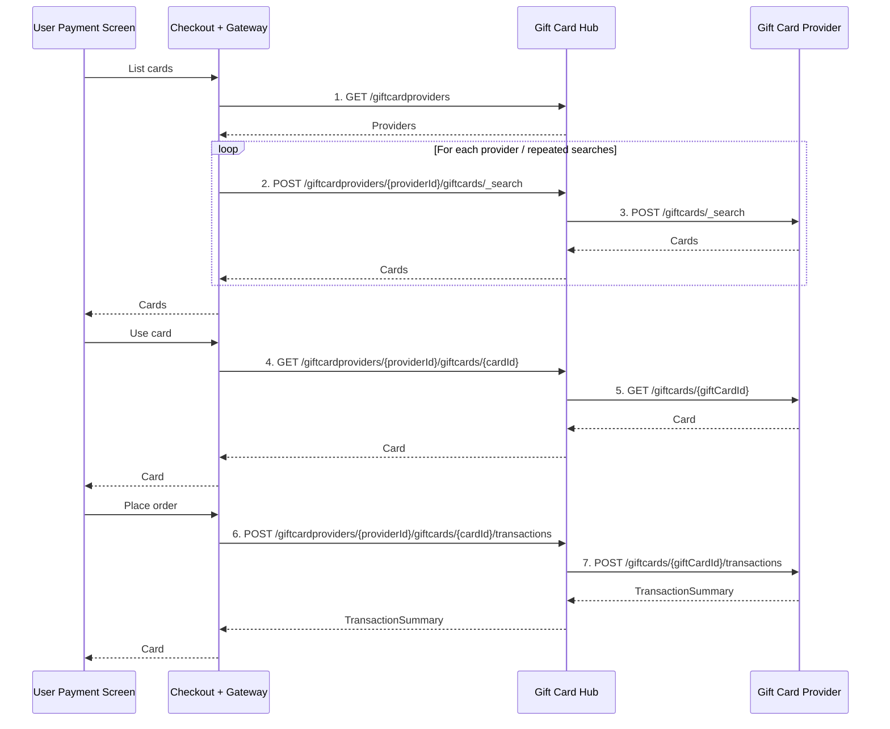
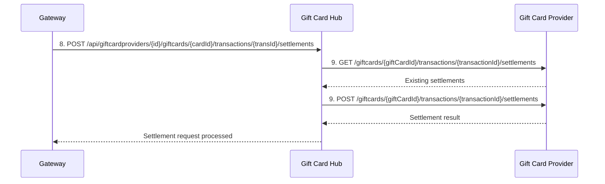
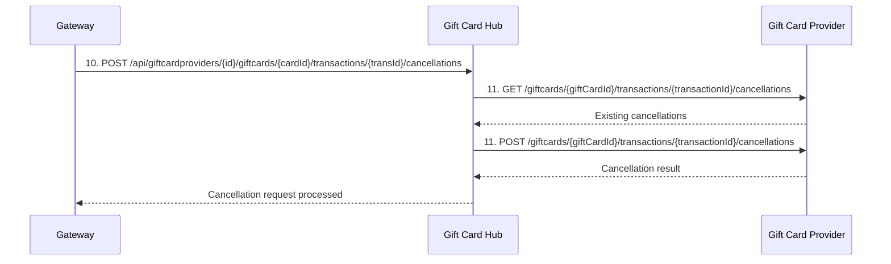

This guide provides a high-level overview of how to register an external gift card provider on VTEX and implement the endpoints used for gift card creation, checkout, settlement, and cancellation. For endpoint schemas, required fields, and complete request and response examples, see the [Gift Card Hub API](https://developers.vtex.com/docs/api-reference/giftcard-hub-api) and the [Gift Card Provider Protocol API](https://developers.vtex.com/docs/api-reference/giftcard-provider-protocol).

## How the integration works

This integration includes three flows:

- **Checkout:** VTEX lists the configured providers, requests the customer's available gift cards, retrieves details of the selected gift card, and creates the transaction.
- **Settlement:** VTEX checks existing settlements for the transaction and confirms the settlement when needed.
- **Cancellation:** VTEX checks existing cancellations for the transaction and confirms the cancellation or refund when needed.

> ℹ️ VTEX orchestrates these flows through the Gift Card Hub. The provider is responsible only for the external protocol endpoints called through `serviceUrl`.

### Checkout flow

The following diagram shows the checkout flow between the storefront, Gift Card Hub, and the external provider.



|    Step    | Interaction                                    | Endpoint                                                                                                                                                                                                   | Description                                                                      |
| :---------: | ---------------------------------------------- | ---------------------------------------------------------------------------------------------------------------------------------------------------------------------------------------------------------- | -------------------------------------------------------------------------------- |
| **1** | **Checkout >> Gift Card Hub** (Internal) | [List all gift card providers](https://developers.vtex.com/docs/api-reference/giftcard-hub-api#get-/api/giftcardproviders) (Gift Card Hub API)                                                                | Lists the configured providers.                                                  |
| **2** | **Checkout >> Gift Card Hub** (Internal) | [Get a gift card from a gift card provider](https://developers.vtex.com/docs/api-reference/giftcard-hub-api#post-/api/giftcardproviders/-giftCardProviderId-/giftcards/_search) (Gift Card Hub API)           | Gift Card Hub receives the search request and forwards it to the provider.       |
| **3** | **Gift Card Hub >> Provider** (External) | [List all gift cards](https://developers.vtex.com/docs/api-reference/giftcard-provider-protocol#post-/giftcards/_search) (Gift Card Provider Protocol API)                                                    | Provider returns the customer's available gift cards.                            |
| **4** | **Checkout >> Gift Card Hub** (Internal) | [Get a gift card from a gift card provider by ID](https://developers.vtex.com/docs/api-reference/giftcard-hub-api#get-/api/giftcardproviders/-giftCardProviderId-/giftcards/-giftCardId-) (Gift Card Hub API) | Gift Card Hub receives the selected gift card and forwards it to the provider.   |
| **5** | **Gift Card Hub >> Provider** (External) | [Get a gift card by ID](https://developers.vtex.com/docs/api-reference/giftcard-provider-protocol#get-/giftcards/-giftCardId-) (Gift Card Provider Protocol API)                                              | Provider returns the details of the selected gift card.                          |
| **6** | **Checkout >> Gift Card Hub** (Internal) | [Create a gift card transaction](https://developers.vtex.com/docs/api-reference/giftcard-hub-api#post-/api/giftcardproviders/-giftCardProviderId-/giftcards/-giftCardId-/transactions) (Gift Card Hub API)    | Gift Card Hub  receives the transaction request and forwards it to the provider. |
| **7** | **Gift Card Hub >> Provider** (External) | [Create a gift card transaction](https://developers.vtex.com/docs/api-reference/giftcard-provider-protocol#post-/giftcards/-giftCardId-/transactions) (Gift Card Provider Protocol API)                       | Provider creates the debit transaction and returns the result.                   |

### Settlement flow

The following diagram shows the settlement flow between Gateway, Gift Card Hub, and the external provider.



|    Step    | Interaction                                    | Endpoint                                                                                                                                                                                                                                                                                                                                                                                  | Description                                                                        |
| :---------: | ---------------------------------------------- | ----------------------------------------------------------------------------------------------------------------------------------------------------------------------------------------------------------------------------------------------------------------------------------------------------------------------------------------------------------------------------------------- | ---------------------------------------------------------------------------------- |
| **8** | **Gateway >> Gift Card Hub** (Internal)  | [Settle a gift card transaction](https://developers.vtex.com/docs/api-reference/giftcard-hub-api#post-/api/giftcardproviders/-giftCardProviderId-/giftcards/-giftCardId-/transactions/-tId-/settlements) (Gift Card Hub API)                                                                                                                                                                    | Gift Card Hub receives the settlement request and forwards it internally.          |
| **9** | **Gift Card Hub >> Provider** (External) | [List all gift card transactions settlements](https://developers.vtex.com/docs/api-reference/giftcard-provider-protocol#get-/giftcards/-giftCardId-/transactions/-tId-/settlements) + [Settle a gift card transaction](https://developers.vtex.com/docs/api-reference/giftcard-provider-protocol#post-/giftcards/-giftCardId-/transactions/-tId-/settlements) (Gift Card Provider Protocol API) | `GET` checks existing settlements, and `POST` confirms the settlement. |

### Cancellation flow

The following diagram shows the cancellation flow between Gateway, Gift Card Hub, and the external provider.



|     Step     | Interaction                                    | Endpoint                                                                                                                                                                                                                                                                                                                                                                                                            | Description                                                                            |
| :----------: | ---------------------------------------------- | ------------------------------------------------------------------------------------------------------------------------------------------------------------------------------------------------------------------------------------------------------------------------------------------------------------------------------------------------------------------------------------------------------------------- | -------------------------------------------------------------------------------------- |
| **10** | **Gateway >> Gift Card Hub** (Internal)  | [Cancel a gift card transaction](https://developers.vtex.com/docs/api-reference/giftcard-hub-api#post-/api/giftcardproviders/-giftCardProviderId-/giftcards/-giftCardId-/transactions/-tId-/cancellations) (Gift Card Hub API)                                                                                                                                                                                            | Gift Card Hub receives the cancellation request and forwards it internally.            |
| **11** | **Gift Card Hub >> Provider** (External) | [List all gift card transactions cancellations](https://developers.vtex.com/docs/api-reference/giftcard-provider-protocol#get-/giftcards/-giftCardId-/transactions/-transactionId-/cancellations) + [Cancel a gift card transaction](https://developers.vtex.com/docs/api-reference/giftcard-provider-protocol#post-/giftcards/-giftCardId-/transactions/-transactionId-/cancellations) (Gift Card Provider Protocol API) | `GET` checks existing cancellations, and `POST` performs the cancellation.  |

## What a provider must handle

Before integrating with VTEX, the provider system must already:

- Create and issue gift cards with an initial balance.
- Store and control the balance of each gift card or customer account.
- Process debits and credits in response to protocol calls.
- Guarantee balance consistency and integrity in your own system.

> ⚠️ The provider remains the source of truth for balances, expiration dates, and transaction history.

For example, if the provider returns a balance of `500.00` in `GET /giftcards/{giftCardId}`, VTEX uses that value in the purchase flow. The provider remains responsible for the accuracy of the returned balance.

> ℹ️ After the provider is configured and the endpoints are available, VTEX automatically orchestrates the calls required during checkout, settlement, and cancellation.

In this guide, you'll learn how to:

- [Register the gift card provider on VTEX](#step-1-register-the-gift-card-provider-in-vtex)
- [Confirm the provider registration](#step-2-confirm-the-provider-registration)
- [Implement the provider protocol endpoints](#step-3-implement-the-provider-protocol-endpoints)
- [Handle authentication and required responses](#expected-authentication-behavior)

## Before you begin

Before you start, make sure the provider:

- Provides a base URL that VTEX can use to call the gift card provider protocol endpoints.
- Validates provider authentication headers in every request.
- Responds within 15 seconds.

## Register the gift card provider on VTEX

Use the [Create or update gift card provider](https://developers.vtex.com/docs/api-reference/giftcard-hub-api#put-/api/giftcardproviders/-giftCardProviderId-) endpoint to register or update a provider on VTEX.

__PUT - Update gift card provider__

`https://{accountName}.vtexcommercestable.com.br/api/giftcardproviders/{giftCardProviderId}`

This request uses VTEX account credentials, not provider credentials. Send the following headers:

- `Accept: application/json`
- `Content-Type: application/json`
- `X-VTEX-API-AppKey`
- `X-VTEX-API-AppToken`

Request body

```json
{
  "id": "myGiftCardProvider",
  "serviceUrl": "https://api.example.com/v1/giftcard",
  "oauthProvider": "vtex",
  "preAuthEnabled": true,
  "cancelEnabled": true,
  "appKey": "provider-app-key",
  "appToken": "provider-app-token"
}
```

> ⚠️ In the [Create or update gift card provider](https://developers.vtex.com/docs/api-reference/giftcard-hub-api#put-/api/giftcardproviders/-giftCardProviderId-) endpoint documentation, `serviceUrl` is defined as `providerApiEndpoint`. This value specifies the base URL that VTEX uses to call the provider.

### serviceUrl requirements

When configuring `serviceUrl`, follow these recommendations:

- Include at least one path segment. Don't use only the root domain.
- Don't add a trailing slash to `serviceUrl`. Otherwise, VTEX may generate a URL with a double slash (`//`), which can cause routing failures depending on your server implementation.

VTEX integrates protocol paths directly to `serviceUrl`, without adding separators. The final URL structure is:

`serviceUrl + protocol path`

Example:

- `serviceUrl`: `https://api.example.com/v1/giftcard`
- Protocol path: `/giftcards/_search`
- Final URL: `https://api.example.com/v1/giftcard/giftcards/_search`

### Provider authentication

The `appKey` and `appToken` configured during provider registration are the credentials that VTEX sends in all protocol calls through the following headers:

- `X-PROVIDER-API-AppKey`
- `X-PROVIDER-API-AppToken`

The provider must validate these headers in every endpoint:

- Return `401 Unauthorized` with an empty body when headers are missing.
- Return `403 Forbidden` with an empty body when credentials are invalid.

## Confirm the provider registration

After registering the provider, use the [List all gift card providers](https://developers.vtex.com/docs/api-reference/giftcard-hub-api#get-/api/giftcardproviders) endpoint to confirm that the configuration is available in the VTEX account.

__GET - List all gift card providers__

`https://{accountName}.vtexcommercestable.com.br/api/giftcardproviders`

## Implement the provider protocol endpoints

VTEX calls the following endpoints relative to `serviceUrl` (`providerApiEndpoint`):

- [Create a gift card](https://developers.vtex.com/docs/api-reference/giftcard-provider-protocol#post-/giftcards) (`POST /giftcards`)
- [List all gift cards](https://developers.vtex.com/docs/api-reference/giftcard-provider-protocol#post-/giftcards/_search) (`POST /giftcards/_search`)
- [Get a gift card by ID](https://developers.vtex.com/docs/api-reference/giftcard-provider-protocol#get-/giftcards/-giftCardId-) (`GET /giftcards/{giftCardId}`)
- [Create a gift card transaction](https://developers.vtex.com/docs/api-reference/giftcard-provider-protocol#post-/giftcards/-giftCardId-/transactions) (`POST /giftcards/{giftCardId}/transactions`)
- [List all gift card transactions settlements](https://developers.vtex.com/docs/api-reference/giftcard-provider-protocol#get-/giftcards/-giftCardId-/transactions/-tId-/settlements) (`GET /giftcards/{giftCardId}/transactions/{transactionId}/settlements`)
- [Settle a gift card transaction](https://developers.vtex.com/docs/api-reference/giftcard-provider-protocol#post-/giftcards/-giftCardId-/transactions/-tId-/settlements) (`POST /giftcards/{giftCardId}/transactions/{transactionId}/settlements`)
- [List all gift card transactions cancellations](https://developers.vtex.com/docs/api-reference/giftcard-provider-protocol#get-/giftcards/-giftCardId-/transactions/-transactionId-/cancellations) (`GET /giftcards/{giftCardId}/transactions/{transactionId}/cancellations`)
- [Cancel a gift card transaction](https://developers.vtex.com/docs/api-reference/giftcard-provider-protocol#post-/giftcards/-giftCardId-/transactions/-transactionId-/cancellations) (`POST /giftcards/{giftCardId}/transactions/{transactionId}/cancellations`)

> ⚠️ All provider protocol endpoints must accept `application/vnd.vtex.giftcards.v1+json` as the media type. For `POST` requests, VTEX sends this value in both `Accept` and `Content-Type`. For `GET` requests, VTEX sends it in `Accept`.

> ⚠️ The provider server must also accept additional VTEX headers, such as `<ul>` `<li>` `content-length`: body size in bytes (only in POSTs)`</li>` `<li>` `x-vtex-operation-id`: Internal operation UUID `</li>` `<li>` `x-vtex-debug-id`: Debug ID (may have an empty value) `</li>` `<li>` `traceparent`: W3C distributed tracing header `</li>` `<li>` `baggage`: tracking metadata `</li>` `</li>` `accept-encoding`: gzip `</li>` `</ul>`.

> ℹ️ Don't reject requests because of unknown headers.

In settlement and cancellation flows, VTEX always calls the `GET` endpoint before sending a `POST` request. VTEX sums the amounts already processed and sends a new `POST` request only when there is an amount left to settle or cancel. This behavior helps ensure unchanged data ([idempotence](https://en.wikipedia.org/wiki/Idempotence)) and avoids reprocessing operations during retries.

### Creating a gift card

When VTEX Gift Card Hub requests gift card issuance, use your [Create a gift card at a gift card provider](https://developers.vtex.com/docs/api-reference/giftcard-hub-api#post-/api/giftcardproviders/-giftCardProviderId-/giftcards) endpoint to create the gift card in your system.

Return the created gift card data, including the generated `id`. VTEX uses this `id` as the `giftCardId` in subsequent checkout calls.

### Listing customer gift cards

Use the [List all gift cards](https://developers.vtex.com/docs/api-reference/giftcard-provider-protocol#post-/giftcards/_search) endpoint to return the gift cards available for the current customer and cart. This endpoint may be called multiple times during the same checkout session and returns only gift cards with available balance.

> ⚠️ Always return an empty array `[]` when the customer has no gift cards or when the gift card balance is zero. Don't return a gift card object with `"balance": 0`, because this can break the gift card flow on VTEX.

For B2B scenarios, define a consistent identifier strategy:

- Use `client.corporateDocument` when the gift card is associated with a company.
- Use `client.document` when the gift card is associated with an individual.

If both values are present, use the same rule consistently in `_search` and `/transactions`.

### Retrieving a gift card by ID

Use the [Get a gift card by ID](https://developers.vtex.com/docs/api-reference/giftcard-provider-protocol#get-/giftcards/-giftCardId-) endpoint to return the details of a selected gift card. Return the same `giftCardId` received in the path and the current `balance`.

For example, VTEX may call:

`GET {serviceUrl}/giftcards/GC-TEST-001?ts=639091131481342036`

> ℹ️ VTEX may append the `?ts=` query parameter to avoid cache. Ignore this parameter and process only the `giftCardId` in the path.

Example response. For the complete schema, see the API reference.

```json
{
  "id": "GC-TEST-001",
  "redemptionToken": "32ScL57220Vapb8pc50HJ3mWH1cl1L8x",
  "redemptionCode": "***********ASDQ",
  "balance": 870.00,
  "emissionDate": "2024-01-15T10:00:00.000",
  "expiringDate": "2026-12-31T00:00:00.000",
  "currencyCode": "BRL",
  "discount": false,
  "transactions": {
    "href": "cards/{giftCardId}/transactions"
  }
}
```

### Creating a transaction

Use the [Create a gift card transaction](https://developers.vtex.com/docs/api-reference/giftcard-provider-protocol#post-/giftcards/-giftCardId-/transactions) endpoint when the buyer places an order.

This request creates the transaction that reserves or debits the gift card amount. In the response, return a unique transaction `id`.

> ⚠️ VTEX uses this value as `{transactionId}` in settlement and cancellation URLs. The provider must store and recognize this identifier in subsequent requests.

> ℹ️ For B2B orders, use the same customer identifier logic adopted in [List all gift cards](https://developers.vtex.com/docs/api-reference/giftcard-provider-protocol#post-/giftcards/_search) endpoint. Mixing `document` in one endpoint and `corporateDocument` in the other can cause the wrong account to be debited.

### Listing settlements

Use the [List all gift card transactions settlements](https://developers.vtex.com/docs/api-reference/giftcard-provider-protocol#get-/giftcards/-giftCardId-/transactions/-tId-/settlements) endpoint to list previously processed settlements for a transaction.

> ⚠️ This endpoint is mandatory. VTEX always calls it before sending a new settlement request.

The endpoint should return:

- An empty array `[]` when no settlements exist.
- An array of settlement objects when settlements already exist.

VTEX sums the returned settlement values. If the total is equal to or greater than the transaction amount, VTEX doesn't send a new [Settle a gift card transaction](https://developers.vtex.com/docs/api-reference/giftcard-provider-protocol#post-/giftcards/-giftCardId-/transactions/-tId-/settlements) call.

### Creating a settlement

Use the [Settle a gift card transaction](https://developers.vtex.com/docs/api-reference/giftcard-provider-protocol#post-/giftcards/-giftCardId-/transactions/-tId-/settlements) endpoint to confirm the final settlement of the reserved amount.

The endpoint should return:

- `oid`: Unique settlement identifier.
- `value`: The same value received in the request body.
- `date`: Settlement timestamp in [UTC ISO 8601](https://en.wikipedia.org/wiki/ISO_8601) format.

### Listing cancellations

Use the [List all gift card transactions cancellations](https://developers.vtex.com/docs/api-reference/giftcard-provider-protocol#get-/giftcards/-giftCardId-/transactions/-transactionId-/cancellations) endpoint to list previously processed cancellations.

> ⚠️ This endpoint is mandatory. VTEX always calls it before sending a new cancellation request.

The endpoint should return:

- An empty array `[]` when no cancellations exist.
- An array of cancellation objects when cancellations already exist.

VTEX sums the returned cancellation values to decide whether another cancellation request is required.

### Creating a cancellation

Use the [Cancel a gift card transaction](https://developers.vtex.com/docs/api-reference/giftcard-provider-protocol#post-/giftcards/-giftCardId-/transactions/-transactionId-/cancellations) endpoint to cancel or refund a transaction and restore the amount to the buyer's gift card.

The endpoint should return:

- `oid`: Unique cancellation identifier.
- `value`: The same value received in the request body.
- `date`: Cancellation timestamp in [UTC ISO 8601](https://en.wikipedia.org/wiki/ISO_8601) format.

After a successful cancellation, restore the corresponding balance in your own system.

## Expected authentication behavior

All provider endpoints must enforce authentication with `X-PROVIDER-API-AppKey` and `X-PROVIDER-API-AppToken`.

Required responses:

- `200 OK` for successful requests.
- `401 Unauthorized` with an empty body when authentication headers are missing.
- `403 Forbidden` with an empty body when authentication headers are invalid.
- `500 Internal Server Error` for unexpected provider-side errors.

> ℹ️ This authentication behavior is required by VTEX. Providers that incorrectly accept invalid credentials can have related transactions automatically canceled by the platform. For more information, see [Changes in authentication requirements for external gift card providers](https://developers.vtex.com/updates/release-notes/2024-05-27-changes-in-authentication-requirements-for-external-gift-card-providers).

For a reference implementation, see the [giftcard-protocol-example repository](https://github.com/vtex-apps/giftcard-protocol-example).
