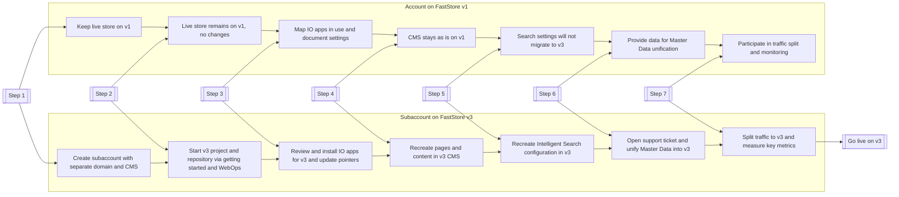

FastStore v3 is the latest version of the framework and the only one supported for creating a storefront with FastStore technology.

To take advantage of its latest updates, stores using FastStore v1 should migrate to v3. This guide explains the migration process, how it works, and the steps that need to be completed.

## Migration overview

The migration process involves running two VTEX accounts in parallel. Your main account (FastStore v1) remains live while you create a subaccount (FastStore v3) for development, validation, and gradual rollout.

The following diagram illustrates the process:

| **Step** | **FastStore v1 (Main account)** | **FastStore v3 (Subaccount)** |
| --- | --- | --- |
| **1. Subaccount setup** | Live store remains on v1. No changes made here. | Create a new subaccount with its own domain and Headless CMS. |
| **2. Start development** | No new development in v1. | Set up the v3 project and repository. |
| **3. VTEX IO apps** | Map installed apps and document settings. | Review app compatibility, reinstall or replace in v3, update pointers, and reapply settings. |
| **4. Headless CMS** | Headless CMS content stays as-is. | Recreate pages and content in the new v3 Headless CMS (migration not supported). |
| **5. Intelligent Search** | Existing search configuration remains unchanged. | Rebuild Intelligent Search settings manually in v3. |
| **6. Master Data** | Provide source data for unification. | Open a support ticket to configure and unify Master Data from v1 into v3. |
| **7. Traffic splitting** | Share live traffic with v3 during the transition. | Gradually receive traffic, measure key metrics, and tune until stable. |
| **Final** | Eventually retired after migration. | Becomes the live store (Go live on v3). |

## Before you begin

This guide is for VTEX accounts currently using FastStore v1 that need to migrate to FastStore v3.

Before starting the migration, verify your project’s FastStore version and prepare the required GitHub setup.
<Steps>
  
### Check your FastStore version

Confirm that your project is running on FastStore v1. You can check it as follows:

- In your project root, check for one of these files:
   - `store.config.js`: used by FastStore v1.
   - `discovery.config.js`: used by FastStore v3.

   If `store.config.js` is present, your project is likely running on FastStore v1.

- Open the `package.json` file and review the dependencies:

  | Package name        | FastStore v1 | FastStore v2+ |
  | ------------------- | :------------: | :-------------: |
  | `@faststore/core`   | ❌           | ✅            |
  | `@faststore/styles` | ✅           | ❌            |

  If `@faststore/styles` is present and `@faststore/core` is missing, your project is running on FastStore v1.

  >ℹ️ See the key differences between FastStore versions in the guide [FastStore versions and support levels](https://developers.vtex.com/docs/guides/faststore/getting-started-faststore-versions-and-support-levels#key-differences-between-faststore-versions)

### Have a GitHub account

You'll need a GitHub account to set up your FastStore v3 project. You can use either a [personal account](https://docs.github.com/en/account-and-profile/setting-up-and-managing-your-personal-account-on-github) or a [GitHub organization](https://docs.github.com/en/account-and-profile/setting-up-and-managing-your-personal-account-on-github). If you choose to use a GitHub organization, make sure you have admin access to it.

</Steps>

## Instructions

### Step 1 - Create a VTEX subaccount

To begin developing in v3, create a subaccount linked to your main VTEX account by following the [Managing a multistore](https://help.vtex.com/en/tutorial/managing-a-multistore--4S0lFVBPylRS5KpVgdyDhJ) article.

This subaccount is a dedicated, isolated environment that ensures all v3 development and deployments do not affect your live FastStore v1 store. It has its own domain, which prevents redirect conflicts, and an independent Headless CMS, which avoids any data or content cross-contamination between environments.

>❗ Don't start developing directly in the main account (live store) without using a subaccount. Doing so can result in the deletion of your Headless CMS live content during the WebOps onboarding process for FastStore v3.

### Step 2 - Start the development for v3

In your new subaccount, start your v3 project by following the [FastStore getting started track](https://developers.vtex.com/docs/guides/faststore/getting-started-overview).

Once you complete these steps, you'll have a repository linked to your subaccount (for example: `subaccount.store`). All your v3 development must be done in this repository.

### Step 3 - Audit VTEX IO apps for compatibility

Each VTEX account or subaccount manages its own VTEX IO app installations, permissions, and URLs. Some apps that work in FastStore v1 may not function out of the box in v3 and may require a custom integration or an alternative distribution method.

Audit all VTEX IO apps from your v1 store to identify compatibility issues and prepare them for migration.

|  Step   |  Description   |
| --- | --- |
| **1.  Map the store apps** | Map all apps (`vendor.name`, current version) used by the v1 store. |
| **2.  Check v3 compatibility** | For each app, confirm whether it’s compatible with FastStore v3.  * If incompatible: choose a path of custom integration, replace with an alternative, or defer/removal. * If compatible: continue to read the steps in this table. |
| **3.  Decide the cross‑account install strategy** | Determine whether the app can be installed in account v3. If it’s currently tied to account v1, choose one:  * Public app: Publish so it can be installed in other accounts. * [Sponsor account](https://developers.vtex.com/docs/guides/vtex-io-documentation-sponsor-account) \+ edition: Use a sponsor account to distribute the app to target accounts via an edition. * Private/single‑account: Rebuild/republish under the vendor for account Y or adjust distribution so Y can install. |
| **4.  Update account‑specific pointers** | Audit the app for hard‑coded account or workspace references and change them from v1 to v3.  * Search for absolute URLs and paths like: `[https://{account}.myvtex.com/_v/](https://{account}.myvtex.com/_v/)...`, `…?an={account}`, or Internal routes or endpoints that include the account or workspace name. * Replace with the v3 account values. Where possible, externalize pointers into configuration (env vars/app settings) to avoid future hardcoding. |
| **5.  Plan for app data and settings** | You cannot transfer app data or app settings from one account to another.  * Export or document all current app settings (including secrets, API keys, and toggles). * Recreate them manually in the v3 account after installation. * Record any one‑time data seeding steps required by the app. |
| **6.  Permissions and policies** | Review and update required policies for the app. Confirm any store or admin permissions needed in v3. |

### Step 4 - Recreate the Headless CMS content

Recreate all necessary pages, components, and content manually in the Headless CMS for your v3 project. For more information, refer to [Working with Headless CMS](https://developers.vtex.com/docs/guides/faststore/headless-cms-overview).

> ℹ️ Content migration between v1 and v3 Headless CMS instances is not supported.

### Step 5 - Recreate Intelligent Search settings

Rebuild your Intelligent Search configuration manually in the v3 environment, and plan enough time to reproduce and test all search settings in your [subaccount](#step-1--create-a-subaccount). Learn more in [Intelligent Search - Overview](https://newhelp.vtex.com/docs/tutorials/intelligent-search-overview).

> ℹ️ Migrating Intelligent Search settings from a v1 project to v3 is not supported.

### Step 6 - Unify Master Data 

Open a ticket with VTEX Support to configure, validate, and unify Master Data from the account (FastStore v1) to the subaccount (FastStore v3). 

This process ensures that all customer information, including profiles, login credentials, and order history, remains consistent across both environments during migration.

>⚠️ Master Data unification must be completed before starting traffic splitting.

### Step 7 - Traffic splitting between v1 and v3

Once you have completed all previous steps, [open a ticket with VTEX Support](https://help.vtex.com/support?cultureInfo=en-us) at least five days before your planned migration date to request traffic splitting between your main account (FastStore v1) and subaccount (FastStore v3). 

This gradual rollout allows you to gradually redirect users from the old store to the new one, monitor performance, and ensure stability before going fully live on v3.

Consider the following during the process:

- **Traffic splitting vs A/B testing:** FastStore uses traffic splitting to gradually transition users between v1 and v3. You can also use this setup to run A/B tests with your analytics or testing tools to compare performance between both versions while the split is active.
- **Measure key metrics:** Track and compare metrics such as conversion rates, engagement, and SEO performance across both versions. Use this data to optimize your configuration and adjust traffic allocation as needed.

Once v3 performance is validated, make it your live store and retire FastStore v1.
