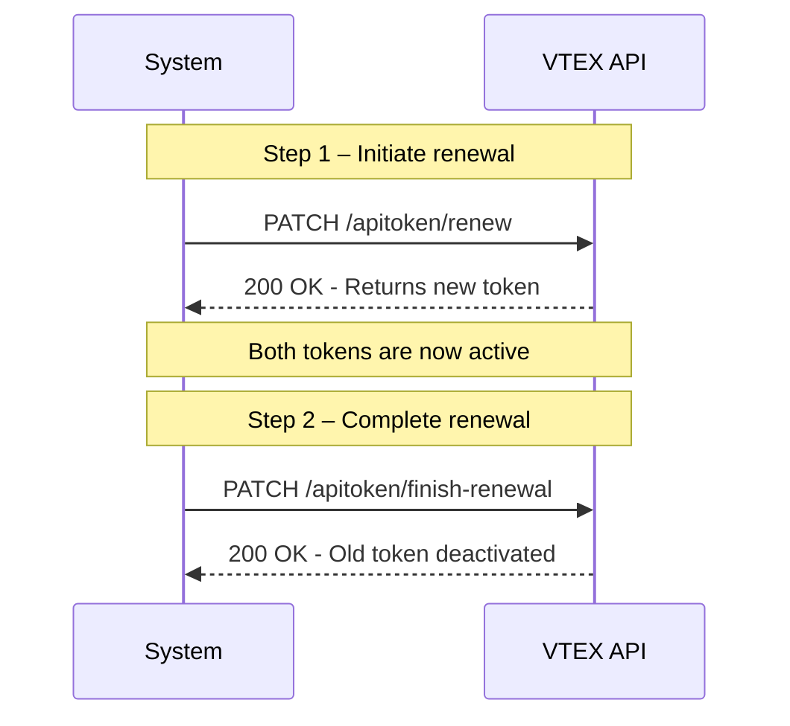

The older API tokens are, the higher the risk of exposure and potential damage to your operations. To minimize vulnerabilities and ensure your store’s security, it's strongly recommended to renew tokens regularly, ideally before any renewal alert in the [API Keys](https://help.vtex.com/tutorial/api-keys--4bFEmcHXgpNksoePchZyy6) admin.

>ℹ️ This guide explains how to renew VTEX API tokens using the [VTEX ID API](https://developers.vtex.com/docs/api-reference/vtex-id-api). Alternatively, you can rotate tokens using the API Keys admin page. Learn more at [Renewing API tokens](https://help.vtex.com/en/tutorial/renewing-api-tokens--7r4AzptYjXErGHadg9LnJ3).

VTEX’s renewal process allows you to generate a new token while the old one remains active, ensuring uninterrupted service during the transition.

>ℹ️ VTEX recommends renewing tokens every 90 or 180 days, based on your organization’s policies. Tokens do not expire automatically, so regular rotation is a proactive security best practice.

## Token rotation process

The API-based token rotation process involves two steps as illustrated in the diagram below:

1. The system initiates the token renewal by calling the `PATCH` [Initiate token renewal](https://developers.vtex.com/docs/api-reference/vtex-id-api#patch-/api/vtexid/apikey/-apiKey-/apitoken/renew) endpoint. The API responds with a new token while keeping the old one active.

2. After updating all systems to use the new token, the system calls the `PATCH` [Complete token renewal](https://developers.vtex.com/docs/api-reference/vtex-id-api#patch-/api/vtexid/apikey/-apiKey-/apitoken/finish-renewal) endpoint to deactivate the old token and complete the rotation.



## Required permission

To ensure security when renewing keys, these endpoints require authorization. You must use a valid API key (not the one being renewed) with access to the following License Manager resource:

| Product | Category | Resource |
| ----- | ----- | ----- |
| License Manager | API Key Management | **Renew API Token** |

## Step 1 - Initiate token renewal

Use the `PATCH` [Initiate token renewal](https://developers.vtex.com/docs/api-reference/vtex-id-api#patch-/api/vtexid/apikey/-apiKey-/apitoken/renew) endpoint to start the renewal process. This generates a new API token without deactivating the current one, allowing both to be used simultaneously during the transition period.

### Request example

```shell
curl -X PATCH "https://apiexamples.vtexcommercestable.com.br/api/vtexid/apikey/{apiKey}/apitoken/renew" \
  -H "Content-Type: application/json" \
  -H "X-VTEX-API-AppKey: {apiKey}" \
  -H "X-VTEX-API-AppToken: {apiToken}" \
```

### Response example

```json
{
  "id": "1f6c17e5-06f9-44a9-a459-b3686e03fa9d",
  "keyName": "my-api-key",
  "creationDateToken": "2025-02-18T12:00:00Z",
  "creationDateNewToken": "2025-02-25T12:00:00Z",
  "expirationPeriod": 30,
  "newToken": "abc123xyz789"
}
```

The response includes the new token (`newToken`), which is valid but not yet exclusive. You can now update your systems to use the new token.

## Step 2 - Complete token renewal

After you’ve updated all systems to use the new token, call the `PATCH` [Complete token renewal](https://developers.vtex.com/docs/api-reference/vtex-id-api#patch-/api/vtexid/apikey/-apiKey-/apitoken/finish-renewal) endpoint to finalize the process. This step deactivates the old token, ensuring that only the new one remains valid.

>⚠️ Before completing the renewal, make sure that no integrations are still using the old token. This action is irreversible.

### Request example

```shell
curl -X PATCH "https://apiexamples.vtexcommercestable.com.br/api/vtexid/apikey/my-api-key/apitoken/finish-renewal" \
  -H "Content-Type: application/json" \
  -H "X-VTEX-API-AppKey: {apiKey}" \
  -H "X-VTEX-API-AppToken: {apiToken}"
```

### Response example

```json
{
  "id": "1f6c17e5-06f9-44a9-a459-b3686e03fa9d",
  "creationDateToken": "2025-02-18T15:30:00Z",
  "creationDateNewToken": null
}
```

A `null` value in `creationDateNewToken` confirms that the old token is now deactivated and the rotation is complete.

## Post-rotation checklist

After completing the token rotation, make sure to follow the steps below to avoid disruptions and maintain security across all systems:

* Update all environments and tools with the new token.
* Remove the old token from vaults or environment variables.
* Monitor logs for failed authentication attempts.
* Inform affected teams or services about the token change.
