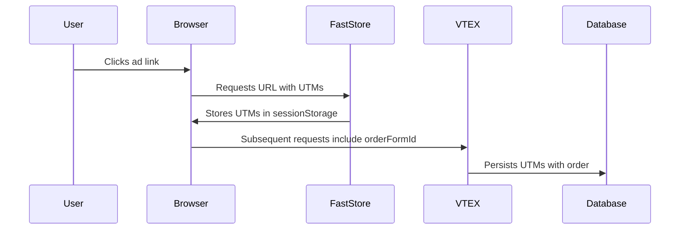

Validating UTM (Urchin Tracking Module) tracking ensures your marketing campaigns are accurately measured and can deliver personalized experiences to boost conversions. When a customer clicks a campaign link — such as from an email, social media post, or paid ad — UTM parameters like `utm_source`, `utm_medium`, and `utm_campaign`, are attached to the URL. These parameters help identify where the traffic is coming from, which campaigns are driving engagement, and how users navigate through your store.

If UTM data is lost during navigation, search, or checkout, your analytics and promotional strategies may be affected. For example, you might be unable to determine whether a sale came from a Google Ads campaign or an organic search. Also, if UTMs aren't properly passed to checkout, UTM-based promotions (such as 10% off for users from a winter sale campaign) won't apply.

By validating UTM tracking, you confirm that:

- Campaign data is captured when users access your site.
- UTM parameters persist as users browse, search, and add items to their cart.
- Checkout retains UTM data, enabling accurate order attribution in reports.

In this guide, you'll learn how to verify that UTM parameters are correctly captured and persist from store entry to checkout.

## Before you begin

To capture and retain UTM data from a visitor and attach it to their order, make sure your FastStore project is on version `3.27.0` or later. To update your store to the latest version, follow these steps:

1. Open your FastStore project in a code editor of your preference.
2. Open the terminal and run the following command to update FastStore packages:

    ```bash
    yarn upgrade -L --scope @faststore
    ```

## Instructions

### Step 1: Test UTM capture in store session

To verify if UTMs are stored when a user visits your store, simulate a campaign visit in your development environment:

1. Open the terminal and run `yarn dev` to start the server locally.
2. Open the localhost available and add a UTM parameter on its slug, for example:

    ```sh
    http://localhost:3000/?utm_source=google
    ```

    > ℹ️ Adding `?utm_source=google` simulates a user arriving from a Google Ads campaign.

3. To confirm if the `utm_source=google` was captured when the user acessed the store, open your Developer Tools in your browser and click the **Application** tab.
4. Go to the **Storage** section and navigate to **IndexedDB > keyval-store**.
5. Expand the **keyval-store** option and click **keyval**.
6. In the **Value** column, expand `addressType`.
7. Find the `marketingData` field and expand it. There, you'll see the `utmSource: "google"` parameter, which means it was captured during the user's session.

    

### Step 2: Verify checkout attribution

When a user arrives at your store through a link containing, for example, `?utm_source=google` and adds a product to the cart, the system does the following:



1. Creates an `orderFormId`, a cart identifier for the user's cart.
2. Attaches the UTM data to the cart.
3. Maintains UTM data throughout the purchase process for:
    - Accurate sales attribution, so you know from which traffic source this order came, such as Google Ads or organic traffic.
    - Campaign-specific promotions, such as 30% off for `utm_campaign=winter_sale`.

Another benefit of keeping UTM data throughout the purchase process is the ability to apply campaign-specific discounts. For example, a customer receives an email newsletter from your store with a promotion of 30% off the winter collection with the link `https://store.com?utm_source=newsletter&utm_medium=email&utm_campaign=winter_sale`. When the user clicks the link, adds a $100 product to the cart, and proceed to checkout, the system:

- Tracks the sale under `winter_sale`.
- Applies a 30% discount to the total price.

Now, let's make sure the `utm_source=google` is attached to the order on the client side:

1. Go to the store homepage by accessing the localhost (`http://localhost:3000/?utm_source=google`).
2. Click a product to go to its Product Detail Page (PDP).
3. In the PDP, add the product by clicking `Add to Cart`.
4. Open Developer Tools in your browser and click the **Application** tab to find the `orderFormId` (the cart identifier).

    > ℹ️ The `orderFormId` is a unique identifier assigned to a user's shopping cart (or order form) in the store. This identifier tracks items added to the cart, user session details (such as UTM parameters, shipping preferences), pricing, promotions, and checkout progress.

5. Go to **Cookies** and find `checkout.vtex.com`.
6. Copy the cookie value after `__ofid=` and save it. For example, if you see the following, `__ofid=a1b2c2x4y5z`, copy only `a1b2c2x4y5z`.

### Step 3: Call the Checkout API to confirm the UTM is in the cart

So far, we've confirmed that the `utm_source=google` parameter was captured client-side, so the browser received the UTM data. Now, let's check whether the server also received and retained this data through to checkout. To do this, use the [`Get Cart by ID`](https://developers.vtex.com/docs/api-reference/checkout-api#get-/api/checkout/pub/orderForm/-orderFormId-) endpoint.

1. Use this endpoint by adding the cookie value you saved in the [previous step](#step-2-verify-checkout-attribution). The base URL will look like this:

    ```sh
    https://{accountName}.{environment}.com.br/api/checkout/pub/orderForm/a1b2c2x4y5z
    ```

2. Run this endpoint.
3. In the response body, look for the `marketingData` object field. Inside it, you should find `utmSource: "google"`.

    > ℹ️ The `marketingData` object in the Checkout API contains promotion data such as coupon tracking information and internal or external UTMs.

With these local tests, you can confirm that UTM data is handled both client-side and server-side, persisting from the user's entry into your store through to checkout.
