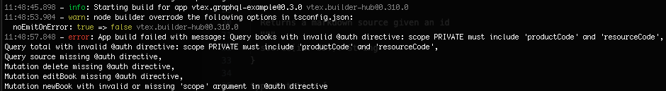

We are releasing GraphQL builder `2.x` for VTEX IO apps, and version `1.x` will be deprecated. The [GraphQL builder](https://developers.vtex.com/docs/guides/vtex-io-documentation-graphql-builder) is responsible for handling [GraphQL schemas](https://graphql.org/learn/schema/), which are used in [API implementations](https://developers.vtex.com/docs/guides/developing-a-graphql-api-in-service-apps) for [service apps](https://developers.vtex.com/docs/guides/vtex-io-documentation-service).

With this new version, all queries require the `@auth` directive to determine the level of authorization. This change enhances security in apps using GraphQL APIs.

## What has changed?

The `@auth` directive is added to queries and mutations to determine the type of authorization the user or app must have to gain access.

When implementing GraphQL queries using the builder version `1.x`, the `@auth` directive is optional and defines a [License Manager resource and product](https://help.vtex.com/en/tutorial/license-manager-resources--3q6ztrC8YynQf6rdc6euk3). The user or app needs to have a [role](https://help.vtex.com/en/tutorial/roles--7HKK5Uau2H6wxE1rH5oRbc) or [policy](https://developers.vtex.com/docs/guides/vtex-io-documentation-policies) that includes the resource or product defined in the directive. When the `@auth` directive is not declared, the query is public by default.

> ⚠️ The GraphQL builder `1.x` will be deprecated on January 7, 2026\. Existing apps built with this builder version will still function on the VTEX platform. From now on, developers won't be able to create new apps and major [versions](https://developers.vtex.com/docs/guides/vtex-io-documentation-releasing-a-new-app-version#understanding-app-versioning) of existing apps. From the deprecation date, apps with builder `1.x` won't build through [link](https://developers.vtex.com/docs/guides/vtex-io-documentation-linking-an-app) or [publish](https://developers.vtex.com/docs/guides/vtex-io-documentation-publishing-an-app).

With the builder version `2.x`, the `@auth` directive is mandatory and requires a new argument called `scope`, with two possible values:

- `PUBLIC`: The query is public, so it doesn’t require any authorization.
- `PRIVATE`: The query is private, which requires authorization for a specific [License Manager resource and product](https://help.vtex.com/en/tutorial/license-manager-resources--3q6ztrC8YynQf6rdc6euk3). With this value, the `productCode` and `resourceCode` arguments are also mandatory.

If a developer tries to build an app with the new GraphQL builder version, the [VTEX IO CLI](https://developers.vtex.com/docs/guides/vtex-io-documentation-vtex-io-cli-installation-and-command-reference) will show an error message in the following cases:

- Any query or mutation doesn’t have the `@auth` directive.
- The `scope` argument is missing in the directive.
- The `scope` is `PRIVATE` in the directive, and `productCode` or `resourceCode` arguments are missing.



## Why did we make this change?

We made this change to improve security and transparency in GraphQL APIs for VTEX IO apps. With this new builder version, developers must explicitly declare if queries and mutations are public or require authorization in the schema.

## What needs to be done?

To use the new builder version, developers will need to make some changes in their apps:

1. Update the GraphQL builder version to `2.x` in the [app’s manifest](https://developers.vtex.com/docs/guides/vtex-io-documentation-manifest).

```json
  "builders": {
    "graphql": "2.x",
    ...
  },
```

2. Add the `@auth` directive for every query and mutation in the app’s GraphQL schema with the `scope` property. If `scope` is `PUBLIC`, add the directive with this argument only:

```graphql
type Query {
  source(id: ID!): String
  @auth(scope: PUBLIC)
}
```

   If `scope` is `PRIVATE`, add the directive with the authorization requirements:

```graphql
type Query {
  book(id: ID!): Book
  @auth(scope: PRIVATE, productCode: "64", resourceCode: "read_account_config")
}
```

For more details, see [GraphQL builder](https://developers.vtex.com/docs/guides/vtex-io-documentation-graphql-builder), [Developing a GraphQL API in Service Apps](https://developers.vtex.com/docs/guides/developing-a-graphql-api-in-service-apps),
and [GraphQL authorization in IO apps](https://developers.vtex.com/docs/guides/graphql-authorization-in-io-apps).
