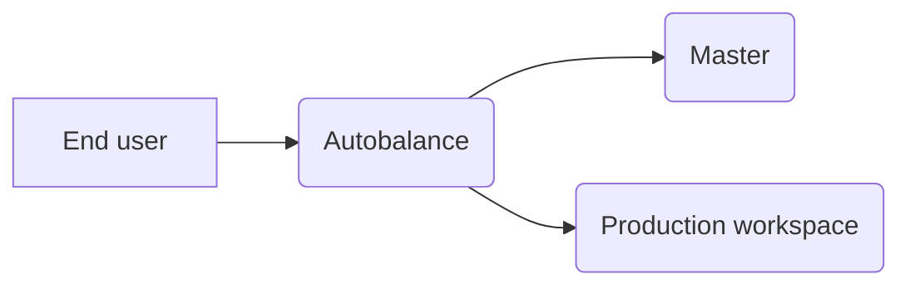

An A/B test compares traffic between two workspaces: the master and a production workspace, and reveals which version is best for your business needs.

For example, suppose you want to update your store's landing page. To confirm the beneficial results of your changes, you can run an A/B test and base your decisions on quantitative metrics.

To execute an A/B test, you can use the VTEX IO CLI or the [A/B Tester Admin app](https://developers.vtex.com/docs/guides/vtexarg-abtester). For more information, please refer to the following sections.

<Flex>

<WhatsNextCard
title="Running A/B tests"
description="Set up your environment and enable A/B testing for your store account."
linkTo="https://developers.vtex.com/docs/guides/vtex-io-documentation-running-native-ab-testing"
linkTitle="See more"
/>
  
<WhatsNextCard
title="A/B testing Legacy and IO store versions"
description="Perform A/B testing between store workspaces in CMS Legacy and VTEX IO to confirm which workspace has the highest conversion rate for your store."
linkTo="https://developers.vtex.com/docs/guides/vtex-io-documentation-performing-ab-testing-between-legacy-and-io"
linkTitle="See more"
/>

</Flex>