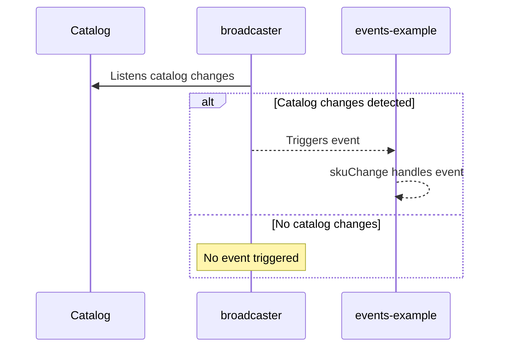

This guide will teach you how to set up a system for detecting and responding to changes in the VTEX Catalog using VTEX IO. 

We will use the [`Broadcaster`](https://developers.vtex.com/docs/apps/vtex.broadcaster) app to trigger events and develop a new app to handle these events.



## Before you begin

Ensure you are in a [development workspace](https://developers.vtex.com/docs/guides/vtex-io-documentation-creating-a-development-workspace) and install the [`broadcaster`](https://developers.vtex.com/docs/apps/vtex.broadcaster) app using the following command:

```sh
vtex install vtex.broadcaster
```

The Broadcaster app broadcasts catalog changes to other parts of the VTEX system. In this guide, we will use it to listen for catalog modifications and execute tasks accordingly.

<CH.Scrollycoding>

## Cloning the boilerplate repository

Clone the `events-example` boilerplate by running the command presented on the right. This will create a local copy of the project, equipping you with the necessary files to start implementing the catalog change handling system.

```shell
git clone https://github.com/vtex-apps/events-example
```

---

## Setting the event handler

Navigate to the `node/service.json` file and configure the event handler's name to `skuChange` and the `keys` property to `["broadcaster.notification"]`.

The `events` field defines the events the service will listen to and specifies how it will handle them. In this case, the `skuChange` function will run whenever the event, identified by the `key` value, is triggered - specifically when the `broadcaster` app triggers the [`notification`](https://github.com/vtex-apps/broadcaster/blob/master/node/middlewares/pushNotification.ts#L8) event).

- `skuChange`: The `skuChange` is a custom name given to the event handler function. You are free to choose a meaningful name for your events; in this case, it represents a change related to a Stock Keeping Unit (SKU).
- `keys`: The keys property specifies the event identifier the service will listen for. In this case, `["broadcaster.notification"]`.


```json node/service.json mark=8:12
{
  "memory": 128,
  "ttl": 10,
  "timeout": 2,
  "minReplicas": 2,
  "maxReplicas": 10,
  "workers": 4,
  "events": {
    "skuChange": {
      "keys": ["broadcaster.notification"]
    }
  },
  "routes": {
    "hcheck": {
      "path": "/_v/app/events-example/hcheck",
      "public": true
    }
  }
}
```

---

## Developing the event handler function

After saving the `node/service.json`, edit the `node/index.ts` file to create the `skuChange` handler function. 

```ts node/index.ts mark=34:39
import type {
  IOClients,
  ParamsContext,
  ServiceContext,
  RecorderState,
} from '@vtex/api'
import { Service } from '@vtex/api'
import { setCacheContext } from './utils/cachedContext'

const TREE_SECONDS_MS = 3 * 1000
const CONCURRENCY = 10

declare global {
  type Context = ServiceContext<IOClients, State>

  interface State extends RecorderState {
    code: number
  }
}

export default new Service<IOClients, State, ParamsContext>({
  clients: {
    options: {
      events: {
        exponentialTimeoutCoefficient: 2,
        exponentialBackoffCoefficient: 2,
        initialBackoffDelay: 50,
        retries: 1,
        timeout: TREE_SECONDS_MS,
        concurrency: CONCURRENCY,
      },
    },
  },
  events: {
    skuChange: (ctx: any) => {
      console.log('Received SKU changed event')
      console.log(ctx.body)
    },
  },
  routes: {
    hcheck: (ctx: any) => {
      setCacheContext(ctx)
      ctx.status = 200
      ctx.body = 'ok'
    },
  },
})
``` 

Note that the `skuChange` function will log the `Received SKU changed event` message whenever the `event-example` app listens to an event from the `broadcaster` app. 

> For more complex functions, consider developing your event handler function in a separate file.

---

## Linking the app

In the `events-example`, run `vtex link` and trigger an event to the `broadcaster` app by making a POST request to `app.io.vtex.com/vtex.broadcaster-adapter/v0/{{account}}/{{workspace}}/notify`. 

<CH.Code>
```sh Request
curl --request post \
	--url https://app.io.vtex.com/vtex.broadcaster/v0/{account}/{workspace}/notify \
	--header 'Accept: application/json' \
	--header 'Content-Type: application/json' \
	--header 'X-VTEX-API-AppKey: {AppKey}' \
	--header 'X-VTEX-API-AppToken: {AppToken}' \
	--data '{"HasStockKeepingUnitModified": "true","IdSku":"1"}'
```
---

```html Response
OK
```

</CH.Code>

---

## Checking the handler function behavior

After linking the `events-example` app and firing the event with the Broadcast app, check the console for a log message similar to the following: `Received SKU changed event service-node@6.38.3`.

Now that your system is configured to detect catalog changes, it is time to tailor your code to respond effectively to these events according to your specific requirements. Customize your code to implement actions and functionalities that align with your desired outcomes in response to catalog modifications.

```sh
13:29:52.531 - info: App running service-node@6.38.3  
13:29:58.810 - info: Received SKU changed event service-node@6.38.3  
13:29:58.815 - info: { HasStockKeepingUnitModified: true, IdSku: '1' } service-node@6.38.3  
13:29:58.824 - info: [16:29:59.186Z]    [26]    mystore/myworkspace:skuChange  204     POST    /mystore/myworkspace/_events   2 ms service-node@6.38.3 
```

</CH.Scrollycoding>
