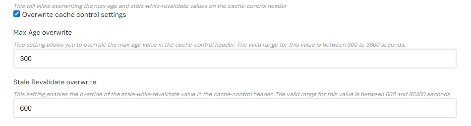

Render Server is the VTEX IO app responsible for server-side rendering of all render apps.

## Settings

The Render Server app has some settings available in the Admin for [cache-control](https://developers.vtex.com/docs/guides/cache-control-settings). Follow the steps below to access the Render Server settings page in your store:

1. Open your store’s Admin.
2. Go to **Apps** > **Extensions Hub** > **App Management**.
3. Search for **Render Server**.
4. In the Render Server app’s box, click on <i class="fa fa-gear"></i> **Settings**.

|Name|Type|Description|
|-|-|-|
|Overwrite cache control settings|`boolean`|This will allow overwriting the `max-age` and `stale-while-revalidate` values on the cache-control header. The default value is `false`.|
|Max-Age overwrite|`number`|This setting allows you to override the `max-age` value in the cache-control header for Product Detail Pages (PDP) and Product Listing Pages (PLP). The valid range for this setting is between 300 to 3600 seconds. The default value is 300 seconds. For more details, see [Cache-control settings](https://developers.vtex.com/docs/guides/cache-control-settings).|
|Stale Revalidate overwrite|`number`|This setting enables the override of the `stale-while-revalidate` value in the cache-control header for Product Detail Pages (PDP) and Product Listing Pages (PLP). The valid range for this setting is between 600 and 86400 seconds. The default value is 600 seconds. For more details, see [Cache-control settings](https://developers.vtex.com/docs/guides/cache-control-settings).|
