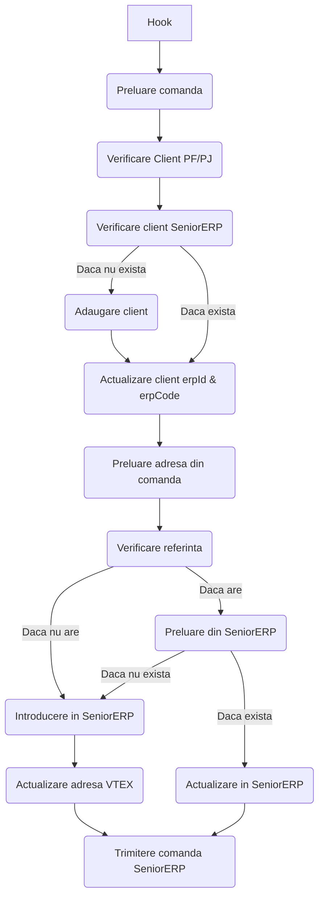
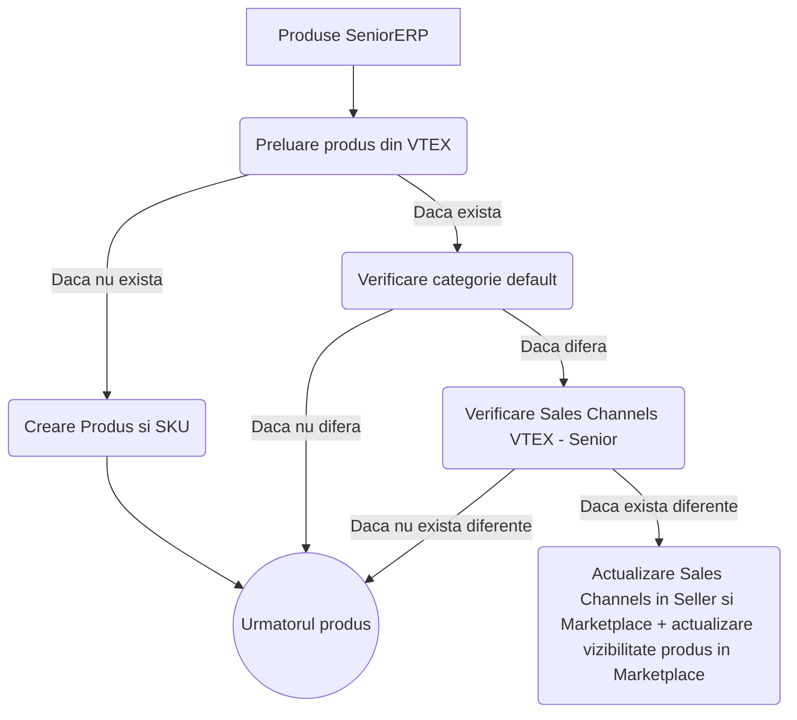
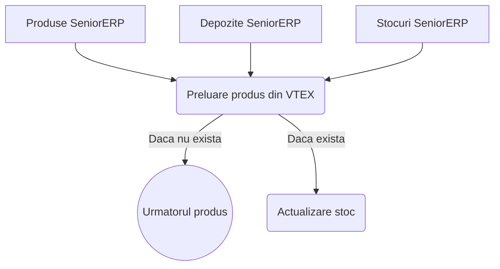
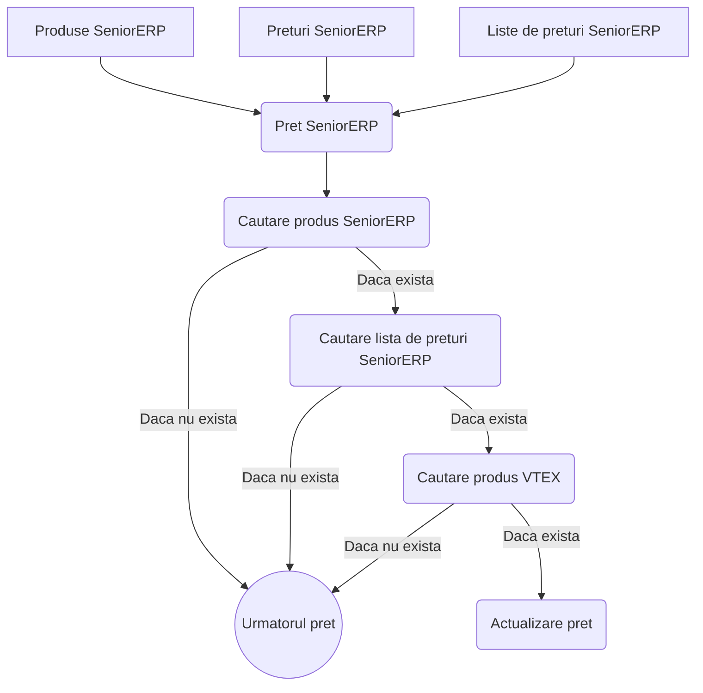
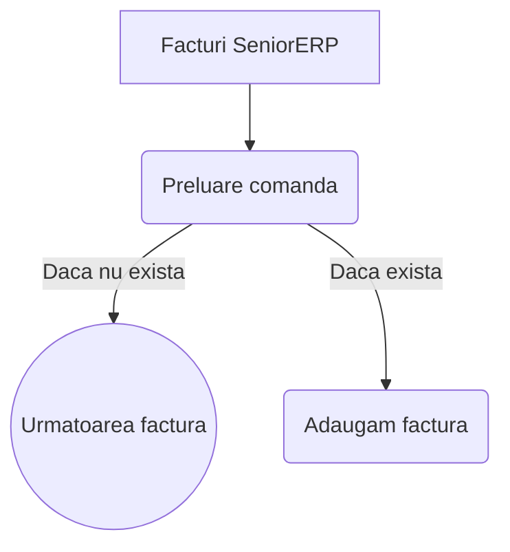

### Servicii

 - VTEX -> SeniorERP
	 - Comenzi
- SeniorERP -> VTEX
	- Sincronizare Produse
	- Sincronizare Stocuri
	- Sincronizare Preturi
	- Sincronizare Facturi

## VTEX -> SeniorERP
### Comenzi

URL: https://metatools.myvtex.com/no-cache/send-order
Comenzile ajung in ruta respectiva printr-un order hook setat.

```
{
	"filter": {
		"status": ["payment-approved"],
		"type": "FromWorkflow"
	},
	"hook": {
		"url": "https://metatools.myvtex.com/no-cache/send-order",
		"headers": {
			"Accept": "application/json",
			"Content-Type": "application/json"
		}
	}
}
```

Flow:
- Preluam toate informatiile despre comanda
- Verificam clientul daca este persoana fizica sau juridica (**clientProfileData.isCorporate**).
- Facem request in SeniorERP si verificam clientul.
    - Daca nu exista:
        - Introducem clientul in SeniorERP (Persoana Fizica sau Juridica, dupa caz)
        - Actualizam profilul clientului cu **erpId** si **erpCode** din SeniorERP
    - Daca exista:
        - Actualizam profilul clientului cu **erpId** si **erpCode** din SeniorERP
- Preluam adresa de livrare din comanda (**shippingData.address**) si verificam daca are referinta (**address.reference**)
    - Daca are referinta:
        - Preluam adresa din SeniorERP, daca nu exista o introducem, daca exista actualizam informatiile.
    - Daca nu are referinta:
        - Introducem adresa in SeniorERP
        - Actualizam referinta pe entitatea adresei (**AD**)
- La final, trimitem si comanda in SeniorERP

```
Pe campul  `VatType` se folosesc urmatoarele id-uri de TVA in functie de tara de livrare

AUT: 249 // 20%
CZE: 308 // 21%
FRA: 270 // 20%
DEU: 272 // 19%
ITA: 283 // 22%
NLD: 297 // 21%
POL: 300 // 23%
ESP: 316 // 21%
B2B: 245 // 0% taxa inversa pentru comenzi B2B
```



## SeniorERP -> VTEX
### Sincronizare Produse

Configurat prin VTEX scheduler sa ruleze odata pe ora (GET -> https://metatools.myvtex.com/api/scheduler/master/senior?version=4).<br>
URL: https://metatools.myvtex.com/no-cache/sync-products

Flow:
- Preluam produsele si clasificarile din SerniorERP
- Pentru fiecare produs
	- Daca exista in VTEX:
		- Daca nu mai este in categoria default
			- Verificam sales channels setate in VTEX
			- Verificam sales channels setate in SeniorERP
			- Daca exista diferente actualizam sales channels in Seller si Marketplace + actualizare vizibilitate produs in Marketplace
	- Daca nu exista in VTEX:
		- Cream un nou produs si SKU



### Sincronizare Stocuri

Configurat prin VTEX scheduler sa ruleze odata pe ora (GET -> https://metatools.myvtex.com/api/scheduler/master/senior?version=4).<br>
URL: https://metatools.myvtex.com/no-cache/sync-stock
Flow:
- Preluam datele din senior ERP
	- Produse
	- Depozite
	- Stocuri
- Pentru fiecare produs
	- Verificam produsul in VTEX
		- Daca exista
			- Actualizam stocul



### Sincronizare Preturi

Configurat prin VTEX scheduler sa ruleze odata pe ora (GET -> https://metatools.myvtex.com/api/scheduler/master/senior?version=4).<br>
URL: https://metatools.myvtex.com/no-cache/sync-prices
Flow:
- Preluam din SeniorERP
	- Produse
	- Preturi
	- Liste de preturi
- Pentru fiecare pret
	- Cautam produsul si daca exista
	- Cautam lista de preturi si daca exista
	- Cautam produsul in VTEX si daca exista actualizam pretul




### Sincronizare Facturi

Configurat prin VTEX scheduler sa ruleze odata pe ora (GET -> https://metatools.myvtex.com/api/scheduler/master/senior?version=4).<br>
URL: https://metatools.myvtex.com/no-cache/sync-invoices
Flow:
- Preluam facturile din SeniorERP
- Pentru fiecare factura
	- Preluam comanda din VTEX si daca exista adaugam factura pe comanda


## Setari Senior ERP

In `Admin > Store > Installed Apps > Senior ERP Settings` trebuie mapate listele de preturi si clasificarile din Senior ERP cu politicile 
comerciale din VTEX.

Denumirea listelor de preturi se obtine din tag-ul `Descriere` in urma interogarii webservice-ului Senior cu `messageModelID=71`

```
<Entitate>
	<D_Liste_Preturi_H_Id>567</D_Liste_Preturi_H_Id>
	<Descriere>Online - EBS - EU</Descriere>
	<Data_Start>2021-09-14T00:00:00</Data_Start>
	<Data_End>2079-06-06T23:59:00</Data_End>
	<IsSistem>false</IsSistem>
	<IsPretBrut>false</IsPretBrut>
	<InclusaInCalculAutomat>false</InclusaInCalculAutomat>
	<NuAplicaDiscounturiPartener>false</NuAplicaDiscounturiPartener>
	<Prioritate>1000</Prioritate>
	<FKListaPretInitial></FKListaPretInitial>
	<IsListaProcentuala>false</IsListaProcentuala>
	<IsActiv>true</IsActiv>
</Entitate>
```
Denumirea clasificarilor se obtine din tag-ul `Descriere` in urma interogarii webservice-ului Senior cu `messageModelID=64`

```
<Entitate>
	<D_Clasificari_Id>259</D_Clasificari_Id>
	<Descriere>Online - EBS - EU</Descriere>
	<ParinteId>1</ParinteId>
	<GenereazaDiscount>false</GenereazaDiscount>
	<StructuraId>259</StructuraId>
	<Nivel>1</Nivel>
</Entitate>
```