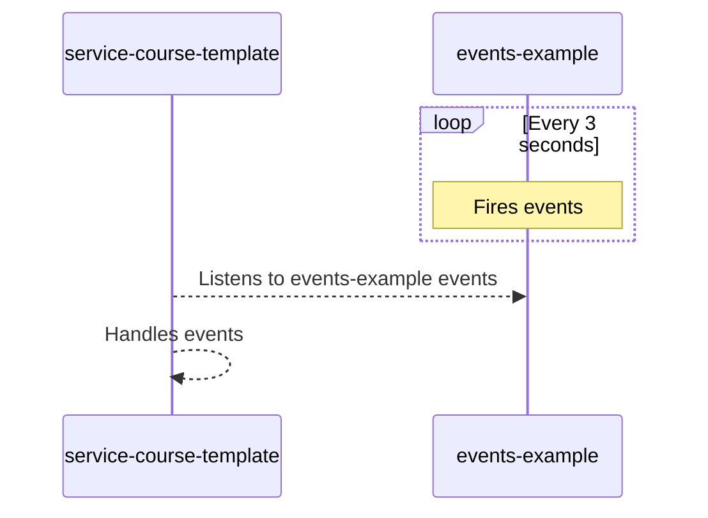

Some interactions on VTEX IO can generate events and be used as triggers for actions. For instance, an app listening for order placement events can respond by sending a confirmation email. In this course, we'll explore the process of firing events using the [events-example](https://github.com/vtex-apps/events-example) app and then demonstrate how the `service-course-template` app can effectively listen to and handle these events.



>⚠️ Events are _workspace and account-bound_, meaning they are only visible for the account and workspace where they were fired. Events fired on your personal workspace will only be listened to by apps linked to this same workspace.

<CH.Scrollycoding>

## Logging into your account

To begin, log in to your VTEX account and create a devolopment [workspace](https://developers.vtex.com/docs/guides/vtex-io-documentation-workspace/) using the terminal. Replace `{accountName}` with your VTEX account name.

```sh
vtex login {accountName}
```
  
---

## Cloning the app responsible for firing events

Now, let's clone the `events-example` app, responsible for firing the events that the `service-course-template` will listen to.

```sh
git clone https://github.com/vtex-apps/events-example
```

---

## Linking the app to a development workspace

Change to the `events-example` directory and link the app to your development workspace. After running `vtex link` on the `events-example` app, the terminal should prompt a healthcheck route. Access the healthcheck route using your browser. You should see an `ok` text.

> Accessing the healthcheck route creates a cache context needed for the VTEX IO to fire events. Without it, the `events-example` app won't be able to fire the events our app is going to listen to.

<CH.Code>

```sh
cd events-example && vtex link
```

---

```sh Terminal focus=39
12:06:38.229 - info: Running yarn in node  
yarn install v1.22.19
warning package.json: No license field
warning No license field
[1/4] 🔍  Resolving packages...
[2/4] 🚚  Fetching packages...
[3/4] 🔗  Linking dependencies...
[4/4] 🔨  Building fresh packages...
success Saved lockfile.
✨  Done in 8.30s.
12:06:47.012 - info: Finished running yarn  
12:06:47.013 - info: Linking app vtex.events-example@0.0.1  
12:06:47.116 - info: Sending 16 files   
12:06:47.118 - info: Link ID: 089d3cc8f38f0dfc  
12:06:47.118 - info: Project size: 0.26MB  
12:06:47.119 - info: Compressing project files...  
12:06:47.166 - info: Compressed project size: 0.11MB  
12:06:48.929 - info: Sending files: 100% - 0.11MB/0.11MB  
12:06:49.174 - info: Build accepted for vtex.events-example@0.0.1 at myaccout/myworkspace vtex.builder-hub@0.296.0  
12:06:49.175 - info: Starting build for app vtex.events-example@0.0.1 vtex.builder-hub@0.296.0  
12:06:54.769 - info: Bundle: 18 files - 0.33MB vtex.builder-hub@0.296.0  
12:06:54.789 - info: Sent bundle to Apps in 826ms vtex.builder-hub@0.296.0  
12:06:54.807 - info: App linked successfully vtex.builder-hub@0.296.0  
12:06:54.856 - info: Node app build finished successfully vtex.builder-hub@0.296.0  
12:06:58.871 - info: Starting vtex.events-example@0.0.1 service-node@6.38.1  
12:06:58.886 - info: Fetching /apps/vtex.events-example@0.0.1/bundle/dist/service-node/app service-node@6.38.1  
12:06:58.887 - info: Fetching /apps/vtex.events-example@0.0.1/files/dist/service-node/dependencies.tar.zst service-node@6.38.1  
12:06:58.986 - info: OK: /apps/vtex.events-example@0.0.1/files/dist/service-node/dependencies.tar.zst service-node@6.38.1  
12:06:59.000 - info: Extracted /apps/vtex.events-example@0.0.1/files/dist/service-node/dependencies.tar.zst service-node@6.38.1  
12:06:59.005 - info: OK: /apps/vtex.events-example@0.0.1/bundle/dist/service-node/app service-node@6.38.1  
12:06:59.012 - info: Extracted /apps/vtex.events-example@0.0.1/bundle/dist/service-node/app service-node@6.38.1  
12:06:59.621 - info: Runtime @vtex/api is: /usr/local/app/node_modules/@vtex/api/lib/index.js service-node@6.38.1  
12:06:59.631 - info: Using @vtex/api from: /usr/local/app/node_modules/@vtex/api/lib/index.js service-node@6.38.1  
12:06:59.639 - info: Spawning 1 workers
Using 30 seconds as worker graceful shutdown timeout service-node@6.38.1  
12:06:59.665 - info: Worker 26 is listening service-node@6.38.1  
12:07:00.328 - info: FIRED HERE service-node@6.38.1  
12:07:00.333 - info: Available service routes:
https://myworkspace--myaccout.myvtex.com/_v/app/events-example/hcheck service-node@6.38.1  
12:07:00.341 - info: App running service-node@6.38.1  
```

</CH.Code>

---

## Handling events

Now, let's return to the `service-course-template` app to manage events triggered by the `events-example` app effectively. This involves the following steps:

- Set up the `service-course-template` app to listen to events emitted by the `events-example` app.
- Create an event handler function for processing the events received from the `events-example` app.
- Configure the `service-course-template` app to use the handler function to handle the listened events.

### Listening to events

In order to listen to the events sent by the `events-example` app, open the `service.json` file and declare the highlighted code to give the app's service this capability. Note that we declare this by using the `events` resolver, the reference of the app that fires the event (`sender`), and the event reference key (`keys`).

```json node/service.json focus=8:15
{
  "memory": 128,
  "ttl": 10,
  "timeout": 10,
  "minReplicas": 2,
  "maxReplicas": 10,
  "workers": 4,
  "events": {
    "liveUsersUpdate": {
      "sender": "vtex.events-example",
      "keys": [
        "send-event"
      ]
    }
  },
  "routes": {
    "analytics": {
      "path": "/_v/app/analytics/realTime",
      "public": true
    }
  }
}
```

---

### Creating an event handler function

Once we are able to listen to the events sent by the `events-example` app, let's create a function to handle these events. For now, let's create a log when receiving an event. To do so, open the `/node/event` directory and update the `liveUsersUpdate.ts` file with the code presented.

```typescript node/event/liveUsersUpdate.ts
export async function updateLiveUsers() {
    console.log('EVENT HANDLER: received event')
}
```

---

### Defining the event handler

Now, we need to specify how the event handler function will be used. Open the `service-course-template/node/index.ts` file and update the `Service` declaration with the highlighted lines.

```typescript node/index.ts mark=11,47:49
import {
  LRUCache,
  Service,
  ServiceContext,
  ParamsContext,
  RecorderState,
  method,
} from '@vtex/api'
import { Clients } from './clients'
import { analytics } from './handlers/analytics'
import { updateLiveUsers } from './event/liveUsersUpdate'

// Create a LRU memory cache for the Status client.
// The @vtex/api HttpClient respects Cache-Control headers and uses the provided cache.
const memoryCache = new LRUCache<string, any>({ max: 5000 })
metrics.trackCache('status', memoryCache)

declare global {
  type Context = ServiceContext<Clients, State>

  interface State extends RecorderState {
    code: number
  }
}

const THREE_SECONDS_MS = 3 * 1000
const CONCURRENCY = 10

export default new Service<Clients, State, ParamsContext>({
  clients: {
    implementation: Clients,
    options: {
      default: {
        retries: 2,
        timeout: 10000,
      },
      events: {
        exponentialTimeoutCoefficient: 2,
        exponentialBackoffCoefficient: 2,
        initialBackoffDelay: 50,
        retries: 1,
        timeout: THREE_SECONDS_MS,
        concurrency: CONCURRENCY,
      },
    },
  },
  events: {
    liveUsersUpdate: updateLiveUsers,
  },
  routes: {
    analytics: method({
      GET: [analytics],
    }),
  },
})
```

---

### Configuring the event handler behavior

We can now specify how the event handler will behave. In the `service-course-template/node/index.ts` file, update the `Service` declaration with the highlighted lines. Going by each configuration, we have the following:

| Field | Type    | Description |
| - | - | - |
| `exponentialTimeoutCoefficient` | Integer | Exponential factor by which the `timeout` will increase in each retry, in seconds. |
| `exponentialBackoffCoefficient` | Integer | Exponential factor by which the `backoff delay` will increase in each retry, in seconds. |
| `initialBackoffDelay` | Integer | Time, in seconds, that the app will wait until the next retry. |
| `retries` | Integer | Maximum times the app will retry. |
| `timeout` | Integer | Timeout until the attempt is considered a failure, in seconds. |
| `concurrency` | Integer | Amount of simultaneous processes the event is able to perform. |

By adding this code to the `Service`, we are adding to the `Client` of this `Service`, the capability to handle events. At this point, we are not yet using the `Client` itself when handling the event.

```typescript node/index.ts mark=26:27,37:44
import {
  LRUCache,
  Service,
  ServiceContext,
  ParamsContext,
  RecorderState,
  method,
} from '@vtex/api'
import { Clients } from './clients'
import { analytics } from './handlers/analytics'
import { updateLiveUsers } from './event/liveUsersUpdate'

// Create a LRU memory cache for the Status client.
// The @vtex/api HttpClient respects Cache-Control headers and uses the provided cache.
const memoryCache = new LRUCache<string, any>({ max: 5000 })
metrics.trackCache('status', memoryCache)

declare global {
  type Context = ServiceContext<Clients, State>

  interface State extends RecorderState {
    code: number
  }
}

const THREE_SECONDS_MS = 3 * 1000
const CONCURRENCY = 10

export default new Service<Clients, State, ParamsContext>({
  clients: {
    implementation: Clients,
    options: {
      default: {
        retries: 2,
        timeout: 10000,
      },
      events: {
        exponentialTimeoutCoefficient: 2,
        exponentialBackoffCoefficient: 2,
        initialBackoffDelay: 50,
        retries: 1,
        timeout: THREE_SECONDS_MS,
        concurrency: CONCURRENCY,
      },
    },
  },
  events: {
    liveUsersUpdate: updateLiveUsers,
  },
  routes: {
    analytics: method({
      GET: [analytics],
    }),
  },
})
```

---

## Linking the event handler app

In the `service-course-template` directory, run `vtex link` and wait for the event to be fired by the `events-example` app. Upon successful reception, a log entry should appear in the console.

```sh Terminal mark=22:23
12:58:15.238 - info: Running yarn in node  
yarn install v1.22.19
warning package.json: No license field
warning No license field
[1/4] 🔍  Resolving packages...
[2/4] 🚚  Fetching packages...
[3/4] 🔗  Linking dependencies...
[4/4] 🔨  Building fresh packages...

success Saved lockfile.
✨  Done in 20.08s.
12:58:35.636 - info: Finished running yarn  
12:58:35.636 - info: Linking app vtex.backend-course@0.0.2  
12:58:35.715 - info: Sending 13 files   
12:58:35.717 - info: Link ID: 0d190e115e9b2d6b  
12:58:35.717 - info: Project size: 0.12MB  
12:58:35.717 - info: Compressing project files...  
12:58:35.761 - info: Compressed project size: 0.05MB  
12:58:37.251 - info: Sending files: 100% - 0.05MB/0.05MB  
12:58:37.252 - info: Build accepted for vtex.backend-course@0.0.2 at myaccout/myworkspace vtex.builder-hub@0.296.0  
12:58:37.253 - info: Starting build for app vtex.backend-course@0.0.2 vtex.builder-hub@0.296.0  
12:58:40.140 - info: EVENT HANDLER: received event service-node@6.38.1  
12:58:40.141 - info: [15:58:40.429Z]	[26]	myaccout/myworkspace:liveUsersUpdate	204	POST	/myaccout/myworkspace/_events	0 ms service-node@6.38.1  
```

</CH.Scrollycoding>
